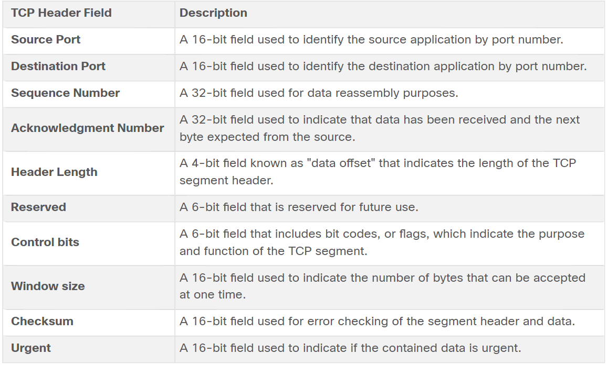
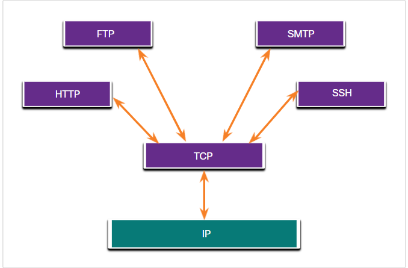
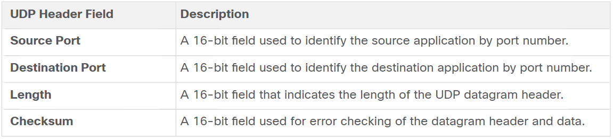
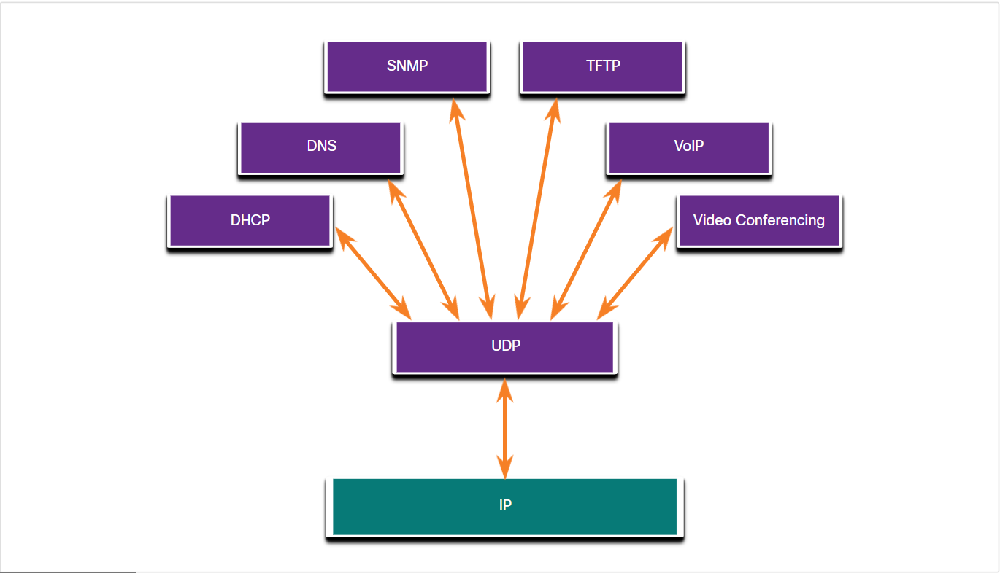
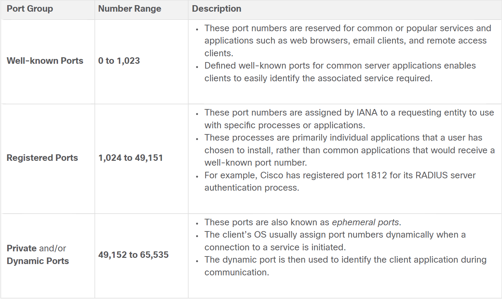
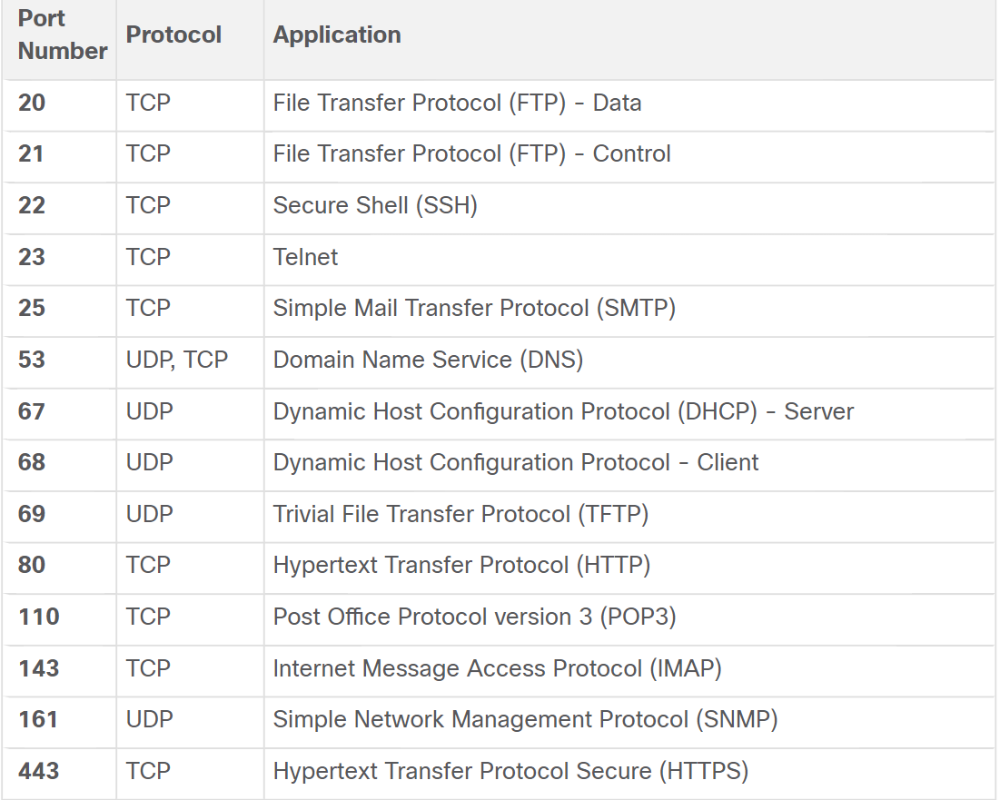
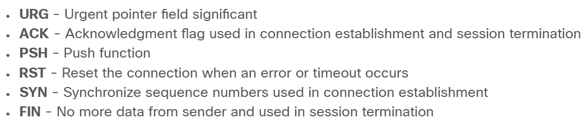
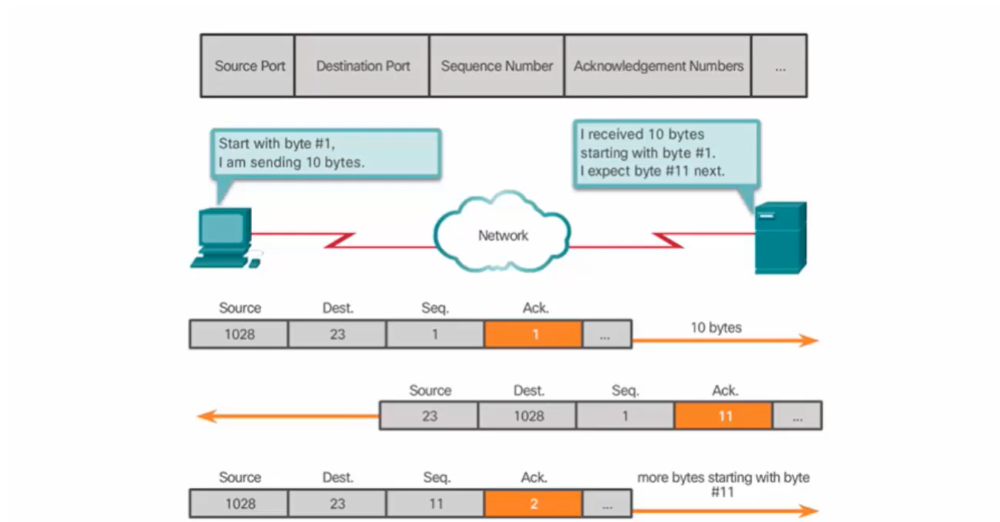
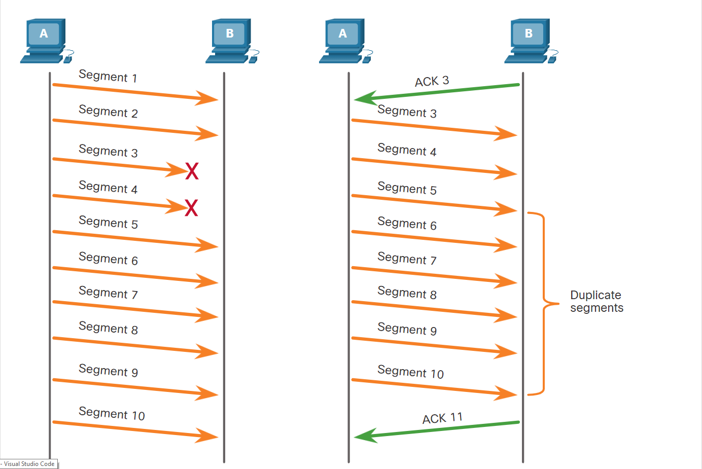
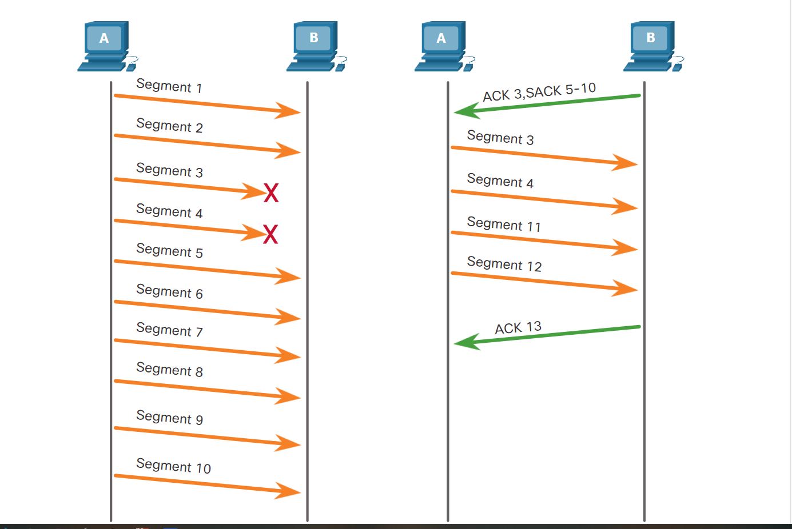

* What is the role of the Transport Layer?
   * Transportation of data, this is where the name came from.
   * The logical communications between applications running on different hosts.
   * It's the link between the application layer and the lower layers that are responsible for network transmission.  

 

* The transport layer's responsibilities
  1. Tracking Individual conversations:  
    the transport layer is responsible for maintaining and tracking the multiple conversations a source and destination can have (data flowing between the source and destination is what we call a conversation).  

  2. Segmenting Data and Reassembling Segments:  
   the transport layer divides the data into smaller blocks (i.e., segments or datagrams depending on the protocol used) that are easier to manage and transport.  

  3. Add Header Information:  
   this header information is represented by binary data organized into fields to each block of data. This data enables the transport layer protocols to perform different functions in managing data communication (e.g.The transport layer ensures that even with multiple application running on a device, all applications receive the correct data).   

  4. Identifying the applications:  
   As we said before the transport layer ensures that the data recieved by the application is the right data for that application using the port numbers where each application on the host has its unique port number and that's how transport layer identifies applications.   

  5. Conversation Multiplexing:  
   Sending some types of data such as streaming a video as one complete communication stream can consume all the bandwidth which would prevent other conversations from happening plus it would make error recovery and retransmission difficult. What solves this problem is the segmentation we talked about before, it allows multiple communications to happen all at once.

    

* IP is only concerned with sturcture, addressing and routing of the packets, it's not concerned with the transportation or the delivery of them.
* Different applications have different reliability requirements.

 

* Transmission Control Protocol (TCP)  
  * Is considered a reliable full-featured transport layer protocol which ensures all of the data arrives at the destination.
  * The fields that ensure the delivery of data require additional processing by sending and recieving hosts.
  * TCP divides data into segments.
  * TCP provides reliability and data flow through the following operations:
    * Number and track data segments.
    * Acknowledge recieved data.
    * Retransmit any unacknowledged data after a certain amount of time.
    * Sequence data that might arrive in wrong order.
    * Send data at an efficient rate that is acceptable by the reciever.  

  * Why is TCP considered to be connection-oriented protocol?  
     Because to maintain the state of a conversation and track the information TCP have to establish a connection between source and destination.  
  * The TCP is responsible for:
      1. Establishing a session  
         The connection that TCP establishes can be perminant or a session and when this connection is being established the sender and receiver negotiate the amount of traffic that can be forwarded at a given time.  
      2. Ensures reliable delivery
      3. Provides same order delivery
      4. Supports flow control  
          * Flow control can prevent the need for retransmission of the data when the resources of the receiving host are overwhelmed.
          * When TCP is aware that the resources that are used by the network hosts are overtaxed, it can request that the sending application reduce the rate of data flow.

   * The TCP header:   
      
     

   * Applications  
     

 

* User Datagram Protocol (UDP)
  * It does not provide reliability or data flow control, which means UDP datagrams can be processed faster than TCP segments.
  * UDP divides data into datagrams that are also referred to as segments.
  * UDP is considered to be connectionless. Why?
    * Because it does not provide reliability and data flow control, so it doesn't need an established connection between sender and reciever.
  * UDP is also called a stateless protocol, because it does not track information sent and recieved.  
  * It's also a best-effort delivery protocol because there's no acknowledgement that the data was delivered by the destination.  
  * UDP is responsible for:
    1. Reconstructing the data in the order it was recieved in.
    2. Any lost segments are not resent.
    3. There's no session establishment.
    4. The sender is not informed of resource availability.  

  * If reliability is required when using UDP as the transport protocol, it must be handled by the application.  

  * UDP header:  
    
    

  * Applications:  
     

   * Although DNS and SNMP use UDP by default, both can also use TCP. DNS will use TCP if the DNS request or DNS response is more than 512 bytes, such as when a DNS response includes many name resolutions. Similarly, under some situations the network administrator may want to configure SNMP to use TCP.

  

* The right protocol for the right application  

<blockquote>
Some applications can tolerate some data loss during transmission over the network, but delays in transmission are unacceptable. For these applications, UDP is the better choice because it requires less network overhead. UDP is preferable for applications such as Voice over IP (VoIP). Acknowledgments and retransmission would slow down delivery and make the voice conversation unacceptable.

UDP is also used by request-and-reply applications where the data is minimal, and retransmission can be done quickly. For example, domain name service (DNS) uses UDP for this type of transaction. The client requests IPv4 and IPv6 addresses for a known domain name from a DNS server. If the client does not receive a response in a predetermined amount of time, it simply sends the request again.

For example, if one or two segments of a live video stream fail to arrive, it creates a momentary disruption in the stream. This may appear as distortion in the image or sound, but may not be noticeable to the user. If the destination device had to account for lost data, the stream could be delayed while waiting for retransmissions, therefore causing the image or sound to be greatly degraded. In this case, it is better to render the best media possible with the segments received, and forego reliability.

For other applications it is important that all the data arrives and that it can be processed in its proper sequence. For these types of applications, TCP is used as the transport protocol. For example, applications such as databases, web browsers, and email clients, require that all data that is sent arrives at the destination in its original condition. Any missing data could corrupt a communication, making it either incomplete or unreadable. For example, it is important when accessing banking information over the web to make sure all the information is sent and received correctly.

Application developers must choose which transport protocol type is appropriate based on the requirements of the applications. Video may be sent over TCP or UDP. Applications that stream stored audio and video typically use TCP. The application uses TCP to perform buffering, bandwidth probing, and congestion control, in order to better control the user experience.

Real-time video and voice usually use UDP, but may also use TCP, or both UDP and TCP. A video conferencing application may use UDP by default, but because many firewalls block UDP, the application can also be sent over TCP.

Applications that stream stored audio and video use TCP. For example, if your network suddenly cannot support the bandwidth needed to watch an on-demand movie, the application pauses the playback. During the pause, you might see a “buffering...” message while TCP works to re-establish the stream. When all the segments are in order and a minimum level of bandwidth is restored, your TCP session resumes, and the movie resumes playing.

The figure summarizes differences between UDP and TCP.
</blockquote>  

* Ports  
  * For instance, assume a host is initiating a web page request from a web server. When the host initiates the web page request, the source port number is dynamically generated by the host to uniquely identify the conversation. Each request generated by a host will use a different dynamically created source port number. This process allows multiple conversations to occur simultaneously.

  * What is a Socket?  
    The source and destination ports are placed within the segment. The segments are then encapsulated within an IP packet. The IP packet contains the IP address of the source and destination. The combination of the source IP address and source port number, or the destination IP address and destination port number is known as a socket.
    
   * A socket on the client with a socket on the server combined together makes a *socket pair*.
   * Sockets enable multiple processes, running on a client, to distinguish themselves from each other, and multiple connections to a server process to be distinguished from each other.  

   * So, we have a source port so that when there's a response to our request the transport layer returns this reponse to the right application (the one with the port specified in the request).

   * For the 16-bit port numbers we have a range from 0 to 65535 of available ports that can be divided into the following:  
     

   * Famous ports and their services  
     

   * **DNS** uses UDP when clients send requests to a DNS server. However, communication between two DNS servers always uses TCP.
   * `netstat` to list the protocols in use, the local address and port numbers, the foreign address and port numbers, and the connection state.

* The Three-Way Handshake Process  
  1. SYN  
   The client asks the server for a **client-to-server** commuincation session.  

  2. ACK and SYN  
   The Server acknowledges the client-to-server communication session and requests a **server-to-client** communication session.  

  3. ACK  
   The client acknowledges the server-to-client communication session.

* Session Termination  
   Either the client or the server can initiate the termination process.  
   To close the connection the FIN control flag must be set in the segment's header.
   1. FIN  
     When the client has no more data to send it sends a segment with the FIN flag set to terminate the client-to-serve session.
   2. ACK  
     The server sends an ACK to acknowledge the receipt of the FIN to terminate the session from client-to-server.
   3. FIN  
     The server sends a FIN to terminate the server-to-client session.  
   4. ACK  
      The client responds with an ACK to acknowledge the FIN from the server

* The six control bits in the TCP header are:  
    

* Initial Sequence Number (ISN)
  During session setup an initial sequence number is set and this number is effectively a random number to prevent certain types of malicious attacks.  
  The sequence number is incremented by the number of bytes being transmitted which makes each sequence number of each packet unique so that the packet can be identified and acknowledged and if it can also be identified if it goes missing. 

* TCP Reliability (Sequence Numbers and Acknowledgments)  
    

* If the hosts don't support SACK and discontinuous segments are not recieved, the ACK would include that it's expecting the missing segment and all the ones after it but if both hosts agree on SACK (Selective Acknowledgements) when establishing the connection only the defected or the missing segments will be sent. 
* Without using SACK  
  

   

* When using SACK  
    

* The sender in TCP has a timer for each segment sent and this timer waits a fixed amount of time if it didn't recieve an ack from the receiver the sender will retransmit the same segment again.  

* To accomplish *flow control* TCP has a 16-bit field called Window Size.
* The initial window size is agreed upon in the three-way handshake when establishing the session.
* Sliding Windows: is the continual adjustment of the window size. 
* I think the destination is who controls the window size and changes it. 

* Maximum Segment Size (MSS)  
  Is a part of the options field in the TCP header. It's usually 1,460 byte because if we consider the MTU being 1500 for ethernet and by subtracting the IP header (20 bytes) and the TCP header (20 bytes) we're left with 1460 byte.  
  It usually does not include the TCP header and it's also decided during the three-way handshake.

* Congestion Avoidance  
  * By determining the rate at which TCP segments are sent but not acknowledged, the source can assume a certain level of network congestion.  
  * To avoid making congestions worse TCP on PCs can sense that there's congestion and therefore lessen the number of bytes it's sending through the network.

* In UDP the datagrams will be reassembled in the order they were recieved in and if the order is important to the application the application itself should be responsible for it.