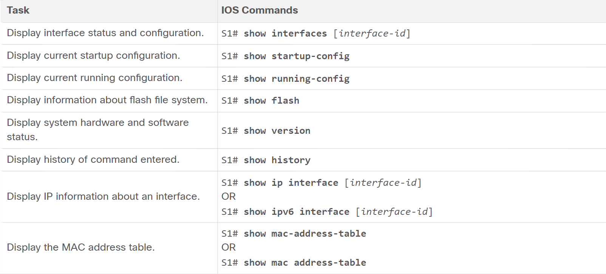
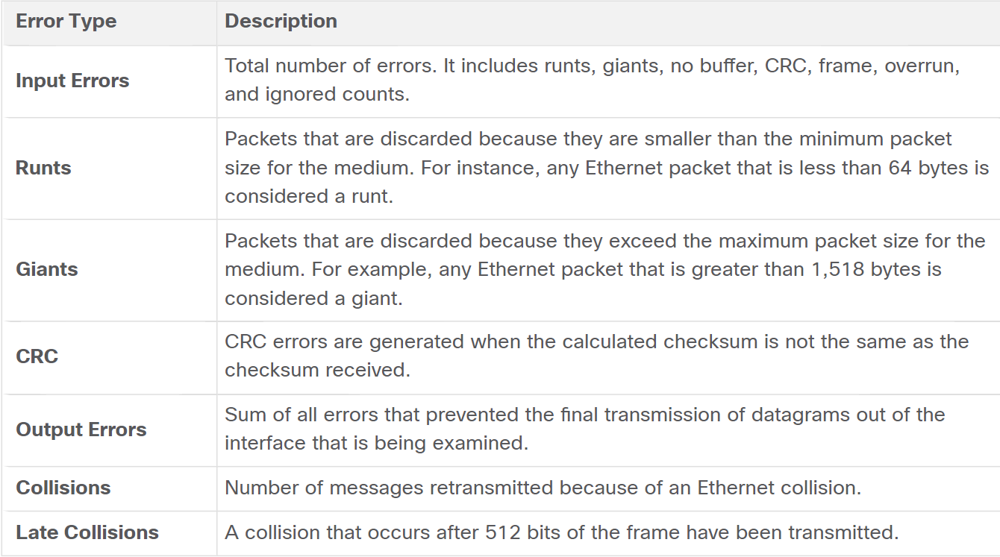

* The 5 steps of booting a cisco switch:
  1. The switch loads on Power On Self Test program that is stored in the *ROM*. POST tests the CPU, DRAM, and the portion of the flash device that makes up the flash file system.
  2. The switch loads the boot loader software (The boot loader is a program stored in the ROM and it's run after the POST).
  3. The boot loader performs low-level CPU initialization (It initializes the registers that control where physical memory is mapped, the quantity of memory and its speed).
  4. The boot loader initializes the flash file system on the system board.
  5. The boot loader locates and loads a default IOS software image into the memory and gives control to that IOS.  
* The switch boots automatically by using the BOOT environment variable. If the BOOT variable was not found set it as follows: `S1(config)# boot system flash:/c2960-lanbasek9-mz.150-2.SE/c2960-lanbasek9-mz.150-2.SE.bin`.  

* LED Indicators  
  * SYST (System LED): Shows whether the system is receiving power and is functioning properly.
  * RPS (Redundant Power System LED): It shows the status of the RPS.
  * Port Status LED (STAT): Indicates that the port status is selected when it's green.
  * Port Duplex LED (DUPLX): Indicates that the port duplex mode is selected when it's green. When selected, port LEDs that are off are half-duplex and the ones that are on are full-duplex.
  * Port Speed LED (SPEED): Indicates that the port speed mode is selected.  
  * Power over Ethernet Mode LED (PoE): Indicates that teh PoE mode is selected.  

* Recovering from a system crash 
  1. I do some stuff to enter the boot loader.
  2. Initialize the flash file system using the `flash_init` command.
  3. `dir flash:` to view the directories and files in flash.
  4. We change the BOOT variable value into the file we found in point 3. with the command `BOOT=[FILE NAME]`
   * The boot loader commands support initializing flash, formatting flash, installing a new IOS, changing the BOOT environment variable and recovery of lost or forgotten passwords.  

* Switch SVI configuration
  * The Switch needs to have an SVI configured on it if we want to do remote management access.
  * Configure the mangement interface: 
    * We do that by setting a vlan for the svi, ip address v4, ip address v6.
    ```console
    S1# configure terminal 
    S1(config)# interface vlan 99
    S1(config-if)# ip address [IP ADDRESS V4] [SUBNET MASK]
    S1(config-if)# ipv6 address [IP ADDRESS V6]/[PREFIX LENGTH]
    S1(config-if)# no shutdown
    S1(config-if)# end
    S1# copy running-config startup-config
    ```  
  * Configure the Default Gateway: 
    * For ipv4 because ipv6 gets it from the RA.
    ```console
    S1# configure terminal
    S1(config)# ip default-gateway [GATEWAY IP]
    S1(config)# end
    S1# copy running-config startup-config
    ```  
  * Verify configurations:
    * With either `show ip interface brief` and `show ipv6 interface brief`.  

<br/>

* Configure Switch Ports  
  * Full-duplex communication also known as bidirectional communication requires *microsegmentation*.  
  * Full-duplex offers 100% efficiency in both directions (transmitting and receiving). This results in doubling of the potential use ofthe stated bandwidth.  
  * Configure Switch Ports manually with specific duplex and speed settings:
  ```console
  S1# configure terminal
  S1(config)# interface FastEthernet 0/1
  S1(config-if)# duplex full 
  S1(config-if)# speed 100 
  S1(config-if)# end 
  S1# copy running-config startup-config
  ```  
  * The default setting for both duplex and speed on 2960 switches is *auto*.
  * Autonegotiation is useful when the sped and duplex settings of the device connecting to the port are unknown or may change.
  * When connecting to known devices such as servers, dedicated workstations, or network devices a best practice is to **manually** set the speed and duplex settings.  

* Auto-MDIX  
  * When connecting to switches without the auto-mdix feature, *straight-through cables* must be used to connect to devices such as servers, workstations, or routers. *Crossover cables* must be used to connect to other switches or repeaters.  
  * To enable auto-MDIX we use the following interface configuration mode command:  
  ```console
  S1(config-if)# mdix auto
  ```  


* Switch Verification commands  

  

* Stuff that can be detected when using the command `show interfaces`
  

* Interface Input and Output Errors  
  * Input Errors
    * Runts: They're usually caused by a malfunctioning NIC or collisions.
    * Giants.
    * CRC Errors: They usually indicate a media or cable error.
  * Output Errors  
    * Collisions.
    * Late Collisions.  

<br/>

* Configuring SSH  
  1. Verify SSH support using `show ip ssh`.  
  2. Configure IP domain name using the global configuration mode command `ip domain-name`.
  3. Generate RSA key pairs using the global configuration mode command `crypto key generate rsa`. Also, to delete the key pair use `crypto key zeroize rsa`.  
   When the rsa key pair is created SSH is automatically enabled and when it's deleted the SSH is automatically disabled.
  4. Configure user authentication locally or using an authentication server.  
     Using the local authentication method create a username and a password using the global configuration mode command `username [USERNAME] secret [PASSWORD]`.
  5. Configure the vty lines  
   ```console
   S1(config)# line vty 0 15
   S1(config-line)# transport input ssh 
   S1(config-line)# login local 
   S1(config-line)# exit 
   ```
  6. Enable SSH version 2 using the the command `ip ssh version 2`. 

* Configuring a router  
  * For each interface
    ```console
    R1(config)# interface gigabitethernet 0/0/0
    R1(config-if)# ip address [IP ADDRESS] [SUBNET MASK]
    R1(config-if)# ipv6 address [IP ADDRESS]/[PREFIX LENGTH]
    R1(config-if)# description Link to LAN 1
    R1(config-if)# no shutdown
    R1(config-if)# exit
    ```
  * We can configure the loopback interface as follows
  ```console
  Router(config)# interface loopback [NUMBER]
  Router(config-if)# ip address [IP ADDRESS] [SUBNET MASK] 
  ```

  * Command History Feature   
  ```console
  R1# terminal history size 200
  R1# show history
  ```  
  * Using the first command we can increase or decrease the size of the buffer that stores the command history.  

* Filtering out the output of verification commands (show commands) can be done with  
  * `section` as follows `show running-config | section line vty` which shows the entire section that starts with, in our example, `line vty`.  
  * `include` as follows `show ip interface brief | include up` which includes all the lines that start with the filtering expression.
  * `exclude` as follows `show ip interface brief | exclude unassigned` which excludes all the lines that match the filtering experession.
  * `begin` as follows `show ip route | begin Gateway` which shows all output that starts with the line that matches the filtering expression. 

<br/><br/>

* Switching in Networking  

  * Two terms that describe frames entering and leaving an interface are:
    * Ingress - which is used to describe the port where a frame enters the device.
    * Egress - which is used to describe the port that frames use when leaving the device.