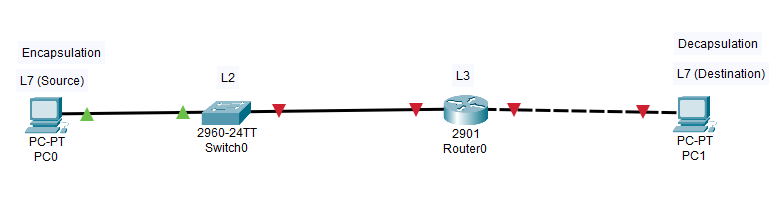
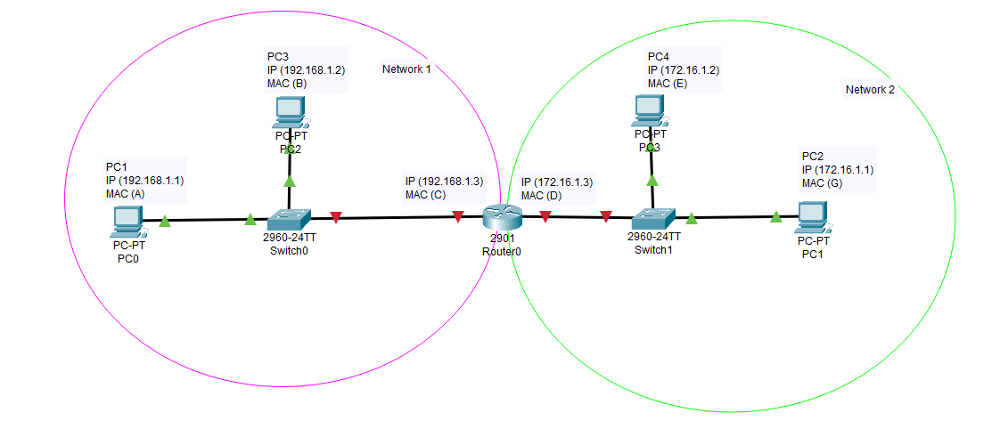

<link href="../styles.module.css" rel="stylesheet">
<link rel="preconnect" href="https://fonts.googleapis.com">
<link rel="preconnect" href="https://fonts.gstatic.com" crossorigin>
<link href="https://fonts.googleapis.com/css2?family=Cedarville+Cursive&display=swap" rel="stylesheet">
<link rel="preconnect" href="https://fonts.googleapis.com">
<link rel="preconnect" href="https://fonts.gstatic.com" crossorigin>
<link href="https://fonts.googleapis.com/css2?family=Cedarville+Cursive&family=Zen+Tokyo+Zoo&display=swap" rel="stylesheet">
<link rel="preconnect" href="https://fonts.googleapis.com">
<link rel="preconnect" href="https://fonts.gstatic.com" crossorigin>
<link href="https://fonts.googleapis.com/css2?family=Cedarville+Cursive&family=Encode+Sans+SC&family=Zen+Tokyo+Zoo&display=swap" rel="stylesheet">

## Cisco Certified Network Associate Notes By Shatha Barqawi

  

# Chapter 3 : Protocols & Models

Saturday, 17/8/2021 

  

###  Protocols Can Be Used For  
1. Message Encoding.  
 The process of converting the message into the proper format which ensures that all the devices understand each other.  

2. Message Delivery.  
 * *Unicast:* one-to-one communication. 
 * *Multicast:* one-to-many communication (Everyone gets the message but the reply is expected only from specific recievers).
 * *Broadcast:* one-to-all communication.  

3. Message Formatting(Encapsulation).  
* Who's the sender?, Who's the Reciever?, what's the message; in general a description of the shape of the data.

4. Message Timing.  
* Access Method.
* Flow Control to not have an congestion or collisions.  
* Response Timeout, so that there would be a specific period of time if it passed the sender knows for sure that the reciever didn't get the message (I think also there's the possibility of the sender not getting the acknowledgement .not sure.).  

5. Message Size.
The message size don't think it needs much explanation.
   
  

###  Network Protocls' Types  
1. Network Communication Protocol.
2. Network SEcurity Protocol (e.g. SSH).
3. Routing Protocol (Best Path).
4. Service Discrovery Protocol (e.g. DHCP & DNS).  

  

### Protocols' Functions  

1. Addressing.  
 * Provide the IP addresses for the source and destination
 * The MAC addresses for the source and destination.  
2. Reliability.  
  * Ensure the reliability of the network. Meaning?  
  That the data gets sent and recieved however the state of that data is.  

3. Flow Control.  
* Controlling the data flow in the network (Who's allowed to send and who's not).  

4. Sequencing.  
* Segmentation happens on the sender's side where the data gets segmented and then each segment will be assigned a sequence number so that the receiver will be able to reassemble the segments in the right order.   

5. Error Detection.  
* Making sure that the data isn't corrupted while being sent to the receiver along the way.    

6. Application Interface.   
* Some protocols are there to facilitate the communications between a user and an application or between applications.  

  

### TCP/IP Protocol Suite (Reference Model #1: TCP/IP Model)  
* It includes  
  1. Open Standard Protocols Suite.  
  Protocols that anyone is allowed to use(e.g. IP).  

  2. Standard-based Protocols Suite.  
  Protocols that are made by and for a specific company or vendor (e.g.EIGRP which is only to be used by CISCO).  

* How Does the TCP/IP Model Look Like(which's the first reference model we'll be talking about)?  
  
  | # | Layer Name     | Protocols of the Layer                                           |
  |---|----------------|------------------------------------------------------------------|
  | 4 | Application    | DNS, DHCP, HTTP, HTTPS, FTP, TFTP & for emails: SMTP, POP3 & IMAP |
  | 3 | Transport      | TCP & UDP                                                        |
  | 2 | Internet       | IPv4, IPv5, OSPF, ICMP, EIGRP & BGP                              |
  | 1 | Network Access | ARP, WLAN & Ethernet                                             |

  

### 4 Application Layer Protocols 
* Name System: 
   * DNS 
   * DHCPv4
   * DHCPv6
   * SLAAC  
* Email:
  * SMTP
  * POP3
  * IMAP 
* File Transfer: 
   * FTP (TCP).
   * TFTP (UDP).
   * SFTP (secure!!). 
* Web:
   * HTTP
   * HTTPS

  

### 3 Transport Layer Protocols  

* TCP (Transmission Control Protocol).  
  It's reliable and connection-oriented.  

* UDP (User Datagram Protocol).  
  Connectionless.  

    

### 2 Internet Layer Protocols  
* Internet Protocols
  * IPv4
  * IPv6
* Messaging Protocols
  * NAT //more on that later 
  * ICMPv4
  * ICMPv6
  * ICMP(ND)//more on that later 
* Routing Protocols
  * OSPF
  * EIGRP
  * RIP
  * BGP  

   

### 1 Network Access Layer Protocols  

* ARP (Address Resolution Protocol).  
  Maps between IP addresses and MAC addresses.  

* Data Link Protocol.  
  Decides the type of the connection (Ethernet or WLAN). 

  

### OSI Model (Open System Interconnection, Reference Model #2)  

  

  

### 1 Physical Layer  
Keywords:  
  * Bits, light or signal.
  * Copper, fiber or wireless.
  * NIC or port.  

PDU: Light or Signal
  

### 2 Data Link Layer  
keywords:
  * Move within same network.
  * MAC Address.

PDU: Frames
  

### 3 Network Layer  
Keywords: 
  * IP. 
  * Routing. 
  * Choose best path.
  * Move between networks.

PDU: Packets
  

### 4 Transport Layer  
Keywords:  
  * Segmentation. 
  * Sequencing.  
  * Reassemble.  
  
PDU: Segments
  

### 5 Session Layer  
Keywords: 
  * Provides services for presentation.  
  
PDU: Data
  

### 6 Presentation Layer  
Keywords: 
  * .jpg, .txt or .js  

PDU: Data
  

### 7 Application Layer  
Keywords: 
  * User Interface.
  
PDU: Data

  

### Small Network Example  
1. 
  

2.  
* In the previous illustrator we can see that the switches connect different devices in the single network whereas the routers connect different networks together and that's why the router has *2 IP addresses* and *2 MAC addresses*.  
  
* As we can also observe that when the first 3 octets of the IP address of the devices are the same it means they're in the same network.  

* So what happens here is that the message, let's assume sent from PC1 to PC2 and the IP address of PC2 but the mac address of the router, goes through the first switch as a frame and the switch sees the MAC of the router so it sends the message to it then the router checks the IP address and changes the MAC into the MAC of PC2 so that the switch in the 2nd network would know where to send the message.  
  
* How the message looked like when it got out from PC1

  | SMAC | DMAC | SIP         | DIP        | TCP Header | Data |
  |------|------|-------------|------------|------------|------|
  |   A  |   C  | 192.168.1.1 | 172.16.1.1 |      -     |   -  |
  
 

* How the message looked like after it got out of the router  

  | SMAC | DMAC | SIP         | DIP        | TCP Header | Data |
  |------|------|-------------|------------|------------|------|
  |   D  |   G  | 192.168.1.1 | 172.16.1.1 |      -     |   -  |
