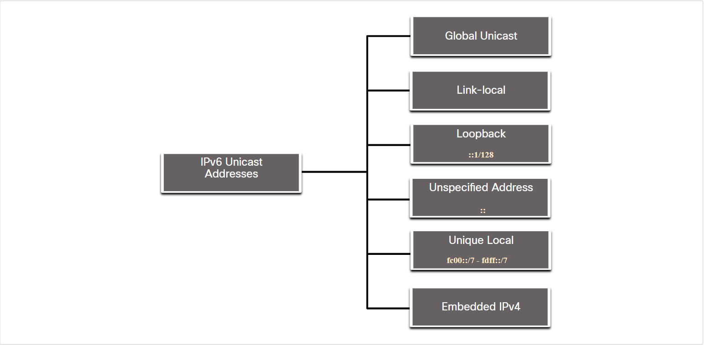
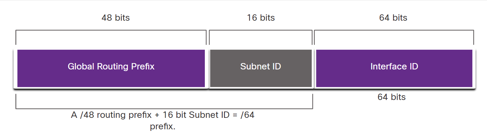
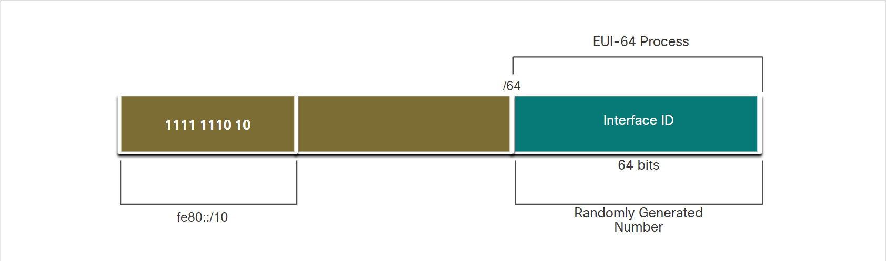

<link href="../styles.module.css" rel="stylesheet">
<link rel="preconnect" href="https://fonts.googleapis.com">
<link rel="preconnect" href="https://fonts.gstatic.com" crossorigin>
<link href="https://fonts.googleapis.com/css2?family=Cedarville+Cursive&display=swap" rel="stylesheet">
<link rel="preconnect" href="https://fonts.googleapis.com">
<link rel="preconnect" href="https://fonts.gstatic.com" crossorigin>
<link href="https://fonts.googleapis.com/css2?family=Cedarville+Cursive&family=Zen+Tokyo+Zoo&display=swap" rel="stylesheet">
<link rel="preconnect" href="https://fonts.googleapis.com">
<link rel="preconnect" href="https://fonts.gstatic.com" crossorigin>
<link href="https://fonts.googleapis.com/css2?family=Cedarville+Cursive&family=Encode+Sans+SC&family=Zen+Tokyo+Zoo&display=swap" rel="stylesheet">

## <span class="copyright">Cisco Certified Network Associate Notes <span style="float:right;">By Shatha Barqawi</span>

<br/><br/>

# <span class="title">Chapter 12: IPv6

<span class="date">Monday, 9/8/2021</span> 

<br/><br/>

* Why IPv6 is needed?
  * Because we're running out of IPv4 addresses.
  * NAT is problematic for many applications, creates latency, and has limitations that severely impede peer-to-peer communications.

<br/><br/>

### <span class="[chapterColor] subtitle">Length of IPv6
* 128 bit.
* First 48 bits is called **Global Routing Prefix**.
* Then the next 16 bit are called **Subnet ID**.  
* The last 64 bits are called **Interface ID**.
* So IPv6 is divided into 3 portions instead of 2 as in IPv4.


<br/><br/>

### <span class="[chapterColor] subtitle">Format to Write IPv6 In  
* *Preferred format* x:x:x:x:x:x:x:x each one of these x's is called a "Hextet" because it's 16 bits or 4 hex's.
* Rules to write the ipv6 in the *compressed format*:
  1. Omit Leading 0s.
  2. Double colon: 
   * Can replace any single, contiguous string of one or more 16-bit hextets consisting of all zeros. 
   * It can only occur just once (we can't put it more than once).
   * If an address has more than one contiguous string of all-0 hextets, best practice is to use the double colon (::) on the longest string. If the strings are equal, the first string should use the double colon (::).

<br/><br/>

### <span class="[chapterColor] subtitle">Categories of IPv6 Addresses  

* Unicast  
  An IPv6 unicast address uniquely identifies an interface on an IPv6-enabled device.
* Multicast  
  An IPv6 multicast address is used to send a single IPv6 packet to multiple destinations.
* Anycast  
  An IPv6 anycast address is any IPv6 unicast address that can be assigned to multiple devices. A packet sent to an anycast address is routed to the nearest device having that address.

* Unlike IPv4, IPv6 does not have a *broadcast* address. However, there is an IPv6 all-nodes multicast address that essentially gives the same result.

<br/><br/>

### <span class="[chapterColor] subtitle">Prefix Length  

* The prefix length can range from 0 to 128. The recommended IPv6 prefix length for LANs and most other types of networks is /64.  
* It is strongly recommended to use a 64-bit Interface ID for most networks. This is because stateless address autoconfiguration (SLAAC) uses 64 bits for the Interface ID. It also makes subnetting easier to create and manage.
  
<br/><br/>

### <span class="[chapterColor] subtitle"> IPv4 and IPv6 Coexistence  

* Tunnel  
  * Tunnels only work with IPv4 so if we have a packet with ipv6 we encapsulate it with another packet that has an IPv4 as source and destination IP.
  * GRE does the encapsulation.
  * DMVPN does encapsulation and encryption.

* Dual-Stack  
  * When a device has 2 ip addresses (IPv4 and IPv6).
  * **Native IPv6** which is using only IPv6.

* NAT64
  * Allows me to transform IPv6 into IPv4.
  * Network Address Translation 64 (NAT64) allows IPv6-enabled devices to communicate with IPv4-enabled devices using a translation technique similar to NAT for IPv4. An IPv6 packet is translated to an IPv4 packet and an IPv4 packet is translated to an IPv6 packet.

<br/><br/>

### <span class="[chapterColor] subtitle">Types of IPv6 Unicast Addresses  

  

* Typically, IPv6 addresses have 2 unicast addresses:
  1. Global Unicast Address(GUA)  
     * Similar to Public IPv4 address.
     * Globally unique and internet-routable.
     * Can be configured statically or dynamically. 
        
     * Global Routing Prefix
       * It's assigned by the ISP.
       * /48 prefixes are a common global routing prefix.
       * The size of the global routing prefix determines the size of the subnet ID.
     * Subnet ID  
       * Unlike IPv4 where we have to borrow bits from the host to make subnets, IPv6 was built with subnetting in mind. The subnet ID is used by an organization to identify subnets within its site (The larger the subnet ID, the more subnets available).
       * Using a typical /64 prefix length, the first four hextets are for the network portion of the address, with the fourth hextet indicating the Subnet ID. The remaining four hextets are for the Interface ID.  
     * Interface ID  
       * The IPv6 interface ID is equivalent to the host portion of an IPv4 address. The term Interface ID is used because a single host may have multiple interfaces, each having one or more IPv6 addresses.  

     * GUA static configuration on a router R1:  
       ```console
       R1(config)# interface gigabitethernet 0/0/0
       R1(config-if)# ipv6 address 2001:db8:acad:1::1/64
       R1(config-if)# no shutdown
       R1(config-if)# exit
       R1(config)# interface gigabitethernet 0/0/1
       R1(config-if)# ipv6 address 2001:db8:acad:2::1/64
       R1(config-if)# no shutdown
       R1(config-if)# exit
       R1(config)# interface serial 0/1/0
       R1(config-if)# ipv6 address 2001:db8:acad:3::1/64
       R1(config-if)# no shutdown
       ```
     * GUA can be assigned automatically (dynamically) using either 2 ways:
       * Stateless Address Autoconfiguration(SLAAC).
       * Stateful DHCPv6. 
     * Dynamic Addressing for IPv6 GUAs
       * RS and RA Messages: RA (Router Advertisment) is sent from the router to any IPv6-enabled device or as a response to an RS (Router Solicitation) sent from a host to the router (Both are sent through ICMPv6).
       * The RA message is a suggestion that's sent to a device on how to obrain an IPv6 GUA and it contains:
         * Network prefix and prefix length.
         * Default gateway address.
         * DNS addresses and domain name.
       * There are 3 methods for RA messages:
          1. SLAAC (*I have everything you need including the prefix, prefix length, and default gateway address*).
             * This is a method that allows a device to create its own GUA without the help of a DHCPv6 server.
             * So in this technique, devices rely on ICMPv6 RA messages to get what it need.  
             * The process would be as follows: 1. The router sends an RA message with the prefix for the local link. 2. Th PC uses SLAAC to obtain a prefix from the RA message and creates its own interface ID either using EUI or a randomly generated 64-bit number.   
          2. SLAAC with a stateless DHCPv6 server (*Here's my information but you need to get other information such as DNS addresses from a stateless DHCPv6 serve*).
             * The process is as follows:
               1. The PC sends an RS to all IPv6 routers "I need addressing Info".
               2. The router sends an RA message with "here's your prefix, prefix-length and default gateway info. You'll need DNS information from a DHCPv6 server".  
               3. The PC sends a DHCPv6 solicit message to all DHCPv6 servers.
          3. Stateful DHCPv6 (no SLAAC) (*I can give you your default gateway address. You need to ask a stateful DHCPv6 server for all your other information*).  
               * Stateful DHCPv6 is similar to DHCP for IPv4.
               * The process:
                 1. PC sends RS to all IPv6 routers.
                 2. The router sends all IPv6 nodes an RA message with method 3 specified.
                 3. PC sends DHCPv6 solicit message to all DHCPv6 servers.
               * A stateful DHCPv6 server allocates and maintains a list of which device receives which IPv6 address. DHCP for IPv4 is stateful.   
        * The interface ID with method 1 and 2 is generated by the device itself using either 2 ways:
          1. EUI-64 Process: 
             * This process uses the 48-bit ethernet MAC address of a client and inserts another 16 bits in the middle of the 48-bit MAC address to create a 64-bit interface ID.
             * The MAC address is made up of 2 parts (Organizationally Unique Identifier(OUI)which are the first 24 bits) and  the (Device Identifier which is the left 24 bits).  
             * An EUI-64 Interface ID is made up of 3 parts (24-bit OUI from the MAC but the 7th bit is reversed), (The inserted 16-bit value FFFE) and the (24-bit device identifier from the client MAC address). 
           2. Randomly generated interface IDs  
              * To ensure the uniqueness of any IPv6 unicast address, the client may use a process known as Duplicate Address Detection (DAD). This is similar to an ARP request for its own address. If there is no reply, then the address is unique.   

     * Note: Unlike IPv4, in IPv6, the all-0s and all-1s host addresses can be assigned to a device. The all-1s address can be used because broadcast addresses are not used within IPv6. The all-0s address can also be used, but is reserved as a Subnet-Router anycast address, and should be assigned only to routers.

  2. Link-local address(LLA)  
     * Required for every IPv6-enabled device.  
     * It can't be routed beyond the link that it's confined to.
     * It should be unique only to this link.  
     * If an LLA is not configured manualy on an interface, the device will automatically create its own without communicating with a DHCP server. And the LLA is generated dynamically either by using randomly generated interface ID or by using the Extended Unique Identifier (EUI) which uses client MAC address with additional bits.  
     * Static configuration of LLA 
       ```console
       R1(config)# interface gigabitethernet 0/0/0
       R1(config-if)# ipv6 address fe80::1:1 link-local
       R1(config-if)# exit
       R1(config)# interface gigabitethernet 0/0/1
       R1(config-if)# ipv6 address fe80::2:1 link-local
       R1(config-if)# exit
       R1(config)# interface serial 0/1/0
       R1(config-if)# ipv6 address fe80::3:1 link-local
       R1(config-if)# exit
       ```
     * The exact same LLA could be configured on each link as long as it is unique on that link. This is because LLAs only have to be unique on that link. However, common practice is to create a different LLA on each interface of the router to make it easy to identify the router and the specific interface.

     * Typically, it is the LLA of the router, and not the GUA, that is used as the default gateway for other devices on the link.  

     * Dynamically assigning LLAs  
       * This illustration explains it all  
         
       * Operating systems, such as Windows, will typically use the same method for both a SLAAC-created GUA and a dynamically assigned LLA.

  3. Unique Local Address  
     * Range FC00::/7 to FDFF::/7.
     * It's not yet implemented.  
     * It have similarity to private addresses for IPv4.  

<br/><br/>

### <span class="[chapterColor] subtitle">TTL in IPv4 is Hop Limit in IPv6

<br/><br/>

### <span class="[chapterColor] subtitle">ICMPv6  
* No Fragmentation


<br/><br/>

### <span class="[chapterColor] subtitle">Assigned IPv6 Multicast Addresses

* IPv6 multicast addresses have the prefix ff00::/8.  
* Two types of IPv6 multicast addresses:
  1. Well-known multicast addresses.  
      * Two common IPv6 assigned multicast groups: **ff02::1 All-nodes multicast group which has the same effect as a broadcast in IPv4** and **FF02::2 All-routers multicast group**
  2. Solicited node multicast addresses.
