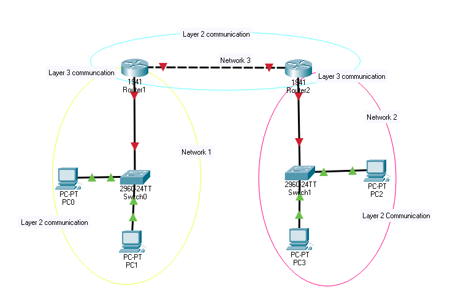
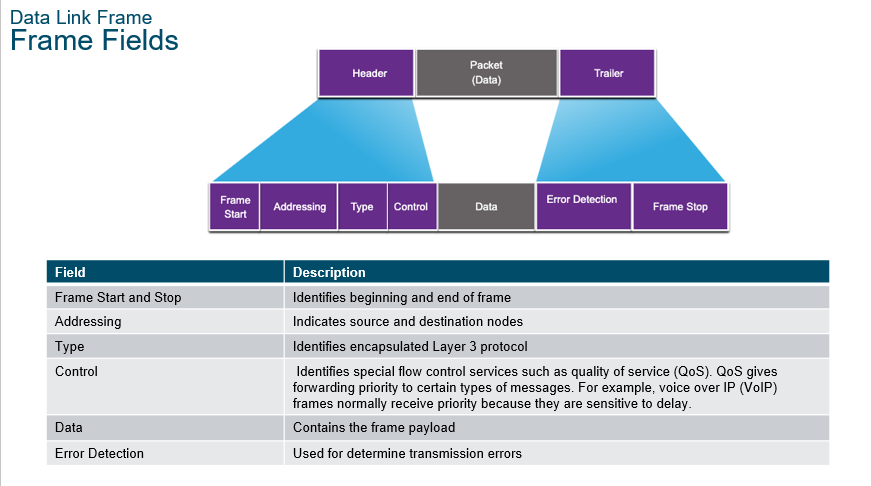

<link href="../styles.module.css" rel="stylesheet">
<link rel="preconnect" href="https://fonts.googleapis.com">
<link rel="preconnect" href="https://fonts.gstatic.com" crossorigin>
<link href="https://fonts.googleapis.com/css2?family=Cedarville+Cursive&display=swap" rel="stylesheet">
<link rel="preconnect" href="https://fonts.googleapis.com">
<link rel="preconnect" href="https://fonts.gstatic.com" crossorigin>
<link href="https://fonts.googleapis.com/css2?family=Cedarville+Cursive&family=Zen+Tokyo+Zoo&display=swap" rel="stylesheet">
<link rel="preconnect" href="https://fonts.googleapis.com">
<link rel="preconnect" href="https://fonts.gstatic.com" crossorigin>
<link href="https://fonts.googleapis.com/css2?family=Cedarville+Cursive&family=Encode+Sans+SC&family=Zen+Tokyo+Zoo&display=swap" rel="stylesheet">

## Cisco Certified Network Associate Notes By Shatha Barqawi

  

# Chapter 6 : Data Link Layer

Monday, 26/7/2021 

  

### Data Link Layer Functionalities  
1. Communication between devices in the same network.
2. The type of addressing used in this layer is *MAC Address/Physical Address*.
3. Error Detection.
4. Control the data on the media (Prevention or Detection of Collisions).

  

### Why Does Error Detection Happen in this Layer?   
Because most of the corruption of data happens in the physical layer.

  

### Two Sublayers Divide the Data Link Layer  
1. Logical Link Control Sublayer (LLC)
   Which provides communication between hardware layers and software layers.  

2. MAC Sublayer  
   It has multiple functionalities:
   * Frame Delimiting, which's the process of building the ethernet header, in other words, building the structure of the frame.
   * Addressing, which's, as the name suggests, adding the source MAC address and the destination MAC address.
   * Error Detection, which's also as the name suggests, the process of checking if there are any problems with the frame.  
   * Media Access Control, which's the process of controlling collisions that are or might be encountered (with the help of CSMA/CD or CSMA/CA).

  

### MAC Address  
* Is written in Hexadecimal to be precise it consists of 12 hexa digits.  
* It exists so that devices on the same network can communicate with each other.  
* Example on a MAC address: ABCD.1234.56FP
* The first part " ABCD.12 " is called the OUI (Organizational Unique Identifier). 
* The second part " 34.56FP " is *Vendor Assigned*.  

 

* If we're talking about **switches** each one has only **one MAC address**. 
* On the other hand, **routers** have a **MAC address for each port**.  

 

* To know a MAC address of the PC open CMD on it and write the command `ipconfig /all`.  

* Levels of communications through a network  
  

  

### Network Documentation and Topologies  
For people to understand our network we have to document it in a way or another so we use Physical Topologies and Logical Topologies to do just that.  

* Physical Topology  
  * What is it?  
   Quoted from *Techopedia*  
     <blockquote>
     
     *The method employed to connect the physical devices on the network with the cables, and the type of cabling used, all constitute the physical topology.*
     </blockquote>

   * Common WAN Physical Topologies  
     1. Point-to-Point.  
      The devices are connected to each other directly but they don't really have to be connected to each other directly in a physical way.  
      Meaning there could be other intermediery devices between them.

     2. Hub and Spoke.  
      The hub with each spoke has a point to point relationship.  
      Sometimes there could be multiple hubs and this is for if one hub goes down the other one would take after it without the whole network going down.    
        

     3. Full Mesh.   
             
 

   * Common LAN Physical Topologies  
      1. Bus.  
           
         IT'S LEGACY.  

      2. Ring.  
           
         IT'S LEGACY TOO.  

      3. Star.  
           
         It's used nowadays.  
         The device in the middle could be a *switch* or a *hub*.  

      4. Extended-star.  
           
         It's also used nowadays.
   

 

* Logical Topology  
  * What do we mean by it?  
     Quoted from *Educba*  
     <blockquote>
     
     *The logical topology deals with network protocols that are used to control the data flow across the network. The ethernet protocol is the most common protocol used for logical topology.*
     </blockquote>

  

### Half and Full Duplex  

*  Half Duplex  
    * The sender sends and when the sending process finishes the sender can receive it can't send and recieve at the same time and if it does happen it results in a collision.  
  
    * Hubs and wireless connections can only use half duplex.  

*  Full Duplex   
    * No collisions EVER.
    * Devices can send and recieve whenever they want. 
    * Switches are always full duplex. Routers too! 

* Quoted from *Wikipedia*  
   <blockquote>
   
    *In a full-duplex system, both parties can communicate with each other simultaneously. An example of a full-duplex device is plain old telephone service; the parties at both ends of a call can speak and be heard by the other party simultaneously. The earphone reproduces the speech of the remote party as the microphone transmits the speech of the local party. There is a two-way communication channel between them, or more strictly speaking, there are two communication channels between them.*

    *In a half-duplex or semiduplex system, both parties can communicate with each other, but not simultaneously; the communication is one direction at a time. An example of a half-duplex device is a walkie-talkie, a two-way radio that has a push-to-talk button. When the local user wants to speak to the remote person, they push this button, which turns on the transmitter and turns off the receiver, preventing them from hearing the remote person while talking. To listen to the remote person, they release the button, which turns on the receiver and turns off the transmitter.*
   </blockquote>

       

### Contention-Based Access Methods  
   These methods are used in networks operating in half duplex mode.

   1. CSMA/CD (Carrier Sense Multiple Access/Collision Detection).
      * Used in legacy bus topology ethernet LANs.
      * So it happens when devices transmit data simultaneously on a shared media these devices detect the collision and then wait a random amount of time and retrasmit (e.g. both of the devices could wait the same amount of time and have another collision).  
   

   2. CSMA/CA (Carrier Sense Multiple Access/Collision Aviodance)  
        * Used in wireless LANs.  
        * The duration needed for the transmission is included with the data being transmitted so that the other devices would know this duration and how long the media won't be available (How long they have to wait to be able to send).
    
       

### Data Encapsulation in the Data Link Layer  

* The packet is to be encapsulated by a *header* and *trailer* for it to become a frame.  
* Later, we will be talking about the *Ethernet Header* but there are other types of headers for frames. Choosing the type of header depends on the type of media we have.   
* I found this descriptive enough  
    

  

### Ethernet is Best Effort Delivery  
It's called that way because the ethernet protocol in layer 2 sends data without guaranteeing that the data was delivered (recieved) or not. That's the Transport Layer's job.  
