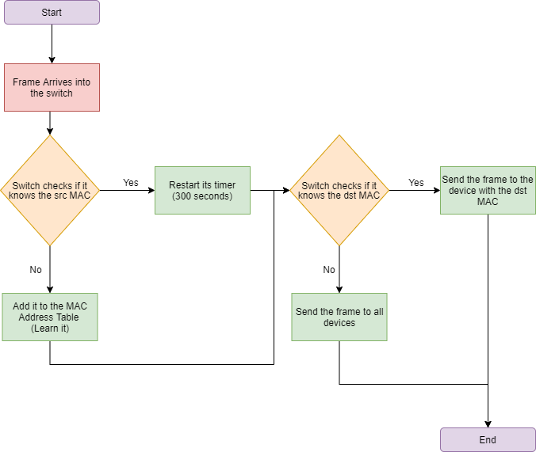

<link href="../styles.module.css" rel="stylesheet">
<link rel="preconnect" href="https://fonts.googleapis.com">
<link rel="preconnect" href="https://fonts.gstatic.com" crossorigin>
<link href="https://fonts.googleapis.com/css2?family=Cedarville+Cursive&display=swap" rel="stylesheet">
<link rel="preconnect" href="https://fonts.googleapis.com">
<link rel="preconnect" href="https://fonts.gstatic.com" crossorigin>
<link href="https://fonts.googleapis.com/css2?family=Cedarville+Cursive&family=Zen+Tokyo+Zoo&display=swap" rel="stylesheet">
<link rel="preconnect" href="https://fonts.googleapis.com">
<link rel="preconnect" href="https://fonts.gstatic.com" crossorigin>
<link href="https://fonts.googleapis.com/css2?family=Cedarville+Cursive&family=Encode+Sans+SC&family=Zen+Tokyo+Zoo&display=swap" rel="stylesheet">

## Cisco Certified Network Associate Notes By Shatha Barqawi

  

#  Ethernet Switching

Tuesday, 27/7/2021 

  

### Ethernet Encapsulation  

* Ethernet operates in both the physical and data link layers. 
* Ethernet supports data bandwidths of the following
  * 10 Mbps  
    100 Mbps  
    1000 Mbps (1 Gbps)  
    10,000 Mbps (10 Gbps)  
    40,000 Mbps (40 Gbps)  
    100,000 Mbps (100 Gbps)  

  

### Frame Fields  

* Maximum size of the frame is 1518 bytes and the minimum is 64 bytes.
* If the frame recieved was of size greater than 1518 bytes it is called a Jumbo Frame (GET BACK TO IT!)
   

  

### Preamble  

  * We don't include the preamble with the size of the frame.  
  * It takes 8 bytes.
  * It contains 7 bytes of rubbsih values for *synchronization*, and 1 byte to point the start of the frame.

  

### Type  
   
   * The field that is called *length* in the previous illustration is the same as the type field.
   * If it was 0x800 then it means IPv4.
   * If it was 0x86DD then its IPv6.
   * If it was 0x806 then it indicates ARP.  

  

### Frame Check Sequence (FCS)  

   * It uses the CRC (Cyclic Redundancy Check) which is a value that relies on a specific calculation which is calculated first in the sender and then the same calculation is done in the reciever and the value of that calculation is compared with the sent value if they're not equal then the frame is dropped.

  

### Ethernet MAC Address  

* It's consisting of 48 bits (24-bits for OUI && 24-bits for Vendor Assignment).

* Destination MAC address could be  
  * Unicast MAC Address
  * Multicast MAC Address  
     To send a message to multiple recievers the MAC should start with  
       * 01-00-5E type IPv4.
       * 33-33    type IPv6.  
  
  * Broadcast MAC Address  
    To broadcast a message the MAC address has to be like this  
      * FF-FF-FF-FF-FF-FF  

  

### MAC Address Table aka Content Addressable Memory(CAM)  
* This table is stored in the switch's RAM.
* It's the place where the switch stores the MAC addresses of the devices it learned along with the device's port.
* What is the process that the switch does to learn MAC addresses?  
   
  * The learning process only happens to incoming frames not outgoing ones  
  * If the 5 minutes (300 seconds) that the timer of the switch sets for each MAC address (device) are finished the MAC address is removed from the table. Why have such functionality? Because there's a possiblity that the device was removed from the network so there's a timer that keeps being set every time the switch recieves traffic from the devices.

* When the communication is Multicast or Broadcast it's the same as the *unknown unicast, which's when the MAC is not in the table,* which means that the switch sends the message to all devices except for the sender if it detects a multicast or broadcast (from the MAC addresses we talked about before).
* Which means that the switch doesn't discern between multicast or broadcast.  

  

### Frame Forwarding Methods  
 1. Store and Forward Switching.  
   First the whole frame is recieved then error detection then forwarding.
 2. Cut-Through Switching.  
   Could be  
      * Fast Forwarding (THE WORST).
        The moment the switch recieves the dst MAC address the frame forwarding strats without any error detection.  

      * Fragment Free.
        There's no error detection but it checks for runts.  
        
        Runt or fragment is a frame that is of size less than 64 byte. 
        Collisions result in runts and they're dropped.  
 
        Jumbo Frames are the complete opposite, they are the frames that are larger than 1518 the switch either drops it or new devices support it.   

  * Where are the frames stored before they're forwarding?  
    In buffers which can be of two types:
      1. Port Based Buffer  
          Each port has a buffer of its own.
      2. Shared Buffer  
          If any port needs more memory it uses this buffer.

  * Engineers avoid Bottle Necks because when they happen it means that all the buffers are full because the traffic is way too much and the network has to drop everything to solve the problem.  
  * So the configurations should be set properly.  

  

### Broadcast Domain & Collision Domain  

* Broadcast Domain  
  * Every network is considered broadcast domain.
  * Broadcast traffic does not go out of the single network.
  * Each port on the router is a broadcast domain.  
  * Each switch is a broadcast domain.
  * 

* Collision Domain  
  * Each switch port is a collision domain.  
  * A hub with anything connected to it is considered one collision domain.  

* Whether the network was half or full duplex the collision and broadcast domains stay as is but as we know there are no collisions in full duplex CRAP.  
* MAKE THE EXAMPLE ON PACKETTRACER.  

  

### ARP (Address Resolution Protocol) Small Introduction    

________ SO IMPORTANT_______  

* What is the point of the ARP?  
    The PC doesn't know the destination MAC address so it sends an ARP request where the dst MAC is FF-FF-FF-FF-FF-FF (always broadcast) and an ARP request is added to the frame and this request has the following "Who Has the MAC of 192.168.1.3?" and this frame is sent to the switch which sees the MAC is broadcast and sends it to all the devices except for the one that sent it in the first place then the proper device sends an ARP reply that has its MAC address as the source MAC so the switch learns the MAC and the PC has a MAC to put as a destination MAC and sends its message where the switch knows the device. 