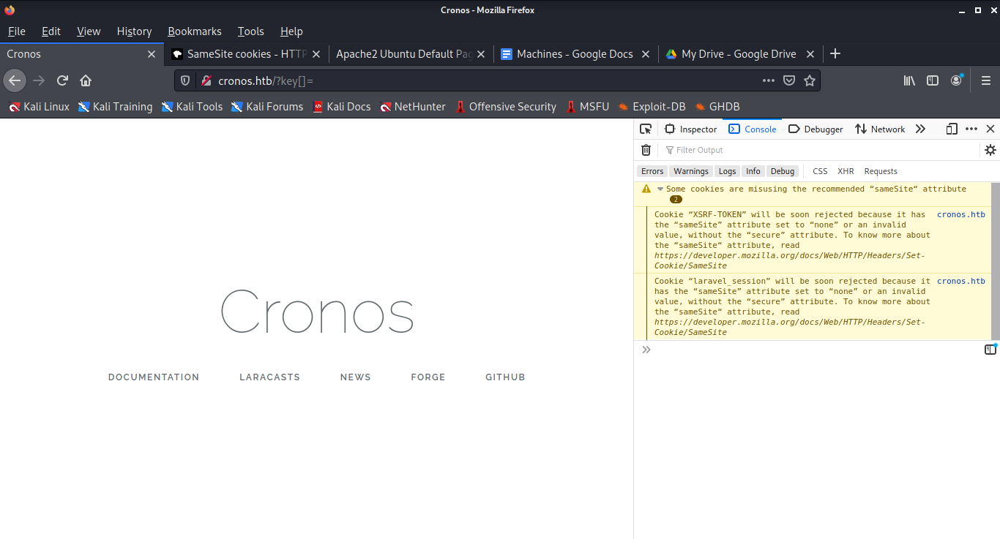
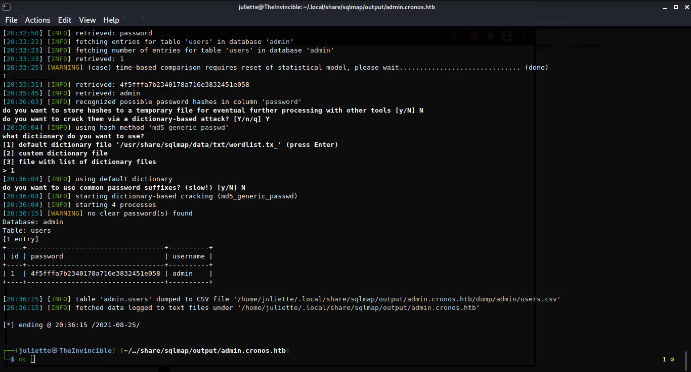

<link href="../../styles.module.css" rel="stylesheet">
<link rel="preconnect" href="https://fonts.googleapis.com">
<link rel="preconnect" href="https://fonts.gstatic.com" crossorigin>
<link href="https://fonts.googleapis.com/css2?family=Cedarville+Cursive&display=swap" rel="stylesheet">
<link rel="preconnect" href="https://fonts.googleapis.com">
<link rel="preconnect" href="https://fonts.gstatic.com" crossorigin>
<link href="https://fonts.googleapis.com/css2?family=Cedarville+Cursive&family=Zen+Tokyo+Zoo&display=swap" rel="stylesheet">
<link rel="preconnect" href="https://fonts.googleapis.com">
<link rel="preconnect" href="https://fonts.gstatic.com" crossorigin>
<link href="https://fonts.googleapis.com/css2?family=Cedarville+Cursive&family=Encode+Sans+SC&family=Zen+Tokyo+Zoo&display=swap" rel="stylesheet">  

## <span class="copyright">Machine #5<span style="float:right;">By Shatha Barqawi</span>

<br/><br/>

# <span class="title">Cronos


<span class="date">Thursday, 26/8/2021</span> 


<br/> 

<span class="helpmach subtitle">Task #1</span> Nmaping aggressively and banner grabbing all at once
```
PORT   STATE SERVICE VERSION
22/tcp open  ssh 	OpenSSH 7.2p2 Ubuntu 4ubuntu2.1 (Ubuntu Linux; protocol 2.0)
| ssh-hostkey:
|   2048 18:b9:73:82:6f:26:c7:78:8f:1b:39:88:d8:02:ce:e8 (RSA)
|   256 1a:e6:06:a6:05:0b:bb:41:92:b0:28:bf:7f:e5:96:3b (ECDSA)
|_  256 1a:0e:e7:ba:00:cc:02:01:04:cd:a3:a9:3f:5e:22:20 (ED25519)
53/tcp open  domain  ISC BIND 9.10.3-P4 (Ubuntu Linux)
| dns-nsid:
|_  bind.version: 9.10.3-P4-Ubuntu
80/tcp open  http	Apache httpd 2.4.18 ((Ubuntu))
|_http-server-header: Apache/2.4.18 (Ubuntu)
|_http-title: Apache2 Ubuntu Default Page: It works
Service Info: OS: Linux; CPE: cpe:/o:linux:linux_kernel
``` 

<br/><br/> 

<span class="helpmach subtitle">Task #2</span> Searchsploiting Laravel 8  
<span class="helpmach subtitle">Results #2</span>
  * I got a part of the version "8.x" from the documentation link on the website.
  * I think the website opens on version 8 by default. There's no solid proof that the one I have is 8.

<br/><br/> 

<span class="helpmach subtitle">Task #3</span> Versions I found in the `/js` directory  
<span class="helpmach subtitle">Result #3</span>  
  ```
  Vue.js v2.1.10
  jQuery JavaScript Library v3.1.1
  Sizzle CSS Selector Engine v2.3.3
  Bootstrap v3.3.7
  ```
<br/><br/> 

<span class="helpmach subtitle">Task #4</span> Searchsploited Bootstrap  
<span class="helpmach subtitle">Results #4</span>  
```
Bootstrapy CMS - Multiple SQL Injection  
e107 2 Bootstrap CMS - Cross-Site Scripting
```

* The SQL injection might be something but I think I have to find something else first because of the links in the PoC of it.  

<br/><br/> 

<span class="helpmach subtitle">Task #5</span> Gobustering `cronos.htb`  
<span class="helpmach subtitle">Results #5</span>  
  ```
  /css  
  /favicon.ico                            	 
  /index.php                      	 
  /js               	
  /robots.txt       	                      	 
  /robots.txt       	                        	 
  /server-status 
  ```


<br/><br/> 

<span class="helpmach subtitle">Task #6</span> What can I do with the  `robots.txt` file on a webserver?     
<span class="helpmach subtitle">Result #6</span>   
They say an empty `robots.txt` is as good as no `robots.txt` but it's useless to me it didn't show me any info on the server.


<br/><br/> 

<span class="helpmach subtitle">Task #7</span> Gobustering `10.10.10.13` hoping I'll find something new.  
<span class="helpmach subtitle">Results #7</span> NOTHING

<br/><br/> 

<span class="helpmach subtitle">Task #8</span> Searchsploiting the version of Apache we have  
<span class="helpmach subtitle">Results #8</span>  
```
Apache 2.4.17 < 2.4.38 - 'apache2ctl graceful' 'logrotate' Local Privilege Escalation  
Apache < 2.2.34 / < 2.4.27 - OPTIONS Memory Leak
```  

<br/><br/> 

<span class="helpmach subtitle">Task #9</span> Looking into the notification I got in Mozilla's console  

* I found an error that the samesite attribute of the cookies we have is set to none. Seems like this could expose the website to CSRF.

    

<br/><br/> 

<span class="helpmach subtitle">Task #9</span> Gobustering `cronos.htb` in `dns` mode  
<span class="helpmach subtitle">Result #9</span>  
* Found `admin.cronos.htb`.

<br/><br/> 

<span class="helpmach subtitle">Task #10</span> Sqlmapped the domain `admin.cronos.htb`   
<span class="helpmach subtitle">Result #10</span>  
* I found the admin's password through it (hashed with md5) so I cracked it and logged into the login page in `admin.cronos.htb` and it showed me a webpage that literally executes commands but the nc didn't work until I tried the `mkfifo` payload.  

  