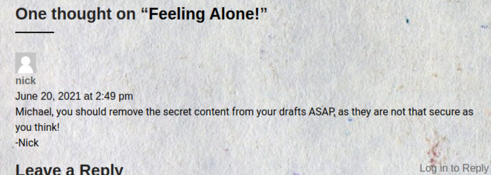
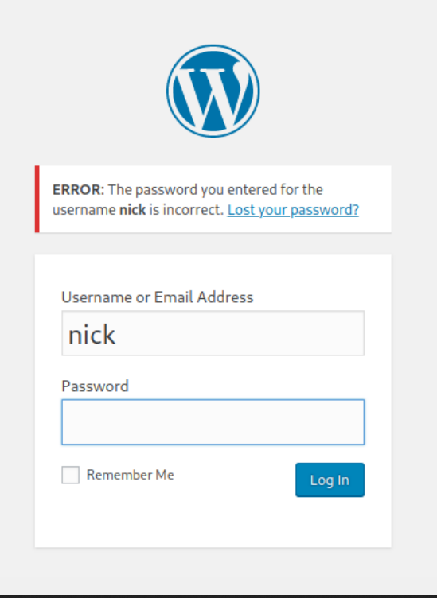

# <span style="color:#CC6699">Machine #19 (Active) Paper</span>  


## <span style="color:#CC6699">Notes During Working on the Machine 🧐🤓   

* Found this in the headers of the response of the http and https. Seems interesting  
  ```
  Server: Apache/2.4.37 (centos) OpenSSL/1.1.1k mod_fcgid/2.3.9
  ```  
* In the body there's this tag that had the following  
  ```html
   <meta name="generator" content="HTML Tidy for HTML5 for Linux version 5.7.28">
  ```  
* What is HTML Tidy and is it relevant? Doesn't seem like it's much  

* Based on Wappalyzer's results the web server is Apache.

* Research fastcgi.
* `gobuster dir -u 10.10.11.143 -x php,cgi,txt,html,md -w ./apache.fuzz.txt -b '404,403,400' -o apache.output.fuzz.txt`
* I think I'm gonna go back to it later.
* The cgi seems like the right path. I think.
* Quoted from Apache's documentation 
  <blockquote>
  It is favored by the PHP developers
  </blockquote>  
  This means that it's a high probability that the backend is written in php.

* I tried an apache exploit for cgi-bin it returned 404 but what was interesting is the `X-Backend-Server` header in the response   
  ```
  HTTP/1.1 404 Not Found
  Date: Fri, 11 Mar 2022 10:41:51 GMT
  Server: Apache/2.4.37 (centos) OpenSSL/1.1.1k mod_fcgid/2.3.9
  X-Backend-Server: office.paper //I'm thinking this could be a virtual host of some kind
  Content-Length: 196
  Content-Type: text/html; charset=iso-8859-1
  ```  

* Turns out it is some kind of a virtual host and when I opened `http://office.paper` I got another response but the `https` didn't give me anything.
* The website seems to be using REST APIs. What made me think this is the structure of the url `http://office.paper/index.php/2021/06/19/feeling-alone/`  

* So nick is revealing more than he should  
    

* So it seems like the website is using *Wordpress* and it's written in *php*.
* `prisonmike` seems like he is the only user that can login. It's not working as the username for the wordpress login
* Seems like the user `nick` exists  
  

* Found this path in source code `http://office.paper/wp-content/uploads/2021/06/Dunder_Mifflin_Inc-150x150.png` for an image it might be useful.  
* Found Wordpress version  
  ```html
  <!-- generator="WordPress/5.2.3" -->
  ```  
* Found this subdomain `http://chat.office.paper/home` and a draft that I found by using an exploit I found for the specific wordpress version we have.  
* Found a bot that I can ask to list files on the system. I can cat the files only.
* `gobuster dns -d office.paper -w SecLists/Discovery/DNS/subdomains-top1million-5000.txt`  

* Queenofblad3s!23

* dwightschrute

<br/><br/>


## <span style="color:#CC6699">How Did I Solve the Machine 😎🥳 


<br/><br/>


## <span style="color:#CC6699">Where I Got Stuck?😡😧  


<br/><br/>


## <span style="color:#CC6699">What Did I learn from this Machine?👀  


<br/><br/>


## <span style="color:#CC6699">Writeups ✍🏽📓   


<br/><br/>


<!-- @nested-tags:EXAMPLE/OF/NESTED/TAGS-->