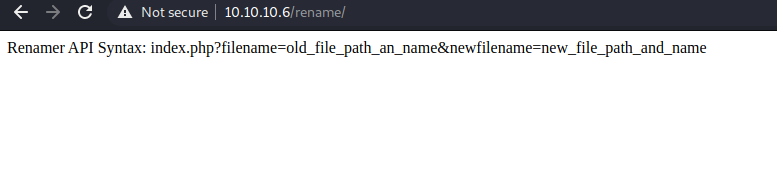
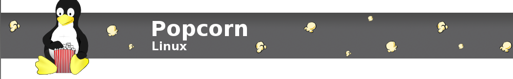

<link href="../../styles.module.css" rel="stylesheet">
<link rel="preconnect" href="https://fonts.googleapis.com">
<link rel="preconnect" href="https://fonts.gstatic.com" crossorigin>
<link href="https://fonts.googleapis.com/css2?family=Cedarville+Cursive&display=swap" rel="stylesheet">
<link rel="preconnect" href="https://fonts.googleapis.com">
<link rel="preconnect" href="https://fonts.gstatic.com" crossorigin>
<link href="https://fonts.googleapis.com/css2?family=Cedarville+Cursive&family=Zen+Tokyo+Zoo&display=swap" rel="stylesheet">
<link rel="preconnect" href="https://fonts.googleapis.com">
<link rel="preconnect" href="https://fonts.gstatic.com" crossorigin>
<link href="https://fonts.googleapis.com/css2?family=Cedarville+Cursive&family=Encode+Sans+SC&family=Zen+Tokyo+Zoo&display=swap" rel="stylesheet">


## <span class="copyright">Machine #7<span style="float:right;">By Shatha Barqawi</span>

<br/><br/>

# <span style="font-family: 'Zen Tokyo Zoo', cursive;">Popcorn


<span class="date">Sunday, 26/9/2021</span> 


<br/> 

## <span style="color:#b980ee;">Reconn

* ### Nmap Results

  * Scan of the most famous ports only
    ```console 
    PORT   STATE SERVICE
    22/tcp open  ssh
    80/tcp open  http
    ```

  * Scan of all the ports
    ```
    PORT  	STATE	SERVICE
    22/tcp	open 	ssh
    80/tcp	open 	http
    28198/tcp filtered unknown
    37379/tcp filtered unknown
    ```

* ### Gobuster Results
  * Gobustering the root `/`
    ```console
    /rename
    /test
    /test.php
    /torrent
    ```  

  * Gobustering the directory `/torrent`
    ```console
      /admin            	(Status: 301) [Size: 316]
      /browse           	(Status: 200)                                	 
      /browse.php       	(Status: 200) [Size: 9278]                                 	 
      /comment.php      	(Status: 200) [Size: 936]                                  	 
      /comment          	(Status: 200) [Size: 936]                                  	 
      /config.php       	(Status: 200) [Size: 0]                                    	 
      /config           	(Status: 200) [Size: 0]                                    	 
      /css              	(Status: 301) [Size: 314]
      /database         	(Status: 301) [Size: 319]
      /download         	(Status: 200) [Size: 0] 
      /download.php     	(Status: 200) [Size: 0] 
      /edit             	(Status: 200) [Size: 0] 
      /edit.php         	(Status: 200) [Size: 0]                                      
      /health           	(Status: 301) [Size: 317]
      /hide             	(Status: 200) [Size: 3765]                                 	 
      /images           	(Status: 301) [Size: 317]  
      /index            	(Status: 200) [Size: 11356]
      /index.php        	(Status: 200) [Size: 11356]   
      /js               	(Status: 301) [Size: 313]	 
      /lib              	(Status: 301) [Size: 314]
      /login            	(Status: 200) [Size: 8371] 
      /login.php        	(Status: 200) [Size: 8371]
      /logout           	(Status: 200) [Size: 182] 
      /logout.php       	(Status: 200) [Size: 182]
      /preview          	(Status: 200) [Size: 28104]  
      /readme           	(Status: 301) [Size: 317]
      /rss.php          	(Status: 200) [Size: 964] 
      /rss              	(Status: 200) [Size: 964]
      /secure           	(Status: 200) [Size: 4] 
      /secure.php       	(Status: 200) [Size: 4]
      /stylesheet       	(Status: 200) [Size: 321] 
      /templates        	(Status: 301) [Size: 320]
      /thumbnail.php    	(Status: 200) [Size:1789]                                    
      /thumbnail        	(Status: 200) [Size:1789]                                     
      /torrents         	(Status: 301) [Size: 319]
      /torrents.php     	(Status: 200) [Size:6477]                                     
      /upload_file      	(Status: 200) [Size:0]                                        
      /upload           	(Status: 301) [Size: 317]
      /upload_file.php  	(Status: 200) [Size:0]                                        
      /upload.php       	(Status: 200) [Size:8357]                                     
      /users            	(Status: 301) [Size: 316]   
      /validator        	(Status: 200)                                      	 
      /validator.php
      ``` 

<br/><br/> 

## <span style="color:#b980ee;">Stuff That I later Discovered to Be Irrelevant

* Found this in `/rename`  
    

* There's a Linux distribution called Linux Popcorn   
  


* Not sure if relevant  
    

* Torrent Hoster exploit 
  ```html
  <center>
  Powered by Torrent Hoster
  <br />
  <form enctype="multipart/form-data" action="http://10.10.10.6/torrent/upload.php" id="form" method="post" onsubmit="a=document.getElementById('form').style;a.display='none';b=document.getElementById('part2').style;b.display='inline';" style="display: inline;">
  <strong>&#65533;&#65533;&#65533;&#65533; &#65533;&#65533;&#65533; &#65533;&#65533;&#65533;&#65533;&#65533; &#65533;&#65533; &#65533;&#65533;:</strong> <?php echo $maxfilesize; ?>&#65533;&#65533;&#65533;&#65533;&#65533;&#65533;&#65533;&#65533;<br />
  <br>
  <input type="file" name="upfile" size="50" /><br />
  <input type="submit" value="&#65533;&#65533;&#65533; &#65533;&#65533;&#65533;&#65533;&#65533;" id="upload" />
  </form>
  <div id="part2" style="display: none;">&#65533;&#65533;&#65533; &#65533;&#65533;&#65533; &#65533;&#65533;&#65533;&#65533;&#65533; .. &#65533;&#65533; &#65533;&#65533;&#65533;&#65533; &#65533;&#65533;&#65533;&#65533;&#65533;</div>
  </center>
  ```  
  * God I spent hours trying to make sense of this shit but turns out it's not my way in. It didn't make sense to be my way in anyway.


* Found an admin password in an sql dump but it's sadly not working `INSERT INTO `users` VALUES (3, 'Admin', '1844156d4166d94387f1a4ad031ca5fa', 'admin', 'admin@yourdomain.com', '2007-01-06 21:12:46', '2007-01-06 21:12:46');`. 
* The password is hashed with MD5 and it's `admin12`.  

* The `test.php` has the phpinfo() page with all php info in it.
* Of course the `/torrent` page has the Torrent Hoster page and it's what contains all the directories above.
* The `/torrent/readme` directory opens up to two files `readme.txt` and `liscense.txt` the readme file contains theat the Torrent Hoster we have is version 2.0 (Exploitdb states that torrent hoster is vulnerable to the "Remount Exploit" whatever its version is. Or at least it hasn't been specified).
* The `/torrent/database` directory has a file called `th_database.sql` when you open it shows me the version of phpmyAdmin SQL Dump ---> 2.10.1 and it also gives out an admin password that is useless to me until now.
* Found an sql injection vulnerability in the search bar. I'm thinking if I could add a user of my own and add there privilage as `admin` after all I have the syntax of the insert statement and the structure of the table, its name and the DB's name.(The Admin's password: `d5bfedcee289e5e05b86daad8ee3e2e2`).

<br/><br/> 

## <span style="color:#b980ee;">How Did I Get RCE? (Writeup?)
* So firstly, I made a torrent file using a torrent app.
* Then I made an account on the website.
* Uploaded the torrent file (There was validation on the file upload so it had to be a torrent file that I upload).
* Then I edited the file and uploaded the rev shell instead of an image that should be representing the torrent in some way or another.
* Anyway, we change the MIME type in the request with the help of Burp Suite to trick the website into thinking we're uploading a jpg when we're really uploading a php shell.
* And just like that when we view the image the shell will be run and BOOM you've got a rev shell with www-data privilege.


<br/><br/> 

## <span style="color:#b980ee;">PrivEsc

* It's just to use one of the Dirty Cows.
