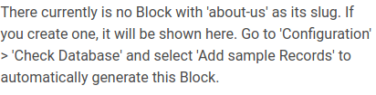

# <span style="color:#9933FF">Machine #16 Registery</span>  


## <span style="color:#9933FF">Notes During Working on the Machine 🧐🤓   

* The http service `-sV` `80/tcp open  http    nginx 1.14.0 (Ubuntu)`.  
* `/install` found it with the gobuster command and it contains pure gebbrish.  
* The web application just loads when provided with `backup.php` and then it opens a blank page. Which means the page exists because I tried some random shit .php and it gave me 404.  
* Found a couple of configuration files.
* Seems like there's a LFI vulnerability.
* Because I'm able to open files in directories I'm forbidden to access.
* Still no trace of a login page (If it's necessary anyway).
* gobuster dir -u http://10.10.10.159/install -x .php,.txt,.html,.md -w /usr/share/dirbuster/wordlists/directory-list-2.3-medium.txt
 -b 403,404  

 gobuster dns -d registry.htb -w ./test.wordlist  

 * Version of bolt I found is 3.6.4 .  
 * Seems that bolt is coded with php.  
 * I tried to gobuster with different directories but it's no use. It's not giving me anything new.
 * I also tried to gobuster the subfolders.
 * Found twig files in `/bolt/theme/base-2018/[FILENAME]` or something like that. Not sure that I remember it correctly.

* Ok I'm going to check all the files I can.  
* I think the only thing that might be useful at the moment in the bolt website is this message  
    
  * Still not sure how thooo.
<br/><br/>

* Response header called `X-Debug-Token: 7ea91f` indicates that the "profiler" is running and it might be exposing information ( the symphony profiler) which is great news.


## <span style="color:#9933FF">How Did I Solve the Machine 😎🥳 


<br/><br/>


## <span style="color:#9933FF">Where I Got Stuck?😡😧  


<br/><br/>


## <span style="color:#9933FF">What Did I learn from this Machine?👀  


<br/><br/>


## <span style="color:#9933FF">Writeups ✍🏽📓   


<br/><br/>
* feroxbuster's results  
```
301      GET        7l       13w      194c http://10.10.10.159/bolt/.git => http://10.10.10.159/bolt/.git/
403      GET        7l       11w      178c http://10.10.10.159/bolt/.htpasswd
403      GET        7l       11w      178c http://10.10.10.159/bolt/.htaccess
403      GET        7l       11w      178c http://10.10.10.159/bolt/.git/.htaccess
403      GET        7l       11w      178c http://10.10.10.159/bolt/.git/.htpasswd
301      GET        7l       13w      194c http://10.10.10.159/bolt/app => http://10.10.10.159/bolt/app/
403      GET        7l       11w      178c http://10.10.10.159/bolt/app/.htaccess
403      GET        7l       11w      178c http://10.10.10.159/bolt/app/.htpasswd
301      GET        7l       13w      194c http://10.10.10.159/bolt/.git/branches => http://10.10.10.159/bolt/.git/branches/
403      GET        7l       11w      178c http://10.10.10.159/bolt/.git/branches/.htaccess
403      GET        7l       11w      178c http://10.10.10.159/bolt/.git/branches/.htpasswd
200      GET       11l       29w      251c http://10.10.10.159/bolt/.git/config
200      GET        1l       10w       73c http://10.10.10.159/bolt/.git/description
301      GET        7l       13w      194c http://10.10.10.159/bolt/app/cache => http://10.10.10.159/bolt/app/cache/
403      GET        7l       11w      178c http://10.10.10.159/bolt/app/cache/.htaccess
403      GET        7l       11w      178c http://10.10.10.159/bolt/app/cache/.htpasswd
301      GET        7l       13w      194c http://10.10.10.159/bolt/extensions => http://10.10.10.159/bolt/extensions/
403      GET        7l       11w      178c http://10.10.10.159/bolt/extensions/.htaccess
403      GET        7l       11w      178c http://10.10.10.159/bolt/extensions/.htpasswd
301      GET        7l       13w      194c http://10.10.10.159/bolt/files => http://10.10.10.159/bolt/files/
301      GET        7l       13w      194c http://10.10.10.159/bolt/app/config => http://10.10.10.159/bolt/app/config/
403      GET        7l       11w      178c http://10.10.10.159/bolt/files/.htpasswd
403      GET        7l       11w      178c http://10.10.10.159/bolt/files/.htaccess
403      GET        7l       11w      178c http://10.10.10.159/bolt/app/config/.htaccess
403      GET        7l       11w      178c http://10.10.10.159/bolt/app/config/.htpasswd
301      GET        7l       13w      194c http://10.10.10.159/bolt/app/database => http://10.10.10.159/bolt/app/database/
403      GET        7l       11w      178c http://10.10.10.159/bolt/app/database/.htaccess
403      GET        7l       11w      178c http://10.10.10.159/bolt/app/database/.htpasswd
301      GET        7l       13w      194c http://10.10.10.159/bolt/.git/hooks => http://10.10.10.159/bolt/.git/hooks/
403      GET        7l       11w      178c http://10.10.10.159/bolt/.git/hooks/.htaccess
403      GET        7l       11w      178c http://10.10.10.159/bolt/.git/hooks/.htpasswd
301      GET        7l       13w      194c http://10.10.10.159/bolt/.git/info => http://10.10.10.159/bolt/.git/info/
403      GET        7l       11w      178c http://10.10.10.159/bolt/.git/info/.htpasswd
403      GET        7l       11w      178c http://10.10.10.159/bolt/.git/info/.htaccess
200      GET      735l     3068w   282698c http://10.10.10.159/bolt/.git/index
301      GET        7l       13w      194c http://10.10.10.159/bolt/.git/logs => http://10.10.10.159/bolt/.git/logs/
403      GET        7l       11w      178c http://10.10.10.159/bolt/.git/logs/.htaccess
403      GET        7l       11w      178c http://10.10.10.159/bolt/.git/logs/.htpasswd
301      GET        7l       13w      194c http://10.10.10.159/bolt/app/cache/development => http://10.10.10.159/bolt/app/cache/development/
403      GET        7l       11w      178c http://10.10.10.159/bolt/app/cache/development/.htaccess
403      GET        7l       11w      178c http://10.10.10.159/bolt/app/cache/development/.htpasswd
301      GET        7l       13w      194c http://10.10.10.159/bolt/.git/objects => http://10.10.10.159/bolt/.git/objects/
403      GET        7l       11w      178c http://10.10.10.159/bolt/.git/objects/.htpasswd
403      GET        7l       11w      178c http://10.10.10.159/bolt/.git/objects/.htaccess
301      GET        7l       13w      194c http://10.10.10.159/bolt/app/config/extensions => http://10.10.10.159/bolt/app/config/extensions/
403      GET        7l       11w      178c http://10.10.10.159/bolt/app/config/extensions/.htaccess
403      GET        7l       11w      178c http://10.10.10.159/bolt/app/config/extensions/.htpasswd
301      GET        7l       13w      194c http://10.10.10.159/bolt/.git/refs => http://10.10.10.159/bolt/.git/refs/
403      GET        7l       11w      178c http://10.10.10.159/bolt/.git/refs/.htpasswd
403      GET        7l       11w      178c http://10.10.10.159/bolt/.git/refs/.htaccess
200      GET        6l       43w      240c http://10.10.10.159/bolt/.git/info/exclude
301      GET        7l       13w      194c http://10.10.10.159/bolt/src => http://10.10.10.159/bolt/src/
403      GET        7l       11w      178c http://10.10.10.159/bolt/src/.htpasswd
403      GET        7l       11w      178c http://10.10.10.159/bolt/src/.htaccess
301      GET        7l       13w      194c http://10.10.10.159/bolt/app/resources => http://10.10.10.159/bolt/app/resources/
403      GET        7l       11w      178c http://10.10.10.159/bolt/app/resources/.htpasswd
403      GET        7l       11w      178c http://10.10.10.159/bolt/app/resources/.htaccess
301      GET        7l       13w      194c http://10.10.10.159/bolt/tests => http://10.10.10.159/bolt/tests/
301      GET        7l       13w      194c http://10.10.10.159/bolt/src/Events => http://10.10.10.159/bolt/src/Events/
403      GET        7l       11w      178c http://10.10.10.159/bolt/tests/.htpasswd
403      GET        7l       11w      178c http://10.10.10.159/bolt/tests/.htaccess
301      GET        7l       13w      194c http://10.10.10.159/bolt/src/Security => http://10.10.10.159/bolt/src/Security/
403      GET        7l       11w      178c http://10.10.10.159/bolt/src/Events/.htpasswd
301      GET        7l       13w      194c http://10.10.10.159/bolt/theme => http://10.10.10.159/bolt/theme/
403      GET        7l       11w      178c http://10.10.10.159/bolt/theme/.htpasswd
403      GET        7l       11w      178c http://10.10.10.159/bolt/theme/.htaccess
403      GET        7l       11w      178c http://10.10.10.159/bolt/src/Security/.htpasswd
301      GET        7l       13w      194c http://10.10.10.159/bolt/app/cache/development/data => http://10.10.10.159/bolt/app/cache/development/data/
301      GET        7l       13w      194c http://10.10.10.159/bolt/vendor => http://10.10.10.159/bolt/vendor/
403      GET        7l       11w      178c http://10.10.10.159/bolt/vendor/.htaccess
403      GET        7l       11w      178c http://10.10.10.159/bolt/vendor/.htpasswd
301      GET        7l       13w      194c http://10.10.10.159/bolt/app/src => http://10.10.10.159/bolt/app/src/
403      GET        7l       11w      178c http://10.10.10.159/bolt/app/src/.htaccess
403      GET        7l       11w      178c http://10.10.10.159/bolt/app/src/.htpasswd
301      GET        7l       13w      194c http://10.10.10.159/bolt/app/cache/profiler => http://10.10.10.159/bolt/app/cache/profiler/
301      GET        7l       13w      194c http://10.10.10.159/bolt/app/cache/profiler/00 => http://10.10.10.159/bolt/app/cache/profiler/00/
403      GET        7l       11w      178c http://10.10.10.159/bolt/app/cache/profiler/.htaccess
403      GET        7l       11w      178c http://10.10.10.159/bolt/app/cache/profiler/.htpasswd
301      GET        7l       13w      194c http://10.10.10.159/bolt/app/cache/profiler/01 => http://10.10.10.159/bolt/app/cache/profiler/01/
301      GET        7l       13w      194c http://10.10.10.159/bolt/app/cache/profiler/05 => http://10.10.10.159/bolt/app/cache/profiler/05/
301      GET        7l       13w      194c http://10.10.10.159/bolt/app/cache/profiler/11 => http://10.10.10.159/bolt/app/cache/profiler/11/
301      GET        7l       13w      194c http://10.10.10.159/bolt/app/cache/profiler/08 => http://10.10.10.159/bolt/app/cache/profiler/08/
301      GET        7l       13w      194c http://10.10.10.159/bolt/app/cache/profiler/12 => http://10.10.10.159/bolt/app/cache/profiler/12/
301      GET        7l       13w      194c http://10.10.10.159/bolt/app/cache/profiler/15 => http://10.10.10.159/bolt/app/cache/profiler/15/
301      GET        7l       13w      194c http://10.10.10.159/bolt/app/cache/profiler/1c => http://10.10.10.159/bolt/app/cache/profiler/1c/
301      GET        7l       13w      194c http://10.10.10.159/bolt/app/cache/profiler/22 => http://10.10.10.159/bolt/app/cache/profiler/22/
301      GET        7l       13w      194c http://10.10.10.159/bolt/app/cache/profiler/29 => http://10.10.10.159/bolt/app/cache/profiler/29/
301      GET        7l       13w      194c http://10.10.10.159/bolt/app/cache/profiler/2d => http://10.10.10.159/bolt/app/cache/profiler/2d/
301      GET        7l       13w      194c http://10.10.10.159/bolt/app/cache/profiler/39 => http://10.10.10.159/bolt/app/cache/profiler/39/
301      GET        7l       13w      194c http://10.10.10.159/bolt/app/cache/profiler/3d => http://10.10.10.159/bolt/app/cache/profiler/3d/
301      GET        7l       13w      194c http://10.10.10.159/bolt/app/cache/profiler/45 => http://10.10.10.159/bolt/app/cache/profiler/45/
301      GET        7l       13w      194c http://10.10.10.159/bolt/app/view => http://10.10.10.159/bolt/app/view/
301      GET        7l       13w      194c http://10.10.10.159/bolt/app/cache/profiler/52 => http://10.10.10.159/bolt/app/cache/profiler/52/
301      GET        7l       13w      194c http://10.10.10.159/bolt/app/cache/profiler/65 => http://10.10.10.159/bolt/app/cache/profiler/65/
301      GET        7l       13w      194c http://10.10.10.159/bolt/app/cache/profiler/66 => http://10.10.10.159/bolt/app/cache/profiler/66/
403      GET        7l       11w      178c http://10.10.10.159/bolt/app/view/.htaccess
403      GET        7l       11w      178c http://10.10.10.159/bolt/app/view/.htpasswd
301      GET        7l       13w      194c http://10.10.10.159/bolt/app/cache/profiler/67 => http://10.10.10.159/bolt/app/cache/profiler/67/
301      GET        7l       13w      194c http://10.10.10.159/bolt/app/cache/profiler/74 => http://10.10.10.159/bolt/app/cache/profiler/74/
301      GET        7l       13w      194c http://10.10.10.159/bolt/app/cache/profiler/75 => http://10.10.10.159/bolt/app/cache/profiler/75/
301      GET        7l       13w      194c http://10.10.10.159/bolt/app/cache/profiler/77 => http://10.10.10.159/bolt/app/cache/profiler/77/
301      GET        7l       13w      194c http://10.10.10.159/bolt/app/cache/profiler/79 => http://10.10.10.159/bolt/app/cache/profiler/79/
301      GET        7l       13w      194c http://10.10.10.159/bolt/app/cache/profiler/82 => http://10.10.10.159/bolt/app/cache/profiler/82/
301      GET        7l       13w      194c http://10.10.10.159/bolt/app/cache/profiler/86 => http://10.10.10.159/bolt/app/cache/profiler/86/
301      GET        7l       13w      194c http://10.10.10.159/bolt/app/cache/profiler/87 => http://10.10.10.159/bolt/app/cache/profiler/87/
301      GET        7l       13w      194c http://10.10.10.159/bolt/app/cache/profiler/89 => http://10.10.10.159/bolt/app/cache/profiler/89/
301      GET        7l       13w      194c http://10.10.10.159/bolt/app/cache/profiler/90 => http://10.10.10.159/bolt/app/cache/profiler/90/
301      GET        7l       13w      194c http://10.10.10.159/bolt/app/cache/profiler/93 => http://10.10.10.159/bolt/app/cache/profiler/93/
301      GET        7l       13w      194c http://10.10.10.159/bolt/app/cache/profiler/98 => http://10.10.10.159/bolt/app/cache/profiler/98/
301      GET        7l       13w      194c http://10.10.10.159/bolt/app/cache/profiler/95 => http://10.10.10.159/bolt/app/cache/profiler/95/
301      GET        7l       13w      194c http://10.10.10.159/bolt/app/cache/profiler/91 => http://10.10.10.159/bolt/app/cache/profiler/91/
301      GET        7l       13w      194c http://10.10.10.159/bolt/app/cache/profiler/a5 => http://10.10.10.159/bolt/app/cache/profiler/a5/
301      GET        7l       13w      194c http://10.10.10.159/bolt/app/cache/profiler/aa => http://10.10.10.159/bolt/app/cache/profiler/aa/
301      GET        7l       13w      194c http://10.10.10.159/bolt/app/cache/profiler/a4 => http://10.10.10.159/bolt/app/cache/profiler/a4/
301      GET        7l       13w      194c http://10.10.10.159/bolt/app/cache/profiler/ab => http://10.10.10.159/bolt/app/cache/profiler/ab/
301      GET        7l       13w      194c http://10.10.10.159/bolt/vendor/bin => http://10.10.10.159/bolt/vendor/bin/
301      GET        7l       13w      194c http://10.10.10.159/bolt/.git/objects/info => http://10.10.10.159/bolt/.git/objects/info/
403      GET        7l       11w      178c http://10.10.10.159/bolt/vendor/bin/.htaccess
403      GET        7l       11w      178c http://10.10.10.159/bolt/vendor/bin/.htpasswd
403      GET        7l       11w      178c http://10.10.10.159/bolt/.git/objects/info/.htaccess
403      GET        7l       11w      178c http://10.10.10.159/bolt/.git/objects/info/.htpasswd
301      GET        7l       13w      194c http://10.10.10.159/bolt/app/cache/profiler/b2 => http://10.10.10.159/bolt/app/cache/profiler/b2/
301      GET        7l       13w      194c http://10.10.10.159/bolt/.git/refs/heads => http://10.10.10.159/bolt/.git/refs/heads/
301      GET        7l       13w      194c http://10.10.10.159/bolt/app/cache/profiler/b7 => http://10.10.10.159/bolt/app/cache/profiler/b7/
301      GET        7l       13w      194c http://10.10.10.159/bolt/app/cache/profiler/b3 => http://10.10.10.159/bolt/app/cache/profiler/b3/
403      GET        7l       11w      178c http://10.10.10.159/bolt/.git/refs/heads/.htaccess
403      GET        7l       11w      178c http://10.10.10.159/bolt/.git/refs/heads/.htpasswd
301      GET        7l       13w      194c http://10.10.10.159/bolt/app/cache/profiler/bc => http://10.10.10.159/bolt/app/cache/profiler/bc/
301      GET        7l       13w      194c http://10.10.10.159/bolt/app/cache/profiler/bd => http://10.10.10.159/bolt/app/cache/profiler/bd/
301      GET        7l       13w      194c http://10.10.10.159/bolt/vendor/composer => http://10.10.10.159/bolt/vendor/composer/
301      GET        7l       13w      194c http://10.10.10.159/bolt/app/cache/profiler/bb => http://10.10.10.159/bolt/app/cache/profiler/bb/
403      GET        7l       11w      178c http://10.10.10.159/bolt/vendor/composer/.htaccess
301      GET        7l       13w      194c http://10.10.10.159/bolt/vendor/contao => http://10.10.10.159/bolt/vendor/contao/
301      GET        7l       13w      194c http://10.10.10.159/bolt/app/cache/profiler/c2 => http://10.10.10.159/bolt/app/cache/profiler/c2/
301      GET        7l       13w      194c http://10.10.10.159/bolt/app/cache/profiler/ca => http://10.10.10.159/bolt/app/cache/profiler/ca/
301      GET        7l       13w      194c http://10.10.10.159/bolt/app/cache/trans => http://10.10.10.159/bolt/app/cache/trans/
301      GET        7l       13w      194c http://10.10.10.159/bolt/app/cache/profiler/c4 => http://10.10.10.159/bolt/app/cache/profiler/c4/
301      GET        7l       13w      194c http://10.10.10.159/bolt/app/cache/profiler/c3 => http://10.10.10.159/bolt/app/cache/profiler/c3/
403      GET        7l       11w      178c http://10.10.10.159/bolt/app/cache/trans/.htaccess
403      GET        7l       11w      178c http://10.10.10.159/bolt/app/cache/trans/.htpasswd
301      GET        7l       13w      194c http://10.10.10.159/bolt/app/cache/profiler/cc => http://10.10.10.159/bolt/app/cache/profiler/cc/
301      GET        7l       13w      194c http://10.10.10.159/bolt/app/cache/profiler/cd => http://10.10.10.159/bolt/app/cache/profiler/cd/
301      GET        7l       13w      194c http://10.10.10.159/bolt/app/cache/profiler/cf => http://10.10.10.159/bolt/app/cache/profiler/cf/
200      GET       21l      168w     1070c http://10.10.10.159/bolt/vendor/composer/LICENSE
301      GET        7l       13w      194c http://10.10.10.159/bolt/.git/logs/refs => http://10.10.10.159/bolt/.git/logs/refs/
403      GET        7l       11w      178c http://10.10.10.159/bolt/.git/logs/refs/.htpasswd
403      GET        7l       11w      178c http://10.10.10.159/bolt/.git/logs/refs/.htaccess
301      GET        7l       13w      194c http://10.10.10.159/bolt/vendor/embed => http://10.10.10.159/bolt/vendor/embed/
301      GET        7l       13w      194c http://10.10.10.159/bolt/.git/objects/pack => http://10.10.10.159/bolt/.git/objects/pack/
403      GET        7l       11w      178c http://10.10.10.159/bolt/.git/objects/pack/.htaccess
403      GET        7l       11w      178c http://10.10.10.159/bolt/.git/objects/pack/.htpasswd
403      GET        7l       11w      178c http://10.10.10.159/bolt/vendor/embed/.htaccess
403      GET        7l       11w      178c http://10.10.10.159/bolt/vendor/embed/.htpasswd
301      GET        7l       13w      194c http://10.10.10.159/bolt/app/cache/profiler/d1 => http://10.10.10.159/bolt/app/cache/profiler/d1/
301      GET        7l       13w      194c http://10.10.10.159/bolt/app/cache/profiler/d2 => http://10.10.10.159/bolt/app/cache/profiler/d2/
301      GET        7l       13w      194c http://10.10.10.159/bolt/vendor/facebook => http://10.10.10.159/bolt/vendor/facebook/
403      GET        7l       11w      178c http://10.10.10.159/bolt/vendor/facebook/.htaccess
403      GET        7l       11w      178c http://10.10.10.159/bolt/vendor/facebook/.htpasswd
301      GET        7l       13w      194c http://10.10.10.159/bolt/app/cache/profiler/de => http://10.10.10.159/bolt/app/cache/profiler/de/
301      GET        7l       13w      194c http://10.10.10.159/bolt/app/cache/profiler/df => http://10.10.10.159/bolt/app/cache/profiler/df/
301      GET        7l       13w      194c http://10.10.10.159/bolt/app/view/css => http://10.10.10.159/bolt/app/view/css/
403      GET        7l       11w      178c http://10.10.10.159/bolt/app/view/css/.htaccess
403      GET        7l       11w      178c http://10.10.10.159/bolt/app/view/css/.htpasswd
301      GET        7l       13w      194c http://10.10.10.159/bolt/app/cache/profiler/e2 => http://10.10.10.159/bolt/app/cache/profiler/e2/
200      GET       62l      177w     1757c http://10.10.10.159/bolt/vendor/bin/composer
301      GET        7l       13w      194c http://10.10.10.159/bolt/app/cache/profiler/fd => http://10.10.10.159/bolt/app/cache/profiler/fd/
301      GET        7l       13w      194c http://10.10.10.159/bolt/app/cache/profiler/ff => http://10.10.10.159/bolt/app/cache/profiler/ff/
301      GET        7l       13w      194c http://10.10.10.159/bolt/vendor/imagine => http://10.10.10.159/bolt/vendor/imagine/
403      GET        7l       11w      178c http://10.10.10.159/bolt/vendor/imagine/.htpasswd
403      GET        7l       11w      178c http://10.10.10.159/bolt/vendor/imagine/.htaccess
301      GET        7l       13w      194c http://10.10.10.159/bolt/vendor/composer/composer => http://10.10.10.159/bolt/vendor/composer/composer/
403      GET        7l       11w      178c http://10.10.10.159/bolt/vendor/composer/composer/.htaccess
301      GET        7l       13w      194c http://10.10.10.159/bolt/app/view/fonts => http://10.10.10.159/bolt/app/view/fonts/
403      GET        7l       11w      178c http://10.10.10.159/bolt/app/view/fonts/.htaccess
403      GET        7l       11w      178c http://10.10.10.159/bolt/app/view/fonts/.htpasswd
301      GET        7l       13w      194c http://10.10.10.159/bolt/app/src/js => http://10.10.10.159/bolt/app/src/js/
403      GET        7l       11w      178c http://10.10.10.159/bolt/app/src/js/.htaccess
403      GET        7l       11w      178c http://10.10.10.159/bolt/app/src/js/.htpasswd
301      GET        7l       13w      194c http://10.10.10.159/bolt/vendor/league => http://10.10.10.159/bolt/vendor/league/
301      GET        7l       13w      194c http://10.10.10.159/bolt/.git/refs/remotes => http://10.10.10.159/bolt/.git/refs/remotes/
200      GET       19l      168w     1068c http://10.10.10.159/bolt/vendor/composer/composer/LICENSE
403      GET        7l       11w      178c http://10.10.10.159/bolt/.git/refs/remotes/.htaccess
403      GET        7l       11w      178c http://10.10.10.159/bolt/.git/refs/remotes/.htpasswd
301      GET        7l       13w      194c http://10.10.10.159/bolt/app/src/lib => http://10.10.10.159/bolt/app/src/lib/
```
```
301      GET        7l       13w      194c http://10.10.10.159/bolt/files => http://10.10.10.159/bolt/files/
301      GET        7l       13w      194c http://10.10.10.159/bolt/tests => http://10.10.10.159/bolt/tests/
301      GET        7l       13w      194c http://10.10.10.159/bolt/src => http://10.10.10.159/bolt/src/
301      GET        7l       13w      194c http://10.10.10.159/bolt/tests/scripts => http://10.10.10.159/bolt/tests/scripts/
301      GET        7l       13w      194c http://10.10.10.159/bolt/app => http://10.10.10.159/bolt/app/
301      GET        7l       13w      194c http://10.10.10.159/bolt/app/resources => http://10.10.10.159/bolt/app/resources/
301      GET        7l       13w      194c http://10.10.10.159/bolt/app/view => http://10.10.10.159/bolt/app/view/
301      GET        7l       13w      194c http://10.10.10.159/bolt/theme => http://10.10.10.159/bolt/theme/
301      GET        7l       13w      194c http://10.10.10.159/bolt/app/view/img => http://10.10.10.159/bolt/app/view/img/
301      GET        7l       13w      194c http://10.10.10.159/bolt/vendor => http://10.10.10.159/bolt/vendor/
301      GET        7l       13w      194c http://10.10.10.159/bolt/src/Security => http://10.10.10.159/bolt/src/Security/
301      GET        7l       13w      194c http://10.10.10.159/bolt/extensions => http://10.10.10.159/bolt/extensions/
301      GET        7l       13w      194c http://10.10.10.159/bolt/app/src => http://10.10.10.159/bolt/app/src/
301      GET        7l       13w      194c http://10.10.10.159/bolt/app/view/css => http://10.10.10.159/bolt/app/view/css/
301      GET        7l       13w      194c http://10.10.10.159/bolt/app/database => http://10.10.10.159/bolt/app/database/
301      GET        7l       13w      194c http://10.10.10.159/bolt/vendor/bin => http://10.10.10.159/bolt/vendor/bin/
301      GET        7l       13w      194c http://10.10.10.159/bolt/app/view/toolbar => http://10.10.10.159/bolt/app/view/toolbar/
301      GET        7l       13w      194c http://10.10.10.159/bolt/src/Events => http://10.10.10.159/bolt/src/Events/
301      GET        7l       13w      194c http://10.10.10.159/bolt/app/view/img/lib => http://10.10.10.159/bolt/app/view/img/lib/
301      GET        7l       13w      194c http://10.10.10.159/bolt/app/cache => http://10.10.10.159/bolt/app/cache/
301      GET        7l       13w      194c http://10.10.10.159/bolt/app/view/js => http://10.10.10.159/bolt/app/view/js/
301      GET        7l       13w      194c http://10.10.10.159/bolt/app/config => http://10.10.10.159/bolt/app/config/
301      GET        7l       13w      194c http://10.10.10.159/bolt/app/src/lib => http://10.10.10.159/bolt/app/src/lib/
301      GET        7l       13w      194c http://10.10.10.159/bolt/app/cache/trans => http://10.10.10.159/bolt/app/cache/trans/
301      GET        7l       13w      194c http://10.10.10.159/bolt/app/src/js => http://10.10.10.159/bolt/app/src/js/
301      GET        7l       13w      194c http://10.10.10.159/bolt/app/cache/development => http://10.10.10.159/bolt/app/cache/development/
301      GET        7l       13w      194c http://10.10.10.159/bolt/app/src/js/modules => http://10.10.10.159/bolt/app/src/js/modules/
301      GET        7l       13w      194c http://10.10.10.159/bolt/app/cache/development/data => http://10.10.10.159/bolt/app/cache/development/data/
301      GET        7l       13w      194c http://10.10.10.159/bolt/app/view/fonts => http://10.10.10.159/bolt/app/view/fonts/
301      GET        7l       13w      194c http://10.10.10.159/bolt/app/config/extensions => http://10.10.10.159/bolt/app/config/extensions/
301      GET        7l       13w      194c http://10.10.10.159/bolt/src/Storage => http://10.10.10.159/bolt/src/Storage/
301      GET        7l       13w      194c http://10.10.10.159/bolt/app/src/js/widgets => http://10.10.10.159/bolt/app/src/js/widgets/
301      GET        7l       13w      194c http://10.10.10.159/bolt/src/Form => http://10.10.10.159/bolt/src/Form/
301      GET        7l       13w      194c http://10.10.10.159/bolt/app/view/js/locale => http://10.10.10.159/bolt/app/view/js/locale/
301      GET        7l       13w      194c http://10.10.10.159/bolt/src/Security/Random => http://10.10.10.159/bolt/src/Security/Random/
301      GET        7l       13w      194c http://10.10.10.159/bolt/src/Storage/Database => http://10.10.10.159/bolt/src/Storage/Database/
301      GET        7l       13w      194c http://10.10.10.159/bolt/src/Translation => http://10.10.10.159/bolt/src/Translation/
301      GET        7l       13w      194c http://10.10.10.159/bolt/vendor/league => http://10.10.10.159/bolt/vendor/league/
301      GET        7l       13w      194c http://10.10.10.159/bolt/vendor/facebook => http://10.10.10.159/bolt/vendor/facebook/
301      GET        7l       13w      194c http://10.10.10.159/bolt/vendor/composer => http://10.10.10.159/bolt/vendor/composer/
200      GET       62l      177w     1757c http://10.10.10.159/bolt/vendor/bin/composer
301      GET        7l       13w      194c http://10.10.10.159/bolt/vendor/embed => http://10.10.10.159/bolt/vendor/embed/
301      GET        7l       13w      194c http://10.10.10.159/bolt/src/Controller => http://10.10.10.159/bolt/src/Controller/
301      GET        7l       13w      194c http://10.10.10.159/bolt/src/Storage/Repository => http://10.10.10.159/bolt/src/Storage/Repository/
301      GET        7l       13w      194c http://10.10.10.159/bolt/app/cache/profiler => http://10.10.10.159/bolt/app/cache/profiler/
301      GET        7l       13w      194c http://10.10.10.159/bolt/app/cache/profiler/12 => http://10.10.10.159/bolt/app/cache/profiler/12/
301      GET        7l       13w      194c http://10.10.10.159/bolt/app/cache/profiler/11 => http://10.10.10.159/bolt/app/cache/profiler/11/
301      GET        7l       13w      194c http://10.10.10.159/bolt/app/cache/profiler/15 => http://10.10.10.159/bolt/app/cache/profiler/15/
301      GET        7l       13w      194c http://10.10.10.159/bolt/app/cache/profiler/22 => http://10.10.10.159/bolt/app/cache/profiler/22/
301      GET        7l       13w      194c http://10.10.10.159/bolt/app/cache/profiler/01 => http://10.10.10.159/bolt/app/cache/profiler/01/
301      GET        7l       13w      194c http://10.10.10.159/bolt/app/cache/profiler/08 => http://10.10.10.159/bolt/app/cache/profiler/08/
301      GET        7l       13w      194c http://10.10.10.159/bolt/app/cache/profiler/de => http://10.10.10.159/bolt/app/cache/profiler/de/
301      GET        7l       13w      194c http://10.10.10.159/bolt/app/cache/profiler/39 => http://10.10.10.159/bolt/app/cache/profiler/39/
301      GET        7l       13w      194c http://10.10.10.159/bolt/app/cache/profiler/45 => http://10.10.10.159/bolt/app/cache/profiler/45/
301      GET        7l       13w      194c http://10.10.10.159/bolt/vendor/imagine => http://10.10.10.159/bolt/vendor/imagine/
301      GET        7l       13w      194c http://10.10.10.159/bolt/app/cache/profiler/52 => http://10.10.10.159/bolt/app/cache/profiler/52/
301      GET        7l       13w      194c http://10.10.10.159/bolt/app/cache/profiler/66 => http://10.10.10.159/bolt/app/cache/profiler/66/
301      GET        7l       13w      194c http://10.10.10.159/bolt/app/cache/profiler/65 => http://10.10.10.159/bolt/app/cache/profiler/65/
301      GET        7l       13w      194c http://10.10.10.159/bolt/app/cache/profiler/89 => http://10.10.10.159/bolt/app/cache/profiler/89/
301      GET        7l       13w      194c http://10.10.10.159/bolt/app/cache/profiler/67 => http://10.10.10.159/bolt/app/cache/profiler/67/
301      GET        7l       13w      194c http://10.10.10.159/bolt/app/cache/profiler/87 => http://10.10.10.159/bolt/app/cache/profiler/87/
301      GET        7l       13w      194c http://10.10.10.159/bolt/app/cache/profiler/77 => http://10.10.10.159/bolt/app/cache/profiler/77/
301      GET        7l       13w      194c http://10.10.10.159/bolt/app/cache/profiler/91 => http://10.10.10.159/bolt/app/cache/profiler/91/
301      GET        7l       13w      194c http://10.10.10.159/bolt/app/cache/profiler/90 => http://10.10.10.159/bolt/app/cache/profiler/90/
301      GET        7l       13w      194c http://10.10.10.159/bolt/app/cache/profiler/75 => http://10.10.10.159/bolt/app/cache/profiler/75/
301      GET        7l       13w      194c http://10.10.10.159/bolt/app/cache/profiler/79 => http://10.10.10.159/bolt/app/cache/profiler/79/
301      GET        7l       13w      194c http://10.10.10.159/bolt/app/cache/profiler/86 => http://10.10.10.159/bolt/app/cache/profiler/86/
301      GET        7l       13w      194c http://10.10.10.159/bolt/app/cache/profiler/ca => http://10.10.10.159/bolt/app/cache/profiler/ca/
301      GET        7l       13w      194c http://10.10.10.159/bolt/app/cache/profiler/82 => http://10.10.10.159/bolt/app/cache/profiler/82/
301      GET        7l       13w      194c http://10.10.10.159/bolt/app/cache/profiler/98 => http://10.10.10.159/bolt/app/cache/profiler/98/
301      GET        7l       13w      194c http://10.10.10.159/bolt/app/cache/profiler/74 => http://10.10.10.159/bolt/app/cache/profiler/74/
301      GET        7l       13w      194c http://10.10.10.159/bolt/app/cache/profiler/95 => http://10.10.10.159/bolt/app/cache/profiler/95/
301      GET        7l       13w      194c http://10.10.10.159/bolt/app/cache/profiler/cc => http://10.10.10.159/bolt/app/cache/profiler/cc/
301      GET        7l       13w      194c http://10.10.10.159/bolt/src/Menu => http://10.10.10.159/bolt/src/Menu/
301      GET        7l       13w      194c http://10.10.10.159/bolt/app/cache/profiler/cd => http://10.10.10.159/bolt/app/cache/profiler/cd/
301      GET        7l       13w      194c http://10.10.10.159/bolt/app/cache/profiler/bc => http://10.10.10.159/bolt/app/cache/profiler/bc/
301      GET        7l       13w      194c http://10.10.10.159/bolt/app/cache/profiler/c2 => http://10.10.10.159/bolt/app/cache/profiler/c2/
301      GET        7l       13w      194c http://10.10.10.159/bolt/src/Request => http://10.10.10.159/bolt/src/Request/
301      GET        7l       13w      194c http://10.10.10.159/bolt/app/cache/profiler/cf => http://10.10.10.159/bolt/app/cache/profiler/cf/
301      GET        7l       13w      194c http://10.10.10.159/bolt/app/cache/profiler/c3 => http://10.10.10.159/bolt/app/cache/profiler/c3/
301      GET        7l       13w      194c http://10.10.10.159/bolt/app/cache/profiler/b7 => http://10.10.10.159/bolt/app/cache/profiler/b7/
301      GET        7l       13w      194c http://10.10.10.159/bolt/app/cache/profiler/d4 => http://10.10.10.159/bolt/app/cache/profiler/d4/
301      GET        7l       13w      194c http://10.10.10.159/bolt/app/cache/profiler/f5 => http://10.10.10.159/bolt/app/cache/profiler/f5/
301      GET        7l       13w      194c http://10.10.10.159/bolt/app/cache/profiler/2c => http://10.10.10.159/bolt/app/cache/profiler/2c/
301      GET        7l       13w      194c http://10.10.10.159/bolt/src/Storage/Mapping => http://10.10.10.159/bolt/src/Storage/Mapping/
301      GET        7l       13w      194c http://10.10.10.159/bolt/src/Logger => http://10.10.10.159/bolt/src/Logger/
301      GET        7l       13w      194c http://10.10.10.159/bolt/app/cache/profiler/7d => http://10.10.10.159/bolt/app/cache/profiler/7d/
301      GET        7l       13w      194c http://10.10.10.159/bolt/app/cache/profiler/9a => http://10.10.10.159/bolt/app/cache/profiler/9a/
301      GET        7l       13w      194c http://10.10.10.159/bolt/app/cache/profiler/1f => http://10.10.10.159/bolt/app/cache/profiler/1f/
301      GET        7l       13w      194c http://10.10.10.159/bolt/app/cache/profiler/4d => http://10.10.10.159/bolt/app/cache/profiler/4d/
301      GET        7l       13w      194c http://10.10.10.159/bolt/app/cache/profiler/6d => http://10.10.10.159/bolt/app/cache/profiler/6d/
301      GET        7l       13w      194c http://10.10.10.159/bolt/src/Response => http://10.10.10.159/bolt/src/Response/
301      GET        7l       13w      194c http://10.10.10.159/bolt/src/Legacy => http://10.10.10.159/bolt/src/Legacy/
301      GET        7l       13w      194c http://10.10.10.159/bolt/src/Storage/Field => http://10.10.10.159/bolt/src/Storage/Field/
301      GET        7l       13w      194c http://10.10.10.159/bolt/app/cache/profiler/7e => http://10.10.10.159/bolt/app/cache/profiler/7e/
301      GET        7l       13w      194c http://10.10.10.159/bolt/src/Extension => http://10.10.10.159/bolt/src/Extension/
301      GET        7l       13w      194c http://10.10.10.159/bolt/src/Storage/Field/Collection => http://10.10.10.159/bolt/src/Storage/Field/Collection/

```

* The root  
```
403      GET        7l       11w      178c http://10.10.10.159/.bash_history
403      GET        7l       11w      178c http://10.10.10.159/.htpasswd
403      GET        7l       11w      178c http://10.10.10.159/.htaccess
301      GET        7l       13w      194c http://10.10.10.159/install => http://10.10.10.159/install/
403      GET        7l       11w      178c http://10.10.10.159/install/.htpasswd
403      GET        7l       11w      178c http://10.10.10.159/install/.htaccess
```

<!-- @nested-tags:EXAMPLE/OF/NESTED/TAGS-->