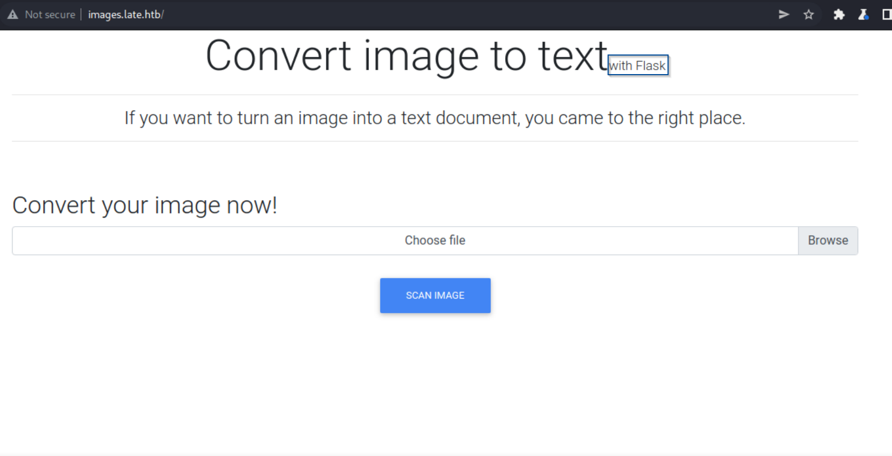
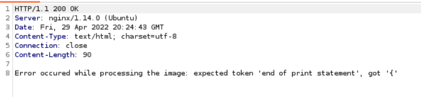

# Machine #25 Late  

## Checklist 🤓   

- [x] Scan for other subdomains on `late.htb`.
- [x] Check if there are exploits for `python-tesseract` because the website might be using it
- [x] Gobuster the root `late.htb` for hidden directories.
- [x] Gobuster `images.late.htb` for hidden directories.
- [ ] If the images are stored somewhere and I find that somewhere and was able to open them. Maybe then I can execute a shell if I inject it into the image file.
- [ ] The website states that there are "Utilities" but I can only see one. Is that normal?
- [ ] Maybe I can name the image a path but I'm not sure how much this would be useful.
- [ ] There is a possibility of Server-Side Template Injection (SSTI)

  

## What Do We Have? 🤔🤔 

* Python backend because the `image.late.htb` page says "with Flask" which is a Python Microframework.   

* When I uploaded an image and "converted it into text" it gave me what seems to be an html code `

`
* It might be using this library `Python-tesseract` to convert the images into words. It's an optical character recognition tool (OCR) for python that takes characters in an image and puts them into a text file. 
* There's a non-functioning `contact.html` page.
  

## Random Notes👀

* It's not working to inject a shell in the image because when the tool reads the image it returns an error message that indicates that something's wrong with the image. Actually even if it executes an error msg the file could've been stored before before it seems that the python function that converts the images takes the image's path.
* I needed to find a way of executing it anyway.
* Got this error when I tried to insert an image with this code inside  
  
Which means I'm getting somewhere.
    

## How Did I Own This Shit 😎🥳  
1. First there's the subdomain `image.late.htb` that we discovered through a link on the website (web service 80) that has an upload functionality that converts text in images into text files in a `

` tag and the functionality was made in Python which is what the "by Flask" indicated.
2. The idea was to inject code through the image when it turns it into text. So I kept researching for injection exploits in python and found this thing called *Server-Side Template Injection* it can be used when templates are used and usually with Flask the Jinja template engine is used so I tried to inject a template code and it worked it returned an error.
3. It was so frustrating finding the best font and the best crap to write in the screenshot image that I needed to convert to get the bloody reverse shell.
4. So we have the reverse shell which is a specific code that could be found anywhere on the internet but as a summary it's a line of code that, from what I understood, it's this way that python has that enables programmers to call methods hierarchacically. And in a way we can call the popen method which allows me to execute a command when creating a subprocess.  
5. The priv esc went like this: There was this script in a path that exists in the PATH variable. After spying on the processes using `pspy` I noticed that this script gets executed by me when sshing but before that it gets executed by the root and the root keeps overwriting it with content every maybe 1 or 2 minutes so what I did is I added a shell fast to it (using vim didn't work) but writing to it using `echo` worked and then as fast as I could ( I want to outrun the root cron that overwrites the file) I sshed through the private key I got for the current user I'm in and boom I got root shell.

  

## Where I Got Stuck?😡😧  

* The bloody images couldn't work until I set a specific font and size and used canva and it was a whole story.
* The machine was relatively easy.

  

## What Did I learn from this Machine?👀  

  