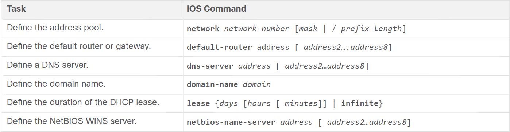
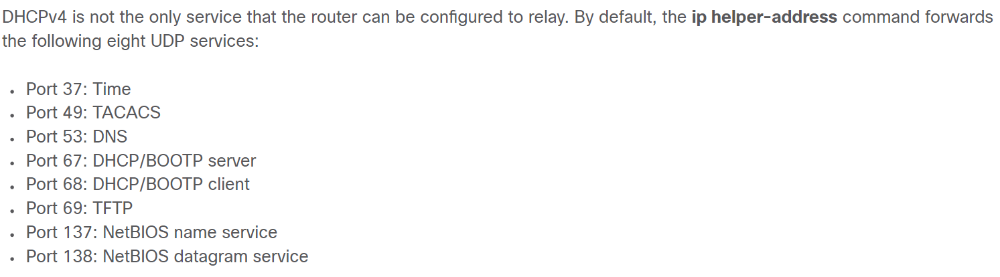

# Dynamic Host Configuration Protocol (DHCP)    

* A dedicated DHCPv4 server is scalable and relatively to manage but in small networks that don't need a dedicated server routers can be configured to deliver DHCP services.  

* A DHCP server leases IPv4 addresses from a pool of  addresses for a limited period of time chosen by the server or until the client no longer needs the address.  
* Administrators configure DHCPv4 servers to set leases to time out at different intervals.

* The lease is typically between 24 hours to a week or more.  

* When the lease expires the client has to ask for a new address, although the client is typically reassigned the same address.  

## DHCPv4 Operation  

* DHCPv4 works in a *client/server mode*.
* The client connects to the network with the leased IPv4 address until the lease expires.  
* The client must ask the DHCP server periodically to extend the lease.  
* The point of the whole *lease* thing is to ensure that clients that move or power off do not keep addresses that they no longer need.  

## Steps to Obtain a Lease  

1. DHCP Discover (DHCPDISCOVER)  
   * Because the device doesn't have an IP address it uses the broadcast IP and MAC addresses to look for a DHCP server and this is what we call the DHCPDISCOVER message.
2. DHCP Offer (DHCPOFFER)  
   * When the DHCP server receives the discovery message it reserves an IPv4 for that client and creates an entry of the client's MAC address and leased IPv4 in its ARP tables.
   * Then the DHCPv4 server sends the binding DHCPOFFER message to the requesting client.  

3. DHCP Request (DHCPREQUEST)  
   * This message is sent as a broadcast to tell the DHCP server that the client accepted its offer and that it declines any other offer if there exists other DHCP servers in the network.  

4. DHCP Acknowledgment (DHCPACK)
   * On receiving the DHCPREQUEST message the server checks if the IP is already in use by pinging that address, if no reply was received then it's not being used by another host and it can be lease to this host and the server adds it to its ARP table.
   * The server sends the DHCPACK and when the client recieves it, it checks its own ARP table and if it didn't find the address in it then it knows that the address is valid and it can use it.  

## Steps to Renew the Lease   

1. DHCP Request (DHCPREQUEST)  
   * Before the lease expires, the client sends a DHCPREQUEST message to the DHCPv4 server that originally offered the IPv4 address. If a DHCPACK is not received within a specified amount of time, the client broadcasts another DHCPREQUEST so that one of the other DHCPv4 servers can extend the lease.
2. DHCP Acknowledgment (DHCPACK)
   * After receiving the DHCPREQUEST message, the server verifies the lease information by returning a DHCPACK.

* DHCPOFFER and DHCPACK can be sent either unicast or broadcast.  

## Configuring Router to Act as a DHCP Server  

1. Exclude IPv4 addresses  
   * The router functioning as a DHCPv4 server assigns all IPv4 addresses in a DHCPv4 address pool unless it is configured to exclude specific addresses. 
   * We would want to exclude the ip addresses that are used for static address assignments (The devices that will be manually configured). We use the following command for exclusion
```console
Router(config)# ip dhcp excluded-address [LOW ADDRESS] [HIGH ADDRESS]
```

2. Define a DHCPv4 pool name
   * We need to define a pool of addresses to assign.
   * So first we create a pool and give it a name with the following command  
  ```console
  Router(config)# ip dhcp pool [POOL NAME]
  Router(dhcp-config)# 
  ```

3. Configure the DHCPv4 Pool  
* Use the `network` statement to define the range of available addresses.
* Use the `default-router` command to define the default gateway router. 

  ```console
  R1(dhcp-config)# network [network id] [subnet mask]
  R1(dhcp-config)# default-router [IP ADDRESS]
  ```  

* Also, there are optional command that can be used  
    


* The command `show ip dhcp binding` shows the IPv4 address to MAC address bindings.  

* To disable and re-enable the DHCPv4 server on a router we can use the following *global configuration mode command*  
  ```console
  R1(config)# no service dhcp
  R1(config)# service dhcp
  ```  

## DHCPv4 Relay  

* In some companies there could be only one DHCPv4 server for all the networks and subnets and because the PC's DHCPDISCOVERY is a broadcast message and routers don't forward broadcasts there had to be a way to let the discovery of my PC reach the server.
  1. The network admin checks if there's an IP address for the PC by using the command `ipconfig /release`.
  2. The network admin uses the command `ipconfig /renew` to try to renew the IP by sending a DHCPDISCOVERY but gets an error because the DHCP server is not on the network. 
  3. The network admin can configure a DHCP server on each router that is connected to a subnet but this will definitely come with a cost. 
  4. The admin can use the command `ip helper-address [ADDRESS]`. The address that I provide in this command is the address of the DHCP server that if the router receives any broadcast message it will be *relayed* to it.   
     ```console
     R1(config)# interface g0/0/0
     R1(config-if)# ip helper-address 192.168.11.6
     R1(config-if)# end
     R1#
     ```  

* Other services that the router also relays  
  

## Configure Router as DHCP Client  

* Sometimes we get DHCP services from the ISP in such cases we can configure our router to be a DHCP client.  
* To do this configuration  
```console
SOHO(config)# interface G0/0/1
SOHO(config-if)# ip address dhcp
SOHO(config-if)# no shutdown
```