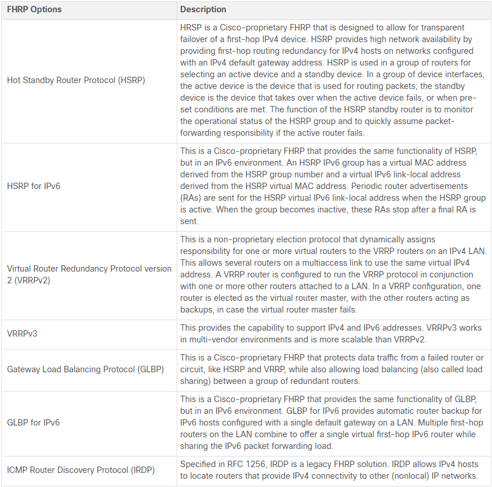

# First Hop Redundancy Protocols *FHRPs* 

* When a network's default gateway goes down the network gets isolated from the rest of the world and this problem is solved with the mechanism of FHRPs

* There is no dynamic method by which devices on a network can determine the address of a new default gateway if the default gateway which they have address to goes down.  

* Note: IPv6 devices receive their default gateway address dynamically from the ICMPv6 Router Advertisement. However, IPv6 devices benefit with a faster failover to the new default gateway when using FHRP.  

## Router Redundancy  

* To solve the problem discussed above we use what we call *Router Redundancy* which could be implemented if we use a virtual router which really is multiple routers with one IP and MAC that the hosts can use as the default gateway address and the mechanism of which router will forward the traffic is decided by the FHRP. 
* This way which router is really forwarding the host traffic is transparent to the host.
* Also, this way if a router goes down another can take its place. 

## Steps for Router Failover  

1. The standby router stops receiving Hello messages from the forwarding router.
2. The standby router assumes the roles of the forwarding router
3. Because the new forwarding router assumes both the IPv4 and MAC addresses of the virtual router the host is completely oblivion to the process.

## FHRP Options  

  

## Hot Standby Routing Protocol *HSRP*  

### HSRP Priority and Preemption  

* By default the active router is chosen depending on the highest IPv4 address.

* We can set the priorities of the routers with numbers in range 0 - 255 and the router with the highest priority is elected to be the active router.
* If the priorities are equal the active router is chosen depending on the numerically highest IP address.
* By default the priority is set to 100.  
* To configure a router to be the active router, use the `standby priority` interface command.

* By default, after a router becomes the active router, it will remain the active router even if another router comes online with a higher HSRP priority.
* With preemption enabled, a router that comes online with a higher HSRP priority will assume the role of the active router.
* So, we use preemption so that when a new router joins the group of routers a re-election happens to check if the new router has higher priority than the active one.  
* Preemption must be enabled using the `standby preempt` interface command.