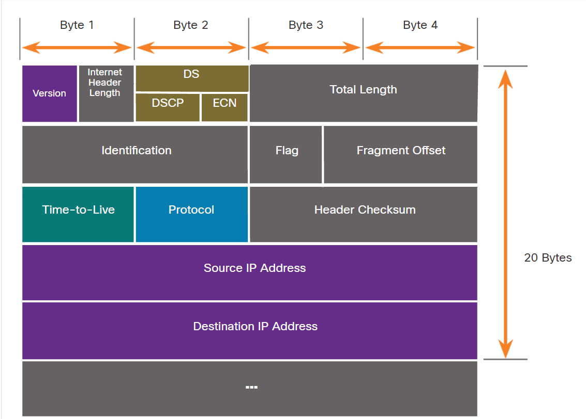
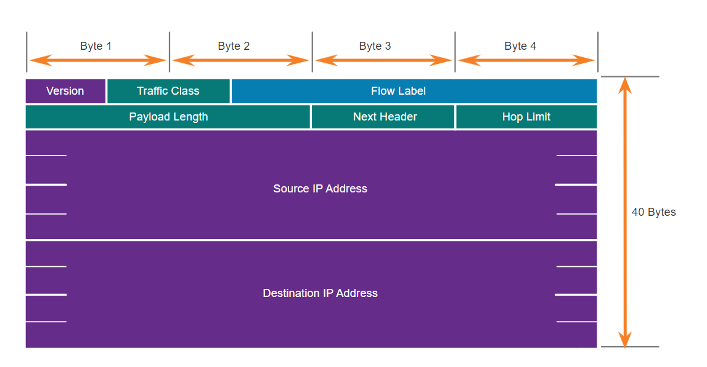

<link href="../styles.module.css" rel="stylesheet">
<link rel="preconnect" href="https://fonts.googleapis.com">
<link rel="preconnect" href="https://fonts.gstatic.com" crossorigin>
<link href="https://fonts.googleapis.com/css2?family=Cedarville+Cursive&display=swap" rel="stylesheet">
<link rel="preconnect" href="https://fonts.googleapis.com">
<link rel="preconnect" href="https://fonts.gstatic.com" crossorigin>
<link href="https://fonts.googleapis.com/css2?family=Cedarville+Cursive&family=Zen+Tokyo+Zoo&display=swap" rel="stylesheet">
<link rel="preconnect" href="https://fonts.googleapis.com">
<link rel="preconnect" href="https://fonts.gstatic.com" crossorigin>
<link href="https://fonts.googleapis.com/css2?family=Cedarville+Cursive&family=Encode+Sans+SC&family=Zen+Tokyo+Zoo&display=swap" rel="stylesheet">

## Cisco Certified Network Associate Notes By Shatha Barqawi

  

# Chapter 8: Network Layer

Sunday, 1/8/2021 

  

### Network Layer Functionalities

  1. Addressing (IP Address).  
      * IP Addresses are unique *inside the specific network*.
      * The IP address takes 20 bytes from the packet.
  2. Encapsulation/Decapsulation.
  3. Routing. 

  

### Some Notes

* how would the sender know if the reciever is in my network if the first 3 octets of the destination IP  are the same as mine then the reciever is on my network. Which means we use the IP to know if the device is in my network or not.
*  The default gateway is the IP address that the device uses to send out of the network he's in.
* In a network the route chosen is decided by the routing protocol in that network.
* The network layer, as in the data link layer, has nth to do with if the data is recieved or not meaning it's also a Best Effort Service.   

  

### Characteristics of IP  
* Connectionless.
* Best Effort.
* Media Independent. Meaning IP doesn't care what's the type of media (copper, fiber, wireless,...etc) it works on any type.

  

### The Tables

* MAC Address Table
  * Exists on the switch 
  * It maps between the MAC address and the interfaces(what the hell does interfaces mean?)
* ARP Table  
  * Used by routers and PCs.
  * Maps between the MAC address and the IP address.
* Routing Table  
  * Used by routers and PCs.
  * Mapping between IP Addresses and interfaces  

  

### A Device Have to Have the Following in order to communicate with other devices  

  * For the PC  
    * IP Address.
    * Subnet mask
    * Default Gateway.  
   
  * For the Router   
    * IP Address.
    * Subnet mask.  
   
  * For the Switch   
    * Needs IP address only when I want to connect to it remotely and in that situation I need to define
      * IP address
      * Subnet mask
      * Default gateway  
     Which are defined on the SVI (interface vlan 1).    
       

* Each device should have 2 addresses  
  An *IP address* which's the logical address that can be assigned to the device manually or automatically.  
  A *MAC address* which's the physical or real address.  

  

### MTU (Maximum Transmission Unit) 
  * It is the maximum size of the packet. 
  * It equals 1500 byte for copper (ethernet).
  * 520 byte for serial.
  * 17966 byte for fiber.
  * 2272 byte for wireless.  
   So as we can see the MTU changes depending on the media we have.  

  

### Fragmentation in the Network Layer

  * From the illustration if we have a copper link (MTU 1500) connected to a router that is connected to a serial link (MTU 520) on the other side, in such case the router fragments the packet so that the serial will be able to transfer the data. 
  * When the packet is fragmented it doesn't get reconstructed until it's recieved by the host. 
  * The fragmentation causes a delay for sure.
  * Unfragmented packets have the values of MF, DF and FO to be zero.
  * A non-zero Fragment Offset with More Fragment equals to zero means this is the last fragment.  

  

### What does the IPv4 header consist of?  
  
  

  1. Source IP.
   
  2. Destination IP.
   
  3. Differentiated Services(DS) 
      * To determine the QoS priority of each packet.    
        
  4. Time to Live (TTL).
      * It exists so that IP packets won't keep hopping from router to router forever.
      * It gets decremented with every hop to a router.
      * If, after decrementation, the ttl value is 0 the router drops the packet and sends an ICMP (Internet Control Message Protocol) time exceeded message to the source IP address.  
       

  5. Protocol.
      * This field enables the network layer to pass the data to the appropriate upper-layer protocol.
      * It's value could be:  
        1. ICMP 01.
        2. TCP 06.
        3. UDP 17.  
       

  6. Fragment Offset  
      * Identifies the order of packet fragments to be reconsturcted.  
       

  7. More Fragment Flag  
      *  Means there are more fragments to come.  
       

  8. Don't Fragment Flag.  
      * If set it means that the packet is not allowed to be fragmented.
      * If this flag was set and the packet was larger than the MTU it will be discarded.  

    
  

### Other IPv4 fields
  * Version (version 4 or 6).
  * Header Length (varies depending on the options).
  * Packet Length (Entire header and data size in bytes).
  * Identification (Identify fragments of packet from fragments of other packets).
  * Header Checksum (Error checking for just the header NO DATA INCLUDED).
  * Options (Provision of extra fields for other services but it's rarely used).  

  

### IPv6
   * In what is it better than IPv4?  
      * It overcomes the limitations with IPv4  
      * More address space than v4.
      * Improved packet handling.
      * Eliminates the need for NAT.
      * Integrated security.  
 

  * IPv6 Header  

     

    1. version
    2. Traffic Class
    3. Flow Label
    4. Hop limit
    5. Source IP
    6. Destination IP 

  

### Host can send a packet to 
 * to itself (loopback) with IP address 127.0.0.1.
 * to a local host (has the same network address). In this case there's no need for the services of the default gateway.
 * to a remote host (hosts don't share the same network address). A default gateway address is required and this default gateway has a routing table containing directly connected and remote network route info.  

  

### Default Gateway    
  * When a host needs to communicate with another network an intermediary device (router) acts as a gateway to the other network.
  * The default gateway's IP address is a host IP address.
  * All hosts on the same network will have the same default gateway IP address.
  * The host only knows the IP addresses of the devices in its network.
  * If the host doesn't recognize the address it will send the packet to the gateway address by default.

  

### Subnet Mask   
  * The sender host uses the subnet mask to check if the destination packet is on the same network.  
  * The subnet mask exists so that we can know the range of hosts we can have on the network.  

  

### Routing
  * Packet Forwarding happens each time the packet hops onto a router it examines the destination IP address for this packet in the routing table for the forwarding info.   
   

  * The router will do one of three things:
    1. Forward the packet to the default route (gateway).  
    2. Forward it to the destination host.
    3. Drop the packet.  
  
   

  * The normal approach (When the IP address is in the routing table) a router would take when it recieves a frame is:
    1. The router removes the layer 2 encapsulation.
    2. Extracts the destination IP address.
    3. Checks the routing table for a match.
    4. Network (e.g. 10.1.2.0) is found in the routing table.
    5. Router re-encapsulates the packet.
    6. Packet is sent to network (10.1.2.0).
  
  

### Routing Table in Details (But not everything on it)  

* Command `netstat -r` or `route print` shows me the routing table of the PC.
* The `show ip route` privileged EXEC mode command is used to view the IPv4 routing table on a Cisco IOS  router.
* Common route sources (codes) include:
  * L - Directly connected local interface IP address.
  * C - Directly connected network.
  * S - Static route was manually configured by an administrator.
  * O - OSPF.
  * D - EIGRP.   
   
* First thing the routing table will give me   
  * `192.168.1.1 on link` means this is me  
    `192.168.1.0 on link` the network I'm on   
    `127.0.0.1 on link` loopback  
    `0.0.0.0` means if you want to send data to anything other than the ips above go to the default route or default gateway.   

* Routing table in detail  
  * The info in the routing table is the *best path* which is the *shortest path*.  
  * For the router to work properly it has to know all the possible routes.  
  * The table has info on the *directly connected routes*, *remote routes* and *default route*.
  * Quoted from the slides  
    <blockquote>
    
    Like a host, most routers also include a default route entry, a gateway of last resort. The default route is used when there is no better (longer) match in the IP routing table. In the figure, the R1 IPv4 routing table would most likely include a default route to forward all packets to router R2.
    </blockquote>  

  * If I didn't have a path that gets me to the destination network (does not exist in the table) the router either drops the packet or sends the packet to the *gateway of last resort*.  
  * The table has The networks and which port it's on.  

* Where do we get the info in the routing table from?  
    1. Directly Connected Network  
     As the name suggests the networks that are directly connected to the router are easily and directly learned by it.
    2. Remote Network  
     The router can learn them by 2 ways:
        1. Static.
           * Manually (remote networks are manually entered into the routing table using static routes).
           * If there is a change in the network topology, the static route is not automatically updated and must be manually reconfigured.
           * A static route is appropriate for a small network and when there are few or no redundant links.
           * A static route is commonly used with a dynamic routing protocol for configuring a default route.
        2. Dynamic  
           * By using dynamic routing protocols such as OSPF, EIGRP, RIP, ISIS, BGP, ...etc (Also, more on these later).  
           * Basic configuration is only required from the network administrator to statically configure the directly connected networks and the dynamic routing protocol will do the following:
             * Discover remote networks.
             * Maintain up-to-date routing information.
             * Choose the best path to destination networks.
             * Attempt to find a new best path if the current path is no longer available.

* What does the Routing Table have?
  * How did it learn the networks?  
    Which could be (C: Connected, L: Local, S: Static or O: OSPF, R: RIP or D: EIGRP).
  * AD/metric (More on that later).
  * What are the networks that it learned?
  * How does it get to each of these networks (the ports e.g.0/0).  

