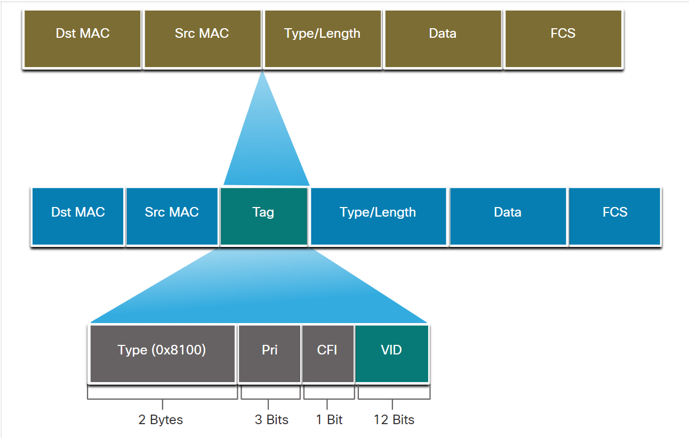
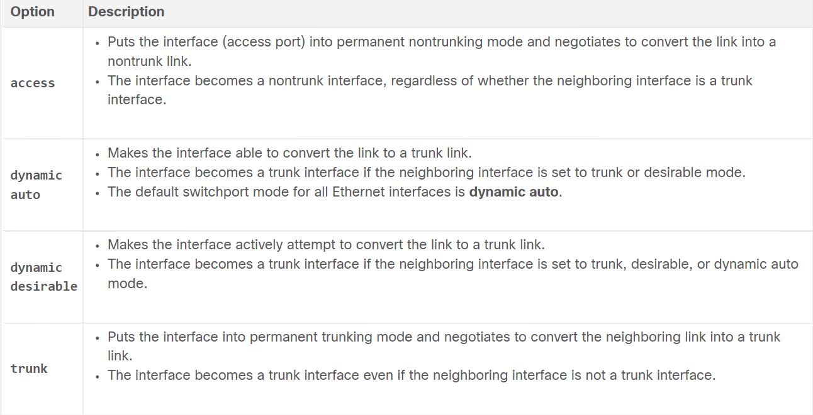

* Overview of VLANs  
  * Virtual LANs provide *segmentation* and *organizational flexibility*.  
  * A group of devices within a VLAN communicate as if each device was attached to the same cable.  
  * VLANs are based on logical connections instead of physical ones.  
  * VLANs in a switched network enable users in various departments to connect to the same network regardless of the physical switch being used or the location of the LAN.
  * VLANs allow an administrator to segment networks based on factors such as *function, team, or application*.
  * Any switch port can belong to a VLAN.
  * Packets that are destined for devices that do not belong to the VLAN must be forwarded through a device that supports routing.
  * Multiple IP subnets can be used without using multiple VLANs but in this case the devices will be in the same layer 2 broadcast domain so boadcast messages will get to those intended for the messages and those not intended.  
  * VLAN improves **network performance** by separating large broadcast domains into smaller ones.
  * Each port can be assigned to one VLAN (except for a port connected to an IP phone or to another switch).  

  * Benefits of designing a network with VLANs:
    1. Smaller broadcsat domains.
    2. Improved security (Only users in the same VLAN can communicate without the services of a router. The router may have a security feature such as an access control list to restrict communications between VLANs).
    3. Improved IT efficiency(Simplify network management because users with similar network requirements can be configured on the same VLAN).
    4. Reduced cost.
    5. Better performance.
    6. Simpler project and application management.
 * Types of VLANs:  
   1. Default  VLAN  
     * The default VLAN on a Cisco switch is VLAN 1. Therefore, all switch ports are on VLAN 1 unless it's explicitly configured to be on another VLAN. 
     * The Native VLAN is VLAN 1 by default.
     * The management VLAN is VLAN 1 by default too.
     * VLAN 1 cannot be renamed or deleted. 
     * `show vlan brief` outputs the ports and what's their VLAN.
   2. Data VLAN  
     * Data VLANs are configured to separate user-generated traffic (voice and netwokr management traffic should not be permitted on it).
   3. Native VLAN  
     * Trunk ports exist to carry the tagged traffic that is being transferred from one switch to another. This tag is called **VLAN ID** and it could be a 4-byte tag in the ethernet header and it exists to identify which VLAN the frame belongs to.  
     * A switch may also send untagged traffic that is generated by a switch or it could come from legacy devices. The trunk port places untagged traffic on the native VLAN and the Native VLAN on a Cisco device is VLAN 1 i.e. the default VLAN.
     * It's best practice to configure the VLAN as unused VLAN.

   4. Management VLAN  
     * It's a data VLAN configured specifically for network management traffic including SSH, Telnet, HTTPS, HTTP, and SNMP.
     * By default VLAN 1 is configured as the management VLAN on a layer 2 switch.
   5. Voice VLAN  
     * A separate VLAN is needed to support Voice over IP (VoIP).
     * VoIP traffic requires:
       * Assured bandwidth to ensure voice quality.
       * Transmission priority over other types of network traffic.
       * Ability to be routed around congested areas on the network.
       * Delay of less than 150 ms across the network.  

<br/>

* VLAN Trunks  
  * Definition: A trunk is a point-to-point link between two network devices that carries more than one VLAN.
  * A trunk does not belong to a specific VLAN.
  * Enables devices connected to different switches but in the same VLAN to communicate without going through a router.  
  * The devices that are connected to the switch aren't aware of the VLANs but they rely on IP addressing instead and the switches aren't aware of IP addressing but they take care of the VLAN switching. Which leads me to saying the fact that the vlan is configured on the switches ports and the switch checks which port has the right vlan to deliver the message. VLANs aren't configured on devices but on the switch port that connects to the device.  

* VLAN identification with a tag  
  * The standard ethernet header does not have the VLAN tag instead it's added through the process of tagging that the switch does before sending the frame out to the trunk port.
  * Tagging is the process of adding a header onto the original ethernet header.
  * The tag header consists of the following:
    
     * Type: A *2-byte* value called the *tag protocol ID* value. For Ethernet, it's set to *0x8100*.
     * User priority: A *3-bit* that supports level or service implementation.
     * Canonical Format Identifier (CFI): A *1-bit* identifier that enables Token Ring Frames to be carried across Ethernet links.
     * VLAN ID: A *12-bit* VLAN identification number that supports up to 4096 VLAN IDs. 

  * After the switch inserts the tag information fields it recalculates the FCS values and inserts the new FCS into the frame.  

<br/>

* Native VLANs and Tagging  
  * Native VLAN traffic isn't always untagged. Some devices that support trunking add a VLAN tag to native vlan traffic. 
  * Management frames are an example of traffic that is usually untagged.
  * If the trunk port receives a tagged frame with the same vlan id as the native vlan it **drops the frame**. 
  * A switch needs to know which vlan to send traffic to when recieving untagged traffic so we can configure (e.g. vlan 99) so whenever the switch recieves untagged traffic it will switch it to vlan 99.

* Voice VLAN Tagging  
  * The access port connected to the Cisco IP phone can be configured to use 2 separate VLANs. One VLAN is for voice traffic and the other is a data VLAN to support the host traffic.
  * The link between the switch and an ip phone simulates a trunk link to carry both voice vlan traffic and data vlan traffic.
  * A Cisco IP phone contains an integrated 3 port switch. The ports provide dedicated connections as follows:
    * Port 1 connects to the switch or other VoIP device.
    * Port 2 is an internal interface that carries the IP phone traffic.
    * Port 3 (access port) connects to a PC or other device.  

* VLAN ranges:
  * Normal range VLANs 
    * vlan id between 1 and 1005.
    * Used in small and medium sized business and enterprise networks.
    * Ids in range *1002 - 1005* are reserved for legacy network technologies.
    * Ids 1 and 1002 to 1005 are automatically created and cannot be removed.
    * Configurations are stored in the switch's *flash memory* in a *VLAN database* file called *vlan.dat*.
    * When configured, VLAN trunking protocol (VTP), helps synchronized the vlan database between switches.  

<br/>

  * Extended range VLANs  
    * Identified by a vlan id in range 1006-4094.
    * Used by service providers to service multiple customers and by global enterprises large enough to need extended range of vlan ids.
    * Configurations are saved, by default, in the running configurations.
    * Support fewer VLAN features than normal range vlans.
    * Requires VTP transparent mode configuration to support extended range VLANs. 

* 4096 is the upper boundary for the number of vlans available on Catalyst switches, because there are only 12-bits in the vlan id field of the 892.1Q header.  

* VLAN Configuration  
  
  1. To create a *Normal Range VLAN* use the following commands  
     ```console
     Switch# configure terminal 
     Switch(config)# vlan [VLAN ID, MULTIPLE VLAN IDs or RANGE OF VLAN IDs]
     Switch(config)# name [VLAN NAME]
     Switch(config)# end
     ```  

  2. Assign ports to the VLAN/s  
      * The `switchport mode access` is optional but strongly recommended as a security best practice. With this command the interface changes to strictly access mode. Access mode indicates that this port belongs to this specific vlan an dit won't negotiate becominga trunk link.  
      * We can use the `interface range` command to configure multiple interfaces simultaneously.
        ```console
        Switch# configure terminal 
        Switch(config)# interface [INTERFACE ID]
        Switch(config-if)# switchport mode access
        Switch(config-if)# switchport access vlan [VLAN ID]
        Switch(config-if)# end
        ```  

<br/> 

* Data & Voice VLAN Configuration  
    ```console
    S3(config)# vlan 20
    S3(config-vlan)# name student
    S3(config-vlan)# vlan 150
    S3(config-vlan)# name VOICE 
    S3(config-vlan)# exit
    S3(config)# interface fa0/18
    S3(config-if)# switchport mode access
    S3(config-if)# switchport access vlan 20
    S3(config-if)# mls qos trust cos
    S3(config-if)# switchport voice vlan 150
    S3(config-if)# end
    ```
<br/>

* Verify VLAN information  
  * `show vlan` command displays a list of all configured VLANs.
  * But this command has the following options `show vlan [brief | id [VLAN ID]| name [VLAN NAME] | summary]`.
  * `show interfaces [INTERFACE] switchport` this command can be used to confirm that the port has been correctly configured. 
  * To change the vlan port membership we can just write the `switchport access vlan [VLAN ID]` again with the proper VLAN ID or if we want to change the membership back to the default (VLAN 1) we use `no switchport access vlan`.  
* To delete a VLAN use the global configuration mode command `no vlan [VLAN ID]`.
* But before deleting the VLAN make sure to switch up the vlan of the ports of this vlan to another active vlan because these ports won't be able to communicate until they're assigned new vlan ids.
* We can also delete the vlan.data file using the privileged EXEC mode command `delete flash:vlan.dat`. This effectively places the switch into its factory default condition.  

<br/>

* To enable trunk links  
    ```console
    Switch# configure terminal
    Switch(config)# interface [INTERFACE ID]
    Switch(config-if)# switchport mode trunk
    Switch(config-if)# switchport trunk native vlan [VLAN ID]
    Switch(config-if)# switchport trunk allowed vlan [VLAN LIST]
    Switch(config-if)# end
    ```
* The previous configuration demonstrates the configuration on 2960 switches that does the 802.1Q encapsulation automatically. Some switches might need the encapsulation to be configured manually.
* The previous configuration could be verified using this command `show interfaces [INTERFACE ID] switchport` or we can use `show interfaces trunk`.  

<br/>

* Reset the Trunk to the Default State  
  * We can use the command `no switchport trunk allowed vlan` and `no switchport trunk native vlan` which remove the allowed vlans and reset the native vlan of the trunk .
  * When we reset to the default state, then trunk allows all vlans and uses vlan 1 as native vlan. 
```console
S1(config)# interface fa0/1
S1(config-if)# no switchport trunk allowed vlan
S1(config-if)# no switchport trunk native vlan
S1(config-if)# end
```  

<br/> 

* Dynamic Trunking Protocol  
  * It allows switches to negotiate trunking with a neighboring device.
  * `switchport mode` full command syntax `Switch(config-if)# switchport mode { access | dynamic { auto | desirable } | trunk }`.  
    
  * To verify DTP mode we can use the command `show dtp interface [INTERFACE ID]`