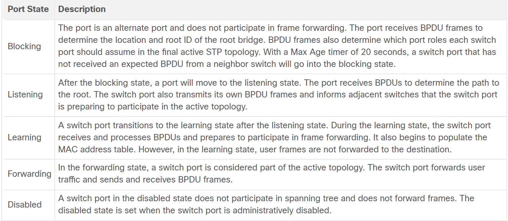
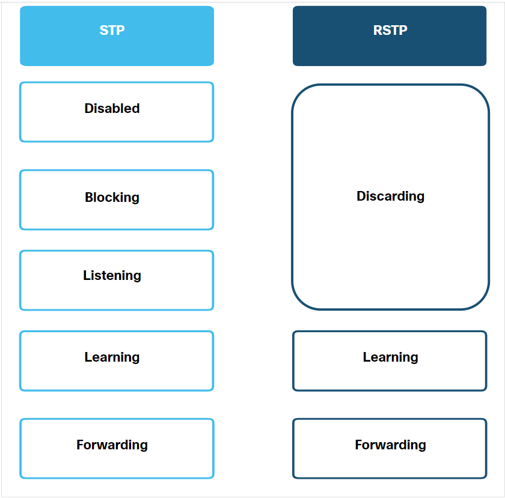
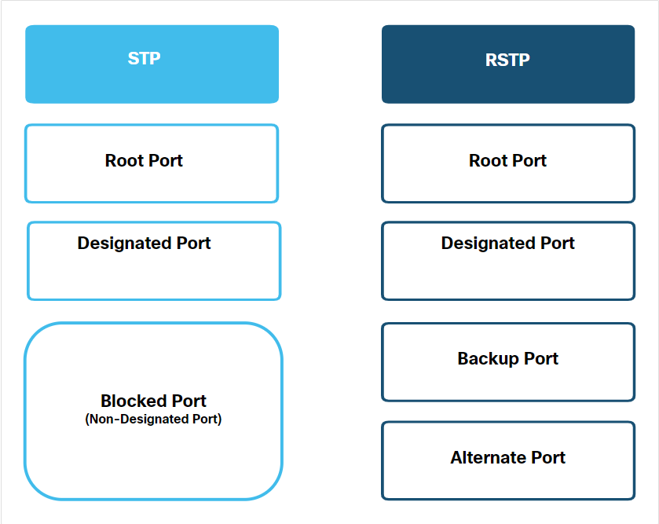

# STP Concepts  

* Redudant paths in a switched Ethernet network may cause both logical and physical layer 2 loops.
* The idea is not to give up on redundancy because it's essential, but to solve the problem of loops and this was accomplished by using the *Spanning Tree Protocol* which is a loop-prevention protocol that allows for redundancy while creating a loop-free layer 2 topology.  

* What can be the result of a layer 2 loop?  
  * MAC address table instability.
  * Link saturation.
  * High CPU utilizaiton.  

* Why Layer 2 loops only? Why don't loops happen on layer 3 too?  
  * Because layer 3 has a mechanism to drop packets that keep looping through the network with the help of the TTL. 
  * That's why STP was developed specifically as loop prevention mechanism for layer 2 ethernet.  

* Issues with Layer 1 Redundancy (When there are multiple links in the network)
  1. MAC Address Instability (MAC Address Flapping): it's when a switch recieves the same MAC address from 2 interfaces. Whichs shouldn't happen.  

  2. Broadcast Storm  
     * A problem could start as instability and continue with a broadcast storm. The switches keep sending broadcasts infinitly until the CPU and the links are full and can't handle any more traffic.
     * This problem can happen either because of a *faulty NIC* or from a *Layer 2 loop* in the network.  

  3. Duplicate Unicast Frame (Almost rare to happen): when the switch doesn't know the destination MAC it broadcasts it and it's called Unknow Unicast and when this happens there might happen that a PC recieves a duplicate frame.  

* Does these things happen only to switches and not routers(Layer 3 Devices)?  
  Yes, they only happen to switches because
  1. Routers don't forward broadcast outside of the link or network.
  2. Each packet has a TTL which means we won't have an infinite loop because when the TTL reaches 0 the packet will be dropped. 


* Spanning Tree Protocol (STP)  
  
  * We will be using Radia Perlman's STP Algorithm (STA) which creates a loop-free topology by selecting a single root bridge and all the other switches determine a single least-cost path from itself to the root bridge.  

  * Link Failure Causes Recalculation. 

  * STA refers to switches as bridges because switches were referred to as bridges in the early days.  
  
  * A blocked port has the effect of making that link non-forwarding which means that each switch has one path to the root bridge. 

  * The STA works as follows (Steps to a Loop-Free Topology):
      
    1. Elect the Root Bridge (Switch za3eem lal7ara).
        * This root switch if it detects that it recieved the same frame from 2 interfaces and when this happens it sets one of these 2 links temporarily *down* until it's needed.

       * Each switch has a BID (Bridge ID) which is MAC + priority of the switch.
       * The less the *priority*, the better.  
       * The election of the Root switch happens as follows:  
         * After a switch boots, it begins sending BPDU frames every **2 seconds** these BPDUs contain the BID and the Root ID.
         * At first all switches declare themselves as the root bridge with their own BID set as Root ID.
         * Switches learn through the exchange of BPDUs which switch has the lowest BID and they agree
       * Lowest BID which means Lowest Priority first and then if the lowest priority is equal we look at the Lowest MAC Address. 
       
       * The internal root path cost is the sum of all the individual port costs along the path from the switch to the root bridge.  

       * Although switch ports have a default port cost associated with them, the port cost is **configurable**. The ability to configure port costs gives the administrator the flexibility to manually control the spanning tree paths to the root bridge.
  
    2. Elect the root ports  
       * Every non-root switch will select one root port. 
       * It's the port closest to the root bridge.  
       * So we look for the shortest internal root paths and the rest of the paths are blocked (Redundent Paths).
       * One RP per switch.

    3. Elect Designated Port  
         * It's the port that the *root bridge* uses to communicate with other switches. 
         * One DP per segment link(each link should have a DP).  
         * * All the *Root Bridge*'s ports are designated ports because the root bridge has the lowest cost to itself.
         * If one end of a segment is a *root port* then the other end is a *designated port*.
         * To decide which one of the ports on the link is the designated one we look at the BID and the switch with the lowest BID is the one we choose to put the DP on it. 
          
    * What is not a root port or a designated port becomes alternate or blocker port, which results in a *single path between each switch and the root bridge*.

    4. Elect Alternate (Blocked) Ports.
       * It's any other port and traffic doesn't go through it. 

 * Path Cost could be 
   * 10gig ==path=cost== 2
   * 1gig ==path=cost== 4
   * Fast Ethernet ==path=cost== 19
   * Ethernet ==path=cost== 100   

 * When a switch has *multiple* equal-cost paths to the root bridge, the switch will decide what's the Root Port using the following criteria
   1. Lowest sender BID.
   2. Lowest sender port priority.
   3. Lowest sender port ID. 

     

* BPDU (Bridge Protocol Data Unit)
  * During the STA and STP functions switches use the BPDU to share information about themselves and their connections.
  * They're used to elect the *root bridge, root ports, designated ports and alternate ports*.
  * It consists of the following:
    * Protocol ID.
    * Version.
    * Message Type.
    * Flag.  
    * Root ID(Bridge ID of the root Bridge. By default every switch considers itself as the root bridge)
    * Cost of the Path.
    * Bridge ID(BID)  
      * Consists of
        * Extended System ID 
          * 12-bits.  
          * Used to identify the vlan for this BPDU.

        * Priority value 
          * 4-bit.
          * The default priority value for cisco switches is **32768**.
          * It has range 0-61440 in increments of **4096**.  

        * MAC address of the switch (48 bit)  
          * When 2 switches are configured with the same priority and the same extended system ID, the switch having the MAC address with the lowest value, expressed in hex, will have the lower BID.  

        * The extended and priority are summed up.
      * The lowest BID values is determined by the combination of these 3 fields.


    * Port ID (The port that the BPDU got out from).

* STP Timers and Port States  
  * Hello Timer - which's the interval between BPDUs. The default is 2 secs (Can be modified between 1 & 10).
  * Forward Delay Timer - The time spent *listening* and *learning*.
  * Max Age Timer - The maximum length of time a switch waits before attempting to change the STP topology.
  * The default times can be changed on the root bridge, which dictates the value of these timers for the STP domain.  

* Port States  
     

  * Disabled (shutdown)
  * Blocked (no traffic)
  * Listening (BPDU only).
  * Learning (BPDU + MAC Learning).
  * Forwarding (Forward Traffic).

* STP can be implemented on multiple VLANs with each vlan having it's own spanning tree instance. So, if we find there is only one spanning tree instance this means that we only have one vlan.


    * Message age.
    * Max age (the max time the root switch waits for BPDUs so that it can decide if the link is down).
    * Hello time (time intervals that BPDUs gets sent in).
    * Forward Delay.
  * When the switches agree on a root switch this root switch will be the only one that sends BPDU.

* Each VLAN has a BID. *[What the hell does that mean!!]*


### Evolution of STP  

* PVST+ (Per-VLAN Spanning Tree) 
  * Each VLAN has it's own calculations.
  * Each VLAN in the network has a Spanning Tree instance.  


* RSTP (Rapid Spanning Tree Protocol)  
  * All vlans has one calculation.
  * Faster convergence than STP.  
  * The same spanning tree algorithm is used for both STP and RSTP to determine port roles and topology.
  * It increases the speed of the recalculation of the spanning tree when the layer 2 network topology chagnes. 
  * If a port is configured to be an alternate port it can immediately change to a forwarding state without waiting for the network to converge.

  * RSTP Port States:  
    * Discarding (immediatly).
    * Learning.
    * Forwarding.

  * STP and RSTP Port States  
     
  
  * STP and RSTP Port Roles  
    
 
  * The backup port is a backup to a shared medium such as a hub.
  * It's less common because hubs are considered legacy devices.

* In RSTP 
  * Edge Port
    * Any port that is connected to an end host is considered an edge port
  * Link Type  
    * Connected to SW or Hub.  
    * Could be either *point to point (Full Duplex)* or *shared (Half Duplex)*.


* Rapid-PVST+ (Rapid Per-VLAN Spanning Tree)
  * Used everywhere in the world.
  * It's the Cisco implementation of RSTP on a per-VLAN basis.
  * With it an independent instance of RSTP runs for each vlan.  

* MSTP (Multiple Spanning Tree Protocol) & MST (Multiple Spanning Tree) => CCNP.


```console
S1# config t
S1(config)# spanning-tree vlan 10 priority 0
//ORRR 
S1(config)# spanning-tree vlan 10 root primary
//                range      1-4096
S1(config)# spanning-tree vlan 10 root secondary
//show spanning-tree
```  

  
* Port Priority.  
* How to change the spanning tree mode 
```console
S1(config)# spanning-tree mode ?
```  


* Problem that is a consequent of the delay that happens in the listening and learning state   
  * When a device is connected to a switch port or when a switch powers up, the switch port goes through both the listening and learning states, each time waiting for the Forward Delay timer to expire. This delay is 15 seconds for each state, listening and learning, for a total of 30 seconds. This delay can present a problem for DHCP clients trying to discover a DHCP server. DHCP messages from the connected host will not be forwarded for the 30 seconds of Forward Delay timers and the DHCP process may timeout. The result is that an IPv4 client will not receive a valid IPv4 address.  
  * Port Fast (same idea as "edge" in the RSTP. Command `S1(config-if)# spanning-tree portfast`).
  * BPDU Guard (command `S1(config-if)# spanning-tree bpduguard enable`)
  * Uplink Fast(legacy)
  * Backbone Fast(legacy)
  * BPDU filter.
  * Loop Guard
  * Root Guard  

## PortFast

* When a switch is configured with **PortFast** that port transitions from blocking to forwarding immediately, no delay will happen. This way DHCP clients can access the network immediately.
* **PortFast** are only used with ports connected to end devices on the other end of the link. If we use it with a port that is connected to another switch we risk having a spanning tree loop.

* In a valid PortFast configuration, BPDUs should never be received on PortFast-enabled switch ports because that would indicate that another bridge or switch is connected to the port. This potentially causes a spanning tree loop. To prevent this type of scenario from occurring, Cisco switches support a feature called BPDU guard. When enabled, **BPDU guard** immediately puts the switch port in an errdisabled (error-disabled) state on receipt of any BPDU. This protects against potential loops by effectively shutting down the port. The BPDU guard feature provides a secure response to invalid configurations because an administrator must manually put the interface back into service.  


### Using Layer 3 Devices as Alternative to STP

* Layer 3 switches can be an alternative to STPs that allows for redundant paths and loops in the topology without blocking ports.