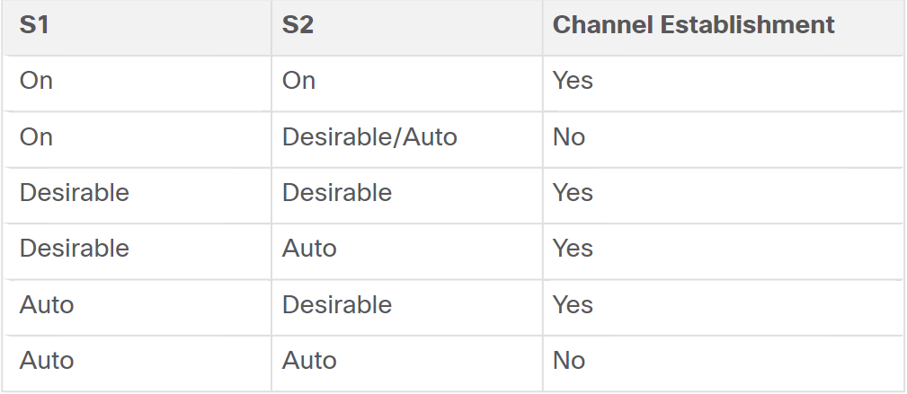
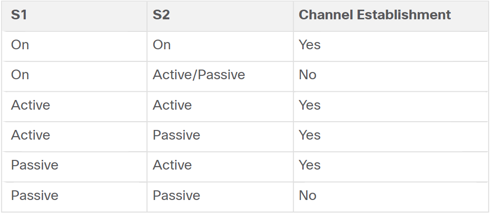

# EtherChannel Operation   

* Port channel is a protocol that allows me to make a bunch of physical links one logical link.
* It's a link aggregation technology that groups multiple physical ethernet links together into one single *logical* link.

* It's used to provide  
  * Fault-tolerance.
  * Load Sharing.
  * Increased bandwidth (EtherChannel technology makes it possible to combine a number of physical links between switches to increase the overall speed of switch-to-switch communication).
  * Redundancy between switches, routers and servers.

* When an EtherChannel is configured, the resulting virtual interface is called a **port channel**. The physical interfaces are bundled together into a port channel interface.  

## Advantages of EtherChannel  

1. Configuration tasks can be done on the EtherChannel interface instead of each individual port, which ensures the consistency of such configurations.

2. Relies on existing ports. No need to upgrade the link to have more bandwidth.

3. Load balancing happens in the links that are a part of an EtherChannel. One or more load balancing method can be used.  

4. The redundant links in an EtherChannel are not blocked because to the STP they appear as one and if STP blocked one of them, they all get blocked because they act like one. 

5. EtherChannel provides redundancy because the overall link is seen as one logical connection. The loss of one physical link within the channel does **not** create a **change in the topology**.

<br/>  

## EtherChannel Restrictions  

* Interface types cannot be mixed. E.g. Fast ethernet and gigabit ethernet cannot be mixed within a single etherchannel.  

* Each etherchannel can only consist of up to 8 compatibly-configured ethernet ports.  

* 2960 switch supports up to 6 etherchannels.

* The individual etherchannel group member port configuration must be consistent on both devices.

<br/>

## AutoNegotiation Protocols  

* EtherChannels can be formed through negotiation using one of 2 protocols
  * Port Aggregation Protocol (PAgP).
  * Link Aggregation Control Protocol (LACP).
* These protocols allow ports with the same characteristics to form a channel through dynamic negotiation.
* Configuration can also be done statically without PAgP and LACP.  

* **Note**  It is mandatory that all ports in EtherChannel have  
  * Same port type (same speed).
  * Duplex Settings.
  * VLAN information.

## Port Aggregation Protocol (PAgP)  

* Works only on Cisco devices (Cisco Proprietary).  

* Sends PAgP packets every 30 seconds. Why?
  * It manages the etherchannel through them by checking the configuration consistency and managing link additions and failures.  
  * Ensures that all ports have the same configurations.

  * Modes of PAgP:
    1. On - Interfaces configured in the on mode do not exchange PAgP packets.
    1. PAgP desirable - It places an interface in an *active* negotiation state in which the interface initiates negotiations with other interfaces by sending PAgP packets.
    2. PAGP Auto - It places an interface in a passive negotiating state in which the interface responds to the PAgP packets that it receives but *does not initiate* PAgP negotiation.
    * **Note**  On mode works with them( Not recommended because if there was a loop it won't be detected).   
    

    * Modes must be compatible on each side. If one side is auto and the other is also auto the negotiation never starts and the etherchannel does not form.
    * If one side is on mode the negotiation won't work unless the mode is on on the other side too.

         

## Link Aggregation Control Protocol (LACP)  

* It's a part of an IEEE specification which makes it usable to facilitate etherchannels in multivendor environments.
* LACP modes
  * ON - Same as explanation in PAgP.
  * LACP Active Mode - Just like the desirable in PAGP.
  * LACP Passive Mode - Just like the Auto in PAGP.

* Channel establishment outcomes  
      

* Port channel can be configured in *access mode*, *trunk mode* or on a *routed port*.

## Configuration  

* EtherChannel is *disabled* by default.

* LACP Configuration   

   ```console
   SW1# config t
   SW1(config)# int range gig 0/1 - 2  
   SW1(config-if-range)# channel-group 1 mode active 
   SW1(config-if-range)#  exit
   SW1(config)# int port-channel 1 
   SW1(config)# switchport mode trunk 
   SW1(config)# switchport trunk allowed vlan 1,2,20 
   ```   

   ```console
   SW1# config t
   SW1(config)# int rang gig0/3-4  
   SW1(config)# channel-group 1 mode passive
   SW1(config)# int po1
   SW1(config)# switchport mode trunk 
   ```  

   ```console
   SW2(config)# show etherchannel summary
   ```  

 * Algorithm:
   * We can use an algorithm depending on:
     * Src MAC.
     * Src IP.
     * Dst MAC.
     * Dst IP.
   * And what makes sense is to depend on the source address because it doesn't make sense to depend on the destinations.