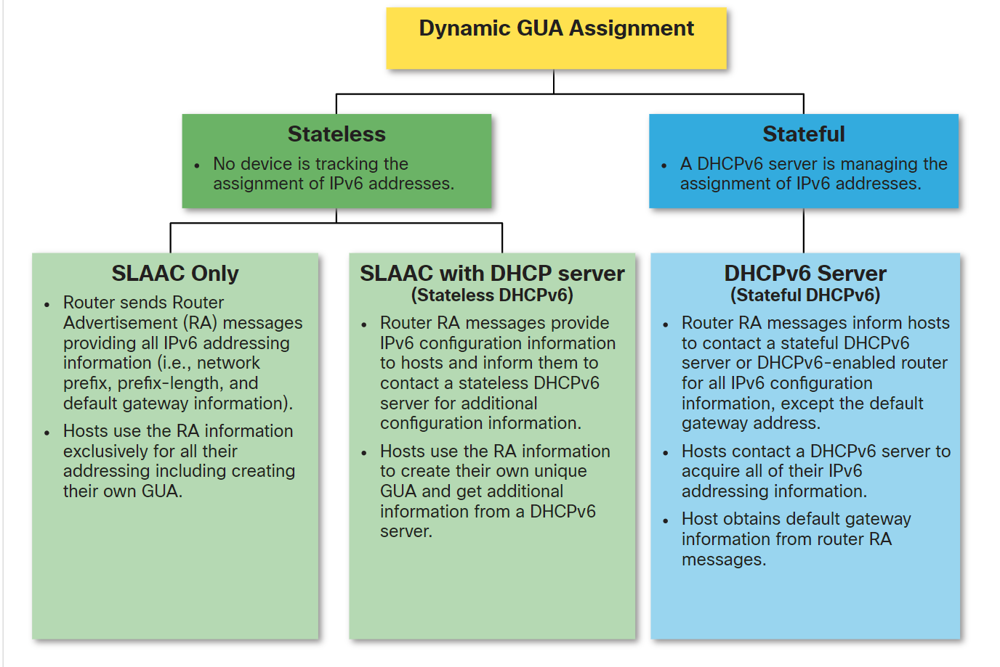
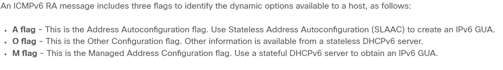
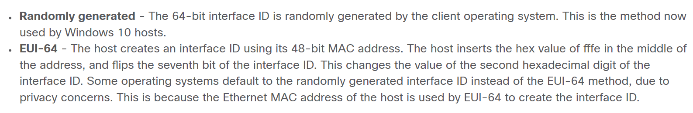

# SLAAC and DHCPv6   

## IPv6 GUA Assignment  

* Manually entering the GUA IPv6 can be time consuming and error prone that's why most hosts are configured to do it dynamically.  

* When using the command `ipconfig` host operating systems will at times show a link-local address appended with a "%" and a number. This is known as a Zone ID or Scope ID. It is used by the OS to associate the LLA with a specific interface.  

* GUA Assignment  


## Three RA Message Flags  

* For the host to know which method to use a flag is sent in the Router Advertisment to specify this  
  


## SLAAC  

* SLAAC is a stateless service. Which means it doesn't have a server to maintain network information and to know if an IP is already used by other host or not.
* RA messages are sent to the host every 200 seconds.
* It enables hosts to create an IPv6 address without the need of a DHCPv6 services. A host usually configures their IPv6 address depending on what they receive in the RA.  

* To configure a router to send RAs use the following command  
  ```console
  R1(config)# ipv6 unicast-routing
  R1(config)# exit
  R1# 
  ```  
* When using the previous command SLAAC only is enabled by default.  
* When the A flag is set and the rest are zeros the RA includes prefix, prefix-length, DNS server, MTU and default gateway information.  

* A default gateway address can only be obtained from the RA message the DHCPv6 server NEVER provide such info.  

* Routers automatically send RA messages every 200 seconds. However, they could also send RAs as a response to an RS sent from a host.

* When a client is configured to obtain its addressing information automatically, it sends an RS message to the *IPv6 all-routers multicast address of ff02::2*.  


* The remainder 64-bit of the IPv6 address that is not obtained from the RA  

    


## Duplicate Address Detection (DAD)  

* When using SLAAC only there's no guarantee that the address is unique and this is where the DAD comes to our rescue.  

* The DAD sends a ICMPv6 Neighbor Solicitation (NS) with a specially constructed multicast address called *solicited node multicast address*. This address duplicates the last 24 bits of the IPv6 of the host. 
* If no other device responds with an NA then the address is unique and can be used.
* But if an NA is received this means that the address is not unique and the host has to construct a new Interface ID.  
  
* It's preferred that the DAD be used with all IPv6 addresses regardless of how they were configured (SLAAC, DHCPv6,..) even if it's remote that the address won't be unique.  


## DHCPv6  

* Server to client DHCPv6 messages use UDP destination port 546 while client to server DHCPv6 messages use UDP destination port 547.  

## DHCP Operation Steps  

1. The host sends an RS message.
2. The router responds with an RA message.
3. The host sends a DHCPv6 SOLICIT message.
4. The DHCPv6 server responds with an ADVERTISE message.
5. The host responds to the DHCPv6 server. This response depends on whether the DHCPv6 is stateless or stateful.  
   1. Stateless: The client creates an IPv6 address using the prefix in the RA message and a self-generated Interface ID. The client then sends a DHCPv6 INFORMATION-REQUEST message to the DHCPv6 server requesting additional configuration parameters (e.g., DNS server address).  
   2. Stateful: The client sends a DHCPv6 REQUEST message to the DHCPv6 server to obtain all necessary IPv6 configuration parameters.
6. The DHCPv6 server sends a reply message.  

## Stateless DHCPv6  

* The stateless DHCPv6 server is only providing information that is identical for all devices on the network such as the IPv6 address of a DNS server.
* We don't use the DHCPv6 server to provide us with IP addresses.  

* To **enable stateless DHCPv6** on an interface use the command `ipv6 nd other-config-flag`.  

## Stateful DHCPv6  

* Is known as stateful DHCPv6 because the DHCPv6 server maintains IPv6 state information.

* Enabling stateful DHCPv6 and disabling SLAAC on an interface with
```console
R1(config-if)# ipv6 nd managed-config-flag
R1(config-if)# ipv6 nd prefix default no-autoconfig   
```  

## Configure DHCPv6 Server  

* Routers can have different DHCPv6 roles  
  * DHCPv6 Server  
    * Router provides stateless or stateful services.
  * DHCPv6 Client  
    * Router interfaces require IPv6 IP configuration from a DHCPv6 server.
  * DHCPv6 Relay Agent  
    * Router provides DHCPv6 forwarding services when the client and the server are located on different networks.  

## Configuring a router as stateless DHCPv6 Server 

1. Enable IPv6 routing.
2. Define a DHCP pool name.
3. Configure the pool.
4. Bind the DHCPv6 pool to an interface.

```console
R1(config)# ip unicast-routing
R1(config)# ipv6 dhcp pool [POOL NAME]
R1(config-dhcpv6)# dns-server 2001:db8:acad:1::254
R1(config-dhcpv6)# domain-name example.com
R1(config-dhcpv6)# exit
R1(config)# interface GigabitEthernet0/0/1
R1(config-if)# description Link to LAN
R1(config-if)# ipv6 address fe80::1 link-local
R1(config-if)# ipv6 address 2001:db8:acad:1::1/64
R1(config-if)# ipv6 nd other-config-flag
R1(config-if)# ipv6 dhcp server IPV6-STATELESS
R1(config-if)# no shut
R1(config-if)# end
R1#
```  

## Configuring a router as stateless DHCPv6 Client  

1. Enable IPv6 routing.
2. Configure client router to create LLA.
3. Configure client router to use SLAAC.
4. Verify client router is assigned a GUA.
5. Verify client router received other DHCPv6 information.

```console
R3(config)# ipv6 unicast-routing
R3(config)# interface g0/0/1
R3(config-if)# ipv6 enable
R3(config-if)# ipv6 address autoconfig
R3# show ipv6 interface brief
R3# show ipv6 dhcp interface [INTERFACE NUMBER]
```  

## Configuring a router as stateful DHCPv6 Server 

1. Enable IPv6 routing.
2. Define a DHCP pool name.
3. Configure the pool.
4. Bind the DHCPv6 pool to an interface.
5. Verify hosts received everything with the command `C:\PC1> ipconfig /all`.

```console
R1(config)# ip unicast-routing
R1(config)# ipv6 dhcp pool [POOL NAME]
R1(config-dhcpv6)# address prefix 2001:db8:acad:1::/64
R1(config-dhcpv6)# dns-server 2001:db8:acad:1::254
R1(config-dhcpv6)# domain-name example.com
R1(config-dhcpv6)# exit
R1(config)# interface GigabitEthernet0/0/1
R1(config-if)# description Link to LAN
R1(config-if)# ipv6 address fe80::1 link-local
R1(config-if)# ipv6 address 2001:db8:acad:1::1/64
R1(config-if)# ipv6 nd managed-config-flag
R1(config-if)# ipv6 nd prefix default no-autoconfig   
R1(config-if)# ipv6 dhcp server IPV6-STATELESS
R1(config-if)# no shut
R1(config-if)# end
R1#
```  

## Configuring a router as stateful DHCPv6 Client 

1. Enable IPv6 routing.
2. Configure client router to create LLA.
3. Configure client router to use SLAAC.
4. Verify client router is assigned a GUA.
5. Verify client router received other DHCPv6 information.

```console
R3(config)# ipv6 unicast-routing
R3(config)# interface g0/0/1
R3(config-if)# ipv6 enable
R3(config-if)# ipv6 address dhcp
R3# show ipv6 interface brief
R3# show ipv6 dhcp interface [INTERFACE NUMBER] 
```  


* The command `R1# show ipv6 dhcp pool` verifies the dhcp pool name and its parameters.  
* Use the `show ipv6 dhcp binding` command output to display the IPv6 link-local address of the client and the global unicast address assigned by the server.  


## Configuring the router as a relay agent  
  ```console
  Router(config-if)# ipv6 dhcp relay destination ipv6-address [interface-type interface-number]
  ```